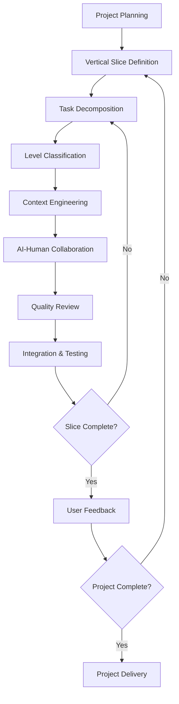

# PACE 1.0 Core Concepts Overview

## Introduction

PACE 1.0 (Programmatic AI Collaboration Engineering) represents a paradigm shift in software development methodology. Rather than viewing AI as a replacement for human developers, PACE establishes a systematic framework for **optimal human-AI collaboration** that amplifies the strengths of both.

## The PACE Philosophy

### The Challenge
Traditional software development methodologies were designed for human-only teams. The emergence of powerful AI coding assistants creates new opportunities but also new challenges:

- **Productivity Gains**: AI can generate code faster than humans
- **Quality Concerns**: AI lacks domain expertise and architectural judgment  
- **Integration Difficulties**: Unclear boundaries between human and AI responsibilities
- **Context Problems**: AI needs rich context to produce optimal output

### The Solution
PACE provides a structured approach that:
- **Maximizes AI strengths** while **preserving human judgment**
- **Establishes clear collaboration boundaries** for optimal productivity
- **Maintains code quality** through systematic review processes
- **Enables rapid iteration** while ensuring architectural integrity

## Four Foundational Pillars

### 1. Vertical Slicing Strategy 🎯

**Principle**: Structure development around independently deliverable user value rather than technical architecture.

**Traditional Approach**:
```
├── Phase 1: Database layer
├── Phase 2: API layer  
├── Phase 3: Business logic
└── Phase 4: User interface
```

**PACE Approach**:
```
├── Slice 1: Core user workflow (end-to-end MVP)
├── Slice 2: Enhanced user experience  
└── Slice 3: Advanced features and optimization
```

**Benefits**:
- Earlier user feedback and validation
- Reduced integration risks
- Continuous value delivery
- Better stakeholder engagement

### 2. Four-Level Task Classification 🤖

**Principle**: Different types of tasks require different human-AI collaboration models.

#### Level 1: Standardized Implementation (AI-Driven)
- **AI Role**: Primary implementer
- **Human Role**: Requirements definition, review, and quality assurance
- **Examples**: UI components, CRUD operations, data transformations
- **Collaboration Model**: AI generates → Human reviews → Iterate

#### Level 2: Integration Coordination (Human-AI Collaborative) 
- **AI Role**: Implementation support and assistance
- **Human Role**: Design coordination, integration strategy
- **Examples**: API integration, state management, business logic implementation
- **Collaboration Model**: Human designs → AI implements → Joint debugging

#### Level 3: Architectural Design (Human-Led)
- **AI Role**: Research, suggestions, implementation assistance
- **Human Role**: Decision making, system design, technical strategy
- **Examples**: Technology selection, system architecture, performance optimization
- **Collaboration Model**: Human decides → AI researches → Human finalizes

#### Level 4: Innovation Exploration (Human-Led)
- **AI Role**: Research assistance, prototype implementation  
- **Human Role**: Creative thinking, problem definition, solution evaluation
- **Examples**: New feature concepts, algorithm design, user experience innovation
- **Collaboration Model**: Human explores → AI assists → Human evaluates

### 3. Context Engineering 📋

**Principle**: Optimize AI effectiveness through systematic context provision.

#### The Context Hierarchy
```
┌─ Project Context ─────────────────────────┐
│  ├─ Business goals and constraints        │
│  ├─ Technical architecture and standards  │
│  └─ Team conventions and preferences      │
└───────────────────────────────────────────┘
         ↓
┌─ Task Context ────────────────────────────┐
│  ├─ Specific requirements and acceptance  │
│  ├─ Related code and dependencies         │
│  └─ Implementation constraints            │
└───────────────────────────────────────────┘
         ↓
┌─ Implementation Context ──────────────────┐
│  ├─ Code examples and patterns           │
│  ├─ Error messages and debugging info    │
│  └─ Iterative feedback and refinements   │
└───────────────────────────────────────────┘
```

#### Context Engineering Techniques
- **Layered Context**: Provide context at appropriate levels of detail
- **Example-Driven**: Include relevant code examples and patterns
- **Constraint Specification**: Clearly define limitations and requirements
- **Iterative Refinement**: Improve context based on AI output quality

### 4. Task Card Documentation 📝

**Principle**: Standardize task communication through comprehensive documentation templates.

#### Task Card Structure
```markdown
# Task Identification
- Task ID, Level, Priority, Estimation
- Assignee and Timeline

# Business Context  
- Business goals and user value
- Acceptance criteria and success metrics

# Technical Specification
- Functional requirements and constraints
- Interface definitions and data models

# Implementation Guidance
- Approach suggestions and best practices
- Code examples and reference materials

# Quality Assurance
- Testing strategy and validation checklist
- Risk assessment and mitigation plans
```

#### Benefits of Standardized Task Cards
- **Clear Communication**: Eliminates ambiguity in requirements
- **Quality Assurance**: Ensures systematic review and validation
- **Knowledge Transfer**: Facilitates team learning and onboarding
- **Progress Tracking**: Enables accurate project monitoring

## Integration Patterns

### The PACE Development Cycle



### Collaboration Workflows

#### Level 1 Workflow: AI-Driven Implementation
```
Human: Define requirements → AI: Generate implementation → Human: Review & refine → Iterate until acceptable
```

#### Level 2 Workflow: Collaborative Integration
```
Human: Design architecture → AI: Implement components → Human & AI: Debug together → Human: Final review
```

#### Level 3 Workflow: Human-Led Architecture
```
Human: Research & decide → AI: Assist with research → Human: Design solution → AI: Help implement
```

#### Level 4 Workflow: Innovation Exploration
```
Human: Identify opportunity → AI: Research possibilities → Human: Experiment → AI: Prototype → Human: Evaluate
```

## Quality Assurance Framework

### Multi-Level Quality Gates

#### Code Quality
- **Automated**: Linting, type checking, automated testing
- **AI-Assisted**: Code review suggestions, pattern detection
- **Human**: Architectural review, business logic validation

#### Functional Quality  
- **Unit Testing**: Component and function level verification
- **Integration Testing**: System interaction validation
- **User Acceptance**: Real-world usage validation

#### Process Quality
- **Task Card Completeness**: Documentation standards compliance
- **Collaboration Effectiveness**: Human-AI interaction optimization
- **Delivery Metrics**: Velocity, quality, and satisfaction tracking

## Success Metrics

### Productivity Metrics
- **Development Velocity**: Features delivered per unit time
- **Code Quality**: Defect rates, maintainability scores
- **Team Satisfaction**: Developer experience and engagement

### Collaboration Metrics
- **AI Utilization**: Effective use of AI capabilities
- **Human Value-Add**: Focus on high-value human activities
- **Learning Curve**: Time to proficiency with PACE

### Business Metrics
- **Time to Market**: Faster feature delivery
- **User Satisfaction**: Better product quality and fit
- **Technical Debt**: Sustainable development practices

## Getting Started with PACE

### Phase 1: Individual Adoption (Week 1-2)
1. Learn core concepts and principles
2. Practice with small personal projects
3. Master task card creation and context engineering

### Phase 2: Team Integration (Week 3-6)
1. Introduce PACE to team members
2. Pilot PACE on a single feature or project
3. Establish team conventions and standards

### Phase 3: Organizational Scaling (Month 2-3)
1. Develop training programs and documentation
2. Create PACE-compliant project templates
3. Implement metrics and continuous improvement

## Common Misconceptions

### "PACE is just about using AI tools"
**Reality**: PACE is a comprehensive methodology that includes project planning, team collaboration, quality assurance, and delivery processes - AI collaboration is just one component.

### "AI will replace human developers"
**Reality**: PACE demonstrates that AI amplifies human capabilities rather than replacing them. Humans remain essential for creativity, judgment, and complex problem-solving.

### "This only works for certain types of projects"
**Reality**: PACE principles apply to any software development project, from simple tools to complex enterprise systems. The methodology scales with project complexity.

### "PACE requires specific AI tools"
**Reality**: PACE is tool-agnostic and works with any AI coding assistant or combination of tools.

## Next Steps

### For Individuals
- Start with the [Quick Start Guide](../../getting-started/quick-start.md)
- Practice with the [TodoMaster Tutorial](../../examples/quick-start/)
- Join the [PACE Community](../../community/) for support

### For Teams
- Review [Team Adoption Strategies](../best-practices/team-adoption.md)
- Set up [Project Templates](../../templates/project-structures/)
- Establish [Quality Assurance Processes](../best-practices/quality-assurance.md)

### For Organizations
- Read the [Enterprise Implementation Guide](../best-practices/enterprise-implementation.md)
- Plan [Training and Rollout Strategy](../best-practices/adoption-strategy.md)
- Implement [Success Measurement](../best-practices/success-metrics.md)

---

PACE 1.0 represents the evolution of software development for the AI era. By providing clear structure for human-AI collaboration, we can achieve unprecedented productivity while maintaining the quality and innovation that only human creativity can provide.

*Ready to dive deeper? Explore our detailed guides on [Vertical Slicing](./vertical-slicing.md), [Context Engineering](./context-engineering.md), and [Task Classification](./task-levels.md).*