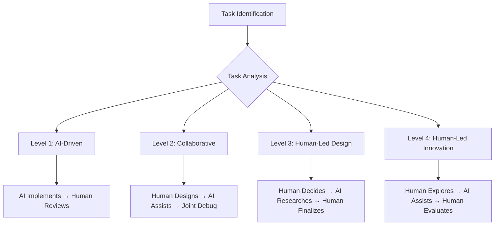

# Four-Level Task Classification System

## Overview

The Four-Level Task Classification System is the cornerstone of PACE 1.0's human-AI collaboration framework. By categorizing development tasks into four distinct levels, teams can optimize their collaboration approach, ensuring that human creativity and AI efficiency are applied where they're most effective.

## The Classification Framework

### Level Distribution in Typical Projects
```
Level 1 (Standardized Implementation): 40-50%
Level 2 (Integration Coordination): 25-35%  
Level 3 (Architectural Design): 15-25%
Level 4 (Innovation Exploration): 5-15%
```

### Collaboration Models by Level



## Level 1: Standardized Implementation (AI-Driven)

### Characteristics
- **Well-defined requirements** with clear acceptance criteria
- **Established patterns** that can be replicated or adapted
- **Low architectural impact** - doesn't change system design
- **Predictable implementation** with known approaches

### AI Role: Primary Implementer
- Generate code based on specifications
- Follow established patterns and conventions
- Handle routine implementation details
- Create comprehensive test coverage

### Human Role: Director and Quality Assurance
- Define clear requirements and constraints
- Provide examples and patterns to follow
- Review generated code for quality and correctness
- Ensure integration with existing systems

### Collaboration Workflow
```
1. Human: Define requirements with rich context
2. AI: Generate initial implementation
3. Human: Review and provide feedback
4. AI: Refine based on feedback
5. Human: Final validation and integration
```

### Example Tasks

#### UI Component Development
```markdown
Task: Create a TaskItem component for displaying individual tasks

Context for AI:
- React + TypeScript project
- Tailwind CSS for styling  
- Specific props interface defined
- Existing design system components to use
- Accessibility requirements (WCAG 2.1)
- Example of similar ListItem component

Expected AI Output:
- Fully functional React component
- TypeScript interfaces and props
- Responsive styling with Tailwind
- Proper accessibility attributes
- Unit tests with React Testing Library
```

#### CRUD Operations
```markdown
Task: Implement user profile CRUD operations

Context for AI:
- Node.js + Express + TypeScript
- Existing database schema and models
- Validation requirements and business rules
- Error handling patterns used in project
- Authentication middleware integration
- Example of similar CRUD controller

Expected AI Output:
- Complete CRUD controller with all endpoints
- Input validation and sanitization
- Proper error handling and status codes
- Database operations with transactions
- Comprehensive API tests
```

#### Data Transformations
```markdown
Task: Create data transformation utilities for user analytics

Context for AI:
- Input/output data formats specified
- Performance requirements (1M+ records)
- Existing utility patterns in the project
- Error handling for malformed data
- TypeScript interfaces for all data types

Expected AI Output:
- Efficient transformation functions
- Proper error handling and validation
- TypeScript types for all operations
- Performance optimizations (streaming, batching)
- Unit tests with edge cases
```

### Level 1 Success Criteria
- **First-attempt success rate >80%**: AI generates usable code on first try
- **Minimal human intervention**: <20% of time spent on modifications
- **Pattern compliance**: Code follows established project conventions
- **Test coverage**: Generated tests achieve >90% coverage
- **Documentation**: Code is self-documenting with clear interfaces

### Common Level 1 Anti-Patterns

#### Anti-Pattern: Vague Requirements
```markdown
❌ Bad Context:
"Create a form component"

✅ Good Context:
"Create a ContactForm component with name, email, message fields. 
Must use our FormField wrapper, validate email format, show loading 
states, handle submission errors, and follow our form styling patterns."
```

#### Anti-Pattern: Missing Examples
```markdown
❌ Bad Context:
"Follow our project patterns for error handling"

✅ Good Context:
"Handle errors using our standard pattern (see UserController.ts lines 45-60). 
Use ErrorHandler.wrap() for async functions and return standardized error 
responses with our ApiError class."
```

## Level 2: Integration Coordination (Human-AI Collaborative)

### Characteristics
- **Multi-component integration** requiring coordination
- **Business logic implementation** with domain-specific rules
- **Moderate complexity** with some ambiguity in requirements
- **System interaction** affecting multiple parts of the application

### AI Role: Implementation Assistant
- Generate code for defined interfaces and contracts
- Implement business logic based on human-designed rules
- Create integration glue code and adapters
- Suggest implementation approaches and patterns

### Human Role: Integration Architect
- Design system interactions and data flow
- Define interfaces and contracts between components
- Make business logic decisions and trade-offs
- Coordinate debugging and problem-solving

### Collaboration Workflow
```
1. Human: Design integration architecture and interfaces
2. AI: Suggest implementation approaches
3. Human: Choose approach and define contracts
4. AI: Implement components and integration code
5. Human & AI: Collaborative debugging and refinement
6. Human: Validate business logic and edge cases
```

### Example Tasks

#### State Management Integration
```markdown
Task: Integrate task management with user authentication state

Human Design Phase:
- Define state architecture (Zustand stores)
- Design data flow between auth and task features
- Specify error handling for authentication failures
- Define loading states and user feedback patterns

AI Implementation Phase:
- Implement store integration code
- Create custom hooks for state coordination
- Handle authentication state changes
- Implement optimistic updates with rollback

Collaborative Debug Phase:
- Test edge cases (expired tokens, network failures)
- Optimize re-render performance
- Validate state persistence across browser sessions
```

#### API Integration
```markdown
Task: Integrate third-party payment service with order processing

Human Design Phase:
- Research payment provider API capabilities
- Design error handling for payment failures
- Define retry logic and timeout strategies
- Specify security requirements and PCI compliance

AI Implementation Phase:
- Implement payment service client
- Create webhook handlers for payment events
- Build retry mechanisms and circuit breakers
- Implement secure data handling

Collaborative Debug Phase:
- Test payment flows in sandbox environment
- Handle webhook delivery failures
- Optimize transaction processing performance
- Validate security and compliance requirements
```

#### Business Logic Implementation
```markdown
Task: Implement order fulfillment workflow with inventory management

Human Design Phase:
- Define business rules for order processing
- Design inventory allocation strategies
- Specify notification and communication flows
- Define rollback procedures for failed orders

AI Implementation Phase:
- Implement workflow state machine
- Create inventory allocation algorithms
- Build notification dispatch systems
- Implement transaction rollback logic

Collaborative Debug Phase:
- Test complex order scenarios
- Validate inventory consistency
- Optimize workflow performance
- Handle concurrent order conflicts
```

### Level 2 Success Criteria
- **Integration completeness**: All components work together seamlessly
- **Business logic accuracy**: Rules are implemented correctly
- **Error handling robustness**: System gracefully handles failures
- **Performance adequacy**: Meets specified performance requirements
- **Maintainability**: Code is organized and extensible

### Level 2 Quality Gates

#### Integration Testing
```typescript
// Example integration test structure
describe('Task Management Integration', () => {
  describe('Authentication Integration', () => {
    it('should sync task access with user permissions');
    it('should handle authentication expiry gracefully');
    it('should maintain task state across auth changes');
  });
  
  describe('Data Flow Validation', () => {
    it('should propagate task updates to dependent components');
    it('should maintain data consistency across stores');
    it('should handle offline/online synchronization');
  });
});
```

## Level 3: Architectural Design (Human-Led)

### Characteristics
- **Architectural decisions** affecting system design
- **Technology selection** and evaluation
- **Performance optimization** requiring trade-off analysis
- **High complexity** with multiple solution approaches

### AI Role: Research Assistant and Implementation Support
- Research technology options and provide analysis
- Generate implementation templates and boilerplate
- Suggest optimization strategies and patterns
- Provide code examples and proof-of-concepts

### Human Role: Decision Maker and Architect
- Analyze requirements and constraints
- Evaluate options and make architectural decisions
- Design system architecture and interfaces
- Define implementation strategies and standards

### Collaboration Workflow
```
1. Human: Analyze problem and define requirements
2. AI: Research options and provide analysis
3. Human: Evaluate options and make decisions
4. AI: Create implementation templates and examples
5. Human: Review and refine architectural approach
6. AI: Generate boilerplate and initial implementation
7. Human: Validate architecture and guide refinements
```

### Example Tasks

#### Database Architecture Design
```markdown
Task: Design scalable database architecture for multi-tenant SaaS

Human Analysis Phase:
- Analyze scalability requirements (10K+ tenants)
- Evaluate data isolation strategies
- Consider compliance requirements (GDPR, SOX)
- Assess cost and operational constraints

AI Research Phase:
- Research multi-tenancy patterns (shared/isolated/hybrid)
- Analyze database technologies (PostgreSQL, MongoDB, etc.)
- Provide performance benchmarks and trade-offs
- Suggest partitioning and sharding strategies

Human Decision Phase:
- Choose hybrid tenancy model with schema isolation
- Select PostgreSQL with row-level security
- Define data retention and archival policies
- Design backup and disaster recovery strategy

AI Implementation Support:
- Generate database schemas and migration scripts
- Create tenant provisioning automation
- Implement monitoring and alerting queries
- Build performance optimization scripts
```

#### Microservices Architecture Design
```markdown
Task: Transition monolith to microservices architecture

Human Analysis Phase:
- Analyze current system bottlenecks and pain points
- Identify service boundaries using domain modeling
- Evaluate organizational readiness and constraints
- Define success criteria and migration timeline

AI Research Phase:
- Research microservices patterns and anti-patterns
- Analyze service decomposition strategies
- Provide infrastructure technology comparisons
- Suggest monitoring and observability approaches

Human Decision Phase:
- Choose strangler fig migration pattern
- Select Kubernetes for container orchestration
- Define service communication protocols (REST + Events)
- Design data consistency and transaction strategies

AI Implementation Support:
- Generate service templates and boilerplate
- Create deployment configurations and pipelines
- Implement service discovery and load balancing
- Build monitoring and logging infrastructure
```

#### Performance Optimization Strategy
```markdown
Task: Optimize application performance for 10x scale increase

Human Analysis Phase:
- Profile current system performance bottlenecks
- Analyze user behavior and usage patterns
- Define performance goals and SLA requirements
- Assess infrastructure budget and constraints

AI Research Phase:
- Research performance optimization techniques
- Analyze caching strategies and technologies
- Provide database optimization recommendations
- Suggest front-end performance improvements

Human Decision Phase:
- Prioritize optimizations by impact/effort ratio
- Choose caching architecture (Redis + CDN)
- Define monitoring and alerting strategy
- Plan phased rollout and validation approach

AI Implementation Support:
- Generate caching layer implementation
- Create database query optimizations
- Build performance monitoring dashboards
- Implement load testing automation
```

### Level 3 Success Criteria
- **Architectural soundness**: Design meets all requirements and constraints
- **Scalability**: Architecture supports expected growth
- **Maintainability**: Design enables long-term evolution
- **Team alignment**: Architecture is understood and accepted by team
- **Documentation completeness**: Decisions are well-documented with rationale

### Level 3 Documentation Requirements

#### Architecture Decision Records (ADRs)
```markdown
# ADR-001: Database Architecture for Multi-Tenant SaaS

## Status
Accepted

## Context
We need to design a database architecture that supports 10,000+ tenants
with strong data isolation, GDPR compliance, and cost-effective scaling.

## Decision
Implement hybrid tenancy with PostgreSQL schema-per-tenant approach.

## Consequences
### Positive
- Strong data isolation and security
- Simplified backup and compliance
- Good performance for most tenant sizes

### Negative  
- Higher operational complexity
- Limited to ~1000 schemas per database
- More complex migrations across tenants

## Implementation Plan
[Detailed implementation steps...]
```

## Level 4: Innovation Exploration (Human-Led)

### Characteristics
- **Undefined problem spaces** requiring creative exploration
- **Experimental features** with uncertain outcomes
- **Research and discovery** of new approaches
- **High uncertainty** with multiple possible solutions

### AI Role: Research Partner and Prototype Assistant
- Gather and synthesize research materials
- Generate experimental prototypes and proof-of-concepts
- Suggest creative approaches and alternatives
- Implement exploratory code for validation

### Human Role: Innovation Leader and Evaluator
- Define exploration goals and success criteria
- Generate creative hypotheses and approaches
- Evaluate experimental results and feasibility
- Make go/no-go decisions based on learning

### Collaboration Workflow
```
1. Human: Identify innovation opportunity and define goals
2. AI: Research relevant technologies and approaches
3. Human: Generate hypotheses and experimental plan
4. AI: Implement prototypes and proof-of-concepts
5. Human: Evaluate results and extract insights
6. Human & AI: Iterate on promising approaches
7. Human: Make decisions about further investment
```

### Example Tasks

#### AI-Powered User Experience Features
```markdown
Task: Explore AI-powered task prioritization and scheduling

Human Innovation Phase:
- Identify user pain points with manual task management
- Hypothesize that AI can improve task ordering decisions
- Define success metrics (user engagement, task completion)
- Design experimental validation approach

AI Research Phase:
- Research task prioritization algorithms and approaches
- Analyze user behavior data for pattern identification
- Suggest machine learning models and training approaches
- Provide implementation examples from similar domains

Human Experimentation Phase:
- Design A/B test comparing manual vs. AI prioritization
- Define minimum viable AI feature for testing
- Create user feedback collection mechanisms
- Plan iterative improvement based on user response

AI Prototype Phase:
- Implement simple priority scoring algorithm
- Create user interface for AI suggestion display
- Build feedback collection and learning mechanisms
- Generate synthetic data for initial testing

Human Evaluation Phase:
- Analyze user engagement and satisfaction metrics
- Evaluate AI suggestion accuracy and relevance
- Assess development effort vs. user value
- Decide on feature investment and next iteration
```

#### Novel Development Workflow Optimization
```markdown
Task: Explore AI-assisted code review and quality improvement

Human Innovation Phase:
- Identify code review bottlenecks and quality issues
- Hypothesize AI can augment human code review
- Define quality metrics and improvement targets
- Design pilot program for validation

AI Research Phase:
- Research state-of-the-art code analysis tools
- Analyze existing code review patterns and feedback
- Suggest AI models for different review aspects
- Provide integration examples with development tools

Human Experimentation Phase:
- Design pilot with subset of team and codebase
- Define AI assistance vs. human reviewer boundaries
- Create feedback mechanisms for AI suggestions
- Plan measurement of review quality and speed

AI Prototype Phase:
- Implement code pattern analysis and suggestion engine
- Create integration with existing review tools
- Build learning mechanisms from reviewer feedback
- Generate initial rule sets and quality checks

Human Evaluation Phase:
- Measure code review speed and thoroughness improvements
- Assess AI suggestion accuracy and developer satisfaction
- Evaluate integration complexity and maintenance overhead
- Decide on broader rollout or alternative approaches
```

#### Emerging Technology Integration
```markdown
Task: Explore blockchain integration for supply chain transparency

Human Innovation Phase:
- Analyze supply chain transparency requirements
- Investigate blockchain technology potential and limitations
- Define proof-of-concept scope and success criteria
- Assess technical and business feasibility constraints

AI Research Phase:
- Research blockchain platforms and consensus mechanisms
- Analyze supply chain transparency use cases and patterns
- Suggest integration architectures and data models
- Provide cost/benefit analysis of different approaches

Human Experimentation Phase:
- Design minimal viable transparency feature
- Select blockchain platform for proof-of-concept
- Define data sharing and privacy protection strategies
- Plan integration with existing supply chain systems

AI Prototype Phase:
- Implement blockchain data recording and verification
- Create supply chain event tracking mechanisms
- Build transparency dashboard and query interfaces
- Generate test data and simulation environments

Human Evaluation Phase:
- Assess transparency improvement and user value
- Evaluate technical complexity and operational costs
- Analyze scalability and performance characteristics
- Decide on production implementation approach
```

### Level 4 Success Criteria
- **Learning achievement**: Clear insights gained about feasibility and value
- **Innovation validation**: Evidence supports or refutes innovation hypothesis
- **Technical feasibility**: Understanding of implementation challenges and approaches
- **Business case clarity**: Clear understanding of investment vs. return
- **Strategic alignment**: Innovation aligns with business and technical strategy

### Level 4 Innovation Framework

#### Hypothesis-Driven Development
```markdown
# Innovation Hypothesis Template

## Problem Statement
[Clear description of user pain point or market opportunity]

## Hypothesis
We believe that [solution approach] will achieve [desired outcome] 
for [target user group] as measured by [success metrics].

## Assumptions
- [Key assumption 1] (risk level: high/medium/low)
- [Key assumption 2] (risk level: high/medium/low)
- [Key assumption 3] (risk level: high/medium/low)

## Validation Plan
- [Experiment 1]: Test assumption 1 with [method] in [timeframe]
- [Experiment 2]: Test assumption 2 with [method] in [timeframe]  
- [Experiment 3]: Test assumption 3 with [method] in [timeframe]

## Success Criteria
- [Metric 1]: Target value and measurement method
- [Metric 2]: Target value and measurement method
- [Metric 3]: Target value and measurement method

## Resource Requirements
- [Time]: Total time investment for validation
- [People]: Required team members and expertise
- [Technology]: Tools, platforms, and infrastructure needed
- [Budget]: Financial investment required
```

## Task Classification Decision Framework

### Classification Criteria

#### Complexity Assessment
```markdown
Low Complexity (Level 1):
- Single component or well-isolated functionality
- Clear requirements with minimal ambiguity
- Established patterns can be followed
- Limited integration with other systems

Medium Complexity (Level 2):
- Multiple components requiring coordination
- Some business logic or domain-specific rules
- Integration with existing systems required
- Moderate ambiguity requiring design decisions

High Complexity (Level 3):
- Architectural impact or technology decisions
- Multiple solution approaches possible
- Performance, scalability, or security concerns
- Affects multiple teams or system components

Innovation Complexity (Level 4):
- Undefined problem or solution space
- Experimental or research-oriented work
- High uncertainty about feasibility or value
- Potential for significant business or technical impact
```

#### Decision Tree for Task Classification
```
Is this task exploratory or experimental?
├─ YES → Level 4 (Innovation Exploration)
└─ NO → Does this task require architectural decisions?
    ├─ YES → Level 3 (Architectural Design)
    └─ NO → Does this task require significant integration?
        ├─ YES → Level 2 (Integration Coordination)
        └─ NO → Level 1 (Standardized Implementation)
```

### Common Classification Mistakes

#### Mistake 1: Over-Leveling Simple Tasks
```markdown
❌ Incorrect Classification:
Task: "Add a new field to user profile form"
Classified as: Level 3 (because it affects the user domain)

✅ Correct Classification:
Task: "Add a new field to user profile form"
Classified as: Level 1 (simple implementation following existing patterns)
```

#### Mistake 2: Under-Leveling Complex Tasks
```markdown
❌ Incorrect Classification:
Task: "Implement real-time collaboration features"
Classified as: Level 2 (integration task)

✅ Correct Classification:  
Task: "Implement real-time collaboration features"
Classified as: Level 3 (architectural decisions about WebSocket vs. WebRTC, 
conflict resolution strategies, data synchronization approaches)
```

#### Mistake 3: Mixing Task Levels
```markdown
❌ Mixed Level Task:
"Design and implement user authentication system"
- Contains both Level 3 (design decisions) and Level 1 (implementation)

✅ Separate Tasks:
Level 3: "Design user authentication architecture"
Level 1: "Implement login form component"
Level 1: "Implement authentication middleware"
Level 2: "Integrate authentication with user session management"
```

## Level-Specific Best Practices

### Level 1 Best Practices
- **Rich Context**: Provide comprehensive examples and patterns
- **Clear Specifications**: Define exact requirements and acceptance criteria
- **Pattern Consistency**: Ensure AI follows established project conventions
- **Quality Review**: Systematic review of AI-generated code
- **Test Coverage**: Comprehensive automated testing requirements

### Level 2 Best Practices
- **Interface Design**: Human designs contracts, AI implements
- **Collaborative Debugging**: Joint problem-solving sessions
- **Integration Testing**: Comprehensive end-to-end validation
- **Error Handling**: Robust handling of integration failures
- **Performance Validation**: Ensure integration meets performance requirements

### Level 3 Best Practices
- **Research-Driven**: Base decisions on thorough analysis
- **Documentation**: Comprehensive ADRs and design documentation
- **Stakeholder Alignment**: Ensure buy-in from affected teams
- **Prototype Validation**: Validate approaches with proof-of-concepts
- **Long-term Thinking**: Consider evolution and maintenance implications

### Level 4 Best Practices
- **Hypothesis-Driven**: Clear hypotheses and validation plans
- **Time-Boxed Exploration**: Defined time limits for investigation
- **Rapid Prototyping**: Quick validation of concepts and approaches
- **Learning Focus**: Optimize for learning rather than production code
- **Clear Go/No-Go Criteria**: Defined criteria for continuing investment

## Measuring Task Classification Effectiveness

### Team Performance Metrics
```typescript
interface TaskLevelMetrics {
  // Productivity Metrics
  velocityByLevel: Record<TaskLevel, number>;
  cycleTimeByLevel: Record<TaskLevel, number>;
  qualityByLevel: Record<TaskLevel, number>;
  
  // Collaboration Metrics  
  aiUtilizationByLevel: Record<TaskLevel, number>;
  humanSatisfactionByLevel: Record<TaskLevel, number>;
  iterationCountByLevel: Record<TaskLevel, number>;
  
  // Learning Metrics
  classificationAccuracy: number;
  levelDistribution: Record<TaskLevel, number>;
  reclassificationRate: number;
}
```

### Success Indicators
- **Productivity**: Development velocity increases compared to pre-PACE baseline
- **Quality**: Defect rates decrease while maintaining or increasing velocity
- **Satisfaction**: Team satisfaction with human-AI collaboration improves
- **Learning**: Team becomes more effective at task classification over time

---

The Four-Level Task Classification System provides the structure for optimal human-AI collaboration. By matching the collaboration model to the task characteristics, teams can achieve unprecedented productivity while maintaining quality and innovation.

*Ready to practice task classification? Try our [Task Classification Workshop](../../examples/task-classification-workshop/) and use our [Classification Decision Tool](../../tools/task-classifier/).*