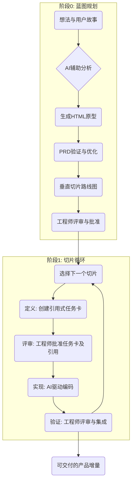
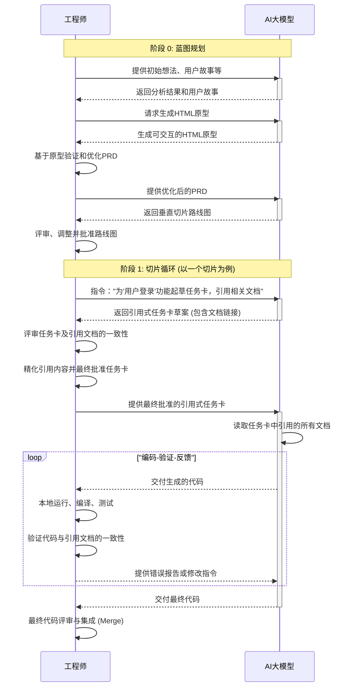

# PACE 1.1 方法论：程序化AI协作工程体系

## 方法论名称解释

**PACE** 是 **Programmatic AI Collaboration Engineering** 的缩写，中文译为"程序化AI协作工程"，其含义为：

- **Programmatic（程序化）**：强调系统化、结构化的工程方法，通过明确的流程、规范和工具来管理复杂的开发过程
- **AI Collaboration（AI协作）**：突出人类工程师与AI系统之间的深度协作，而非简单的工具使用关系
- **Engineering（工程）**：体现严谨的工程实践本质，注重质量、效率和可持续发展

PACE 1.1代表了这一方法论的AI协作增强版本，在保持原有核心理念基础上，深度集成了现代AI工具的协作策略，为软件工程领域的AI协作实践提供了完整的理论基础和实施指南。

---

## 引言：重新定义软件开发的协作模式

在人工智能技术快速发展的今天，软件开发正经历着前所未有的变革。PACE 1.1（Programmatic AI Collaboration Engineering 1.1）方法论应运而生，它不是简单地将AI工具插入传统开发流程，而是从根本上重新设计了人机协作的模式，建立了一个适应性强、可持续发展的智能化软件工程体系。

PACE 1.1的核心洞察是：成功的AI协作不在于让AI完全替代人类，而在于找到最优的人机分工模式，让每一方都能发挥自己的独特优势。人类擅长创造性思维、复杂决策和价值判断，AI擅长模式识别、代码生成和重复性工作。PACE 1.1正是基于这一认知，构建了一个既务实又前瞻的协作框架。

---

## 第一部分：理论基础与核心理念

### 1. AI的本质局限性分析

要理解PACE 1.1的必要性，我们不能仅停留在"AI会犯错"的表象，而必须深入其本质。大型语言模型（LLM）并非像人类一样理解代码逻辑，它的核心是一个基于概率的高度复杂的序列预测引擎。它的能力在于：给定上一个词（Token），预测下一个最可能出现的词。

这个本质，直接导致了它在面对软件工程这一复杂任务时的三大根本性冲突：

#### 1.1 状态管理的不对称性 (State Management Asymmetry)

AI的无状态内核与软件项目的持久化状态之间存在根本矛盾。项目是一个包含成百上千个文件、无数依赖关系和隐性约定，持续演化的"状态集合"。而AI在每次交互中都是无状态的，其"世界"仅限于当前的上下文窗口，缺乏对项目全局和历史状态的记忆。

#### 1.2 生成式推理与逻辑推理的范式冲突 (Paradigm Conflict: Generative vs. Logical Reasoning)

AI基于概率的模式生成（"回忆"见过的相似代码）与工程所要求的确定性逻辑之间存在冲突。当处理依赖管理或API调用时，AI是在模仿它见过的通用模式，而不是在执行真正的逻辑解析，这导致其"通用解决方案"常与项目的"特定约束"不匹配。

#### 1.3 局部注意力与分布式知识的矛盾 (Contradiction: Local Attention vs. Distributed Knowledge)

AI的注意力机制本质上是局部的，而软件系统的知识（如函数定义、类继承、配置）是分布式、非局部的。AI难以理解跨越多个文件或模块的"超距"依赖，导致在处理复杂逻辑时，会因无法看到全局而"忽略"关键的上下文信息。

### 2. 上下文工程：AI协作的核心技术

直接将编程任务抛给一个"无状态、概率性、注意力有限"的AI，必然会导致混乱和失败。解决方案是引入"上下文工程" (Context Engineering) —— 一门设计和构建动态系统的学科，能够在正确的时间，以正确的格式，为AI提供恰当的信息和工具，使其能够完成任务。

#### 2.1 上下文的本质

在AI驱动的软件开发中，上下文不仅仅是信息的集合，更是人类意图和AI能力之间的桥梁。有效的上下文工程需要解决三个核心问题：

- 信息的结构化组织：如何将复杂的业务需求转化为AI可理解的结构化描述
- 认知负荷的管理：如何在有限的上下文窗口内传递最关键的信息
- 意图的精确传达：如何确保AI理解人类的真实意图而非表面需求

#### 2.2 垂直切片策略

垂直切片是PACE 1.1的核心工作模式，它强调：

- 功能完整性：每个切片都是一个可独立交付的功能单元
- 端到端覆盖：从用户界面到数据存储的完整技术栈
- 价值导向：每个切片都能为用户创造可感知的价值
- 风险分散：通过小粒度迭代降低项目风险

PACE 1.1 摒弃了传统的、庞大的瀑布式开发阶段，转而采用"垂直切片" (Vertical Slicing) 的迭代策略，专注于从第一天起就交付价值。我们不试图一次性造出一辆完美的汽车，而是通过构建一系列功能上持续完善、但始终可用的产品（从滑板到踏板车，再到自行车，最终到汽车）来逐步实现目标。

**垂直切片 vs MVP (最小可行产品) 的区别**

垂直切片策略经常被误解为MVP概念，但两者存在本质差异：

- **MVP关注产品层面**：MVP是产品管理概念，关注市场验证和用户反馈，目标是用最小成本验证商业假设
- **垂直切片关注工程层面**：垂直切片是技术实现策略，关注代码架构和开发效率，目标是降低技术风险和提升交付质量

- **MVP可能技术债务高**：为了快速验证市场，MVP往往允许"脏快"的实现方式
- **垂直切片要求技术质量**：每个切片都必须符合生产标准，具备良好的代码质量和架构设计

- **MVP是一次性的**：验证完毕后MVP可能被重写或废弃
- **垂直切片是累积的**：每个切片都成为最终产品的一部分，持续累积价值

简而言之，MVP回答"我们应该做什么产品？"，而垂直切片回答"我们应该如何做这个产品？"

#### 2.3 适应性架构治理

传统的架构治理往往过于刚性，PACE 1.1提出了适应性架构治理的概念：

- 活的架构文档：与代码同步演进的架构描述
- 渐进式一致性：在演进中保持架构的整体一致性
- 智能化检查：通过自动化工具检测架构偏离
- 社区化治理：通过团队协作维护架构健康

### 3. 任务复杂度分级与协作模式

#### 3.1 四级任务分类体系

基于任务的复杂度和AI的适用性，PACE 1.1建立了四级分类体系：

**Level 1 - 标准化实现任务**

- 特征：明确的输入输出，标准化的实现模式
- 适用场景：CRUD操作、数据转换、工具函数、单元测试
- AI参与度：85-95%
- 人类角色：规格定义、质量验证、异常处理
- 协作模式：AI主导执行，人类监督验证

**Level 2 - 集成协调任务**

- 特征：多模块交互，需要考虑系统一致性
- 适用场景：API集成、状态管理、数据流设计、组件组合
- AI参与度：60-80%
- 人类角色：架构设计、接口定义、集成策略
- 协作模式：人类设计框架，AI实现细节

**Level 3 - 架构设计任务**

- 特征：需要权衡多个因素，涉及技术选型
- 适用场景：系统架构、性能优化、技术选型、安全设计
- AI参与度：30-50%
- 人类角色：需求分析、方案评估、决策制定
- 协作模式：人机深度协作，共同探索方案

**Level 4 - 创新探索任务**

- 特征：高度不确定性，需要创造性思维
- 适用场景：新技术验证、算法创新、用户体验设计、商业模式探索
- AI参与度：10-30%
- 人类角色：创意产生、价值判断、战略决策
- 协作模式：人类主导创新，AI提供支持

#### 3.2 动态协作模式切换

PACE 1.1强调协作模式的动态性，根据项目阶段、团队能力、业务压力等因素灵活调整：

- 项目探索期：以Level 3和Level 4任务为主，重点验证可行性
- 快速开发期：以Level 1和Level 2任务为主，重点提升效率
- 稳定维护期：根据变更复杂度动态选择合适级别
- 创新突破期：增加Level 4任务比例，鼓励探索和试验

---

## 第二部分：PACE 1.0工作流程

### 4. PACE 1.0 工作流：从想法到代码的实践步骤

PACE 1.0 流程并非抽象的理论，而是一套具体的、可执行的操作步骤。

#### 4.1 流程图 (Flowchart)



#### 4.2 时序图 (Sequence Diagram)

此图展示了工程师与AI在不同阶段的详细交互过程。



#### 4.3 阶段 0: 蓝图规划 (Idea → Prototype → Roadmap)

此阶段的目标是将模糊的想法转化为清晰的、可执行的开发路线图，并通过HTML原型验证需求准确性。

1. **输入 (Input)**: 工程师提供初始想法、用户故事、访谈记录、竞品分析等原始材料。

2. **AI辅助分析 (AI-Assisted Analysis)**: 工程师与AI协作，对原始材料进行提炼。工程师可以指令AI："根据这些访谈记录，生成核心用户故事列表"或"将这些功能点按用户旅程进行分组"。

3. **HTML原型生成 (HTML Prototype Generation)**: 基于分析结果，AI生成可交互的HTML原型，包含：
   - 主要页面布局和导航流程
   - 关键功能的用户界面设计
   - 基本交互逻辑（使用JavaScript模拟）
   - 数据展示样例（使用Mock数据）

4. **PRD验证与优化 (PRD Validation & Refinement)**: 工程师通过HTML原型进行：
   - 用户体验流程验证
   - 功能完整性检查
   - 界面设计合理性评估
   - 与利益相关者的沟通确认
   - PRD文档的迭代优化

5. **垂直切片路线图 (Vertical Slicing Roadmap)**: 基于验证后的PRD，AI生成包含多个"垂直切片"的开发路线图。每个切片都是一个可独立交付的功能闭环（例如，"用户登录功能"、"静态商品列表展示"）。
4. **评审与批准 (Review & Approve)**: 工程师（或团队）评审这份路线图，调整切片的优先级和顺序，做出最终决策。这是确保方向正确的关键一步。
5. **产出 (Output)**: 一份经批准的 roadmap.md 文档，作为后续所有开发工作的总纲。

#### 4.4 阶段 1: 切片循环 (Slice → Code)

这是开发的核心迭代引擎。团队从路线图中选取优先级最高的切片，进入一个四步循环，直至切片完成。

**步骤 1.1: 定义 (DEFINE): 创建引用式任务卡**

- 操作: 负责该切片的工程师（或团队）创建一个新的规格文件，如 slice-1.1-static-list.spec.md。
- 过程: 工程师按照任务卡格式规范，通过引用现有的公共文档来组装任务卡。例如：引用已有的需求文档、架构设计、API规范等。在此过程中，可以与AI协作："根据这些引用的文档，生成任务卡草案"。
- 产出: 一份采用引用式格式、信息完备的任务卡草案。

**步骤 1.2: 评审 (REVIEW): 批准任务卡及引用**

- 操作: 团队对任务卡草案及其引用的文档进行正式评审。这可以是一次设计评审会议，也可以是在版本控制系统上对spec.md文件发起的合并请求（Pull Request）。
- 目的: 在编写任何代码之前，验证引用的文档是否正确、完整，捕获逻辑错误、架构分歧和引用不一致的问题。这是整个流程中修复成本最低的环节。
- 产出: 一份经团队批准并"锁定"的最终引用式任务卡。此卡片及其引用的所有文档成为后续AI编码的完整依据。

**步骤 1.3: 实现 (IMPLEMENT): AI驱动编码**

- 操作: 工程师将完整的、最终批准的引用式任务卡内容，一次性提供给AI。
- 指令: 提示词变得极其简单直接："严格按照以下任务卡（Task Card）的内容，读取所有引用的文档，生成所有必要的代码。"
- AI执行过程: AI首先读取任务卡中引用的所有文档（需求、架构、API规范等），构建完整的上下文理解，然后生成代码。
- 人机协作循环: AI生成代码后，工程师扮演"验证者"的角色。将AI生成的代码在本地运行、编译、测试，并验证代码与引用文档的一致性。然后，将编译错误、测试失败的报告、或与引用文档的偏差，作为新的上下文反馈给AI，让其进行修复。这是一个紧密的"生成-验证-反馈"循环。
- 产出: 一套功能上符合任务卡要求、与引用文档保持一致、能够通过初步编译和测试的代码文件。

**步骤 1.4: 验证 (VERIFY): 评审与集成**

- 操作: 工程师对AI生成的最终代码进行最后的人工审查和集成。
- 过程: 
  1. 代码评审: 对照任务卡中的"开发自检清单"，逐项核对代码实现是否完全符合规格。
  2. 自动化测试: 运行项目中所有相关的单元测试、集成测试和端到端测试。
  3. 合并代码: 将经过验证的代码通过合并请求（Pull Request）集成到主开发分支。
- 产出: 一个稳定、可交付的产品功能增量。至此，一个切片完成，团队可以回到路线图，开始下一个切片。

---

## 第三部分：任务卡设计与上下文管理

### 5. 智能化任务卡体系

任务卡 (spec.md) 不仅是项目管理的工具或团队协作的契约，它更是为AI的Transformer架构量身定做的"AI友好"输入格式。它是上下文工程在这套方法论中的具体实践载体。

#### 5.1 任务卡的设计哲学

PACE 1.0的任务卡不是传统的需求文档，而是人机协作的接口规范。它具有以下特征：

- AI友好性：结构化的信息组织，便于AI理解和处理
- 渐进式完善：支持从粗粒度到细粒度的逐步细化
- 上下文自包含：包含AI执行所需的完整上下文信息
- 可验证性：明确的验收标准和质量检查点

任务卡的设计原则：

- 为"有限上下文"设计：一张设计良好的任务卡，包含了执行任务所需的全部信息，形成一个独立的、自洽的上下文环境。
- 为"概率性生成"设计：任务卡用确定性的规格（接口、数据模型、验收标准）取代了模糊的自然语言描述，引导其从概率性的模式匹配，转向更具确定性的逻辑实现。
- 为"序列化输出"设计：任务卡从业务到架构再到接口的逻辑顺序，天然地为AI的序列化Token生成过程提供了"思维脚手架"。

#### 5.2 标准任务卡结构

**任务标识与分类**

- 任务ID：全局唯一标识符
- 任务类型：Level 1-4分类
- 优先级：业务优先级和技术优先级
- 依赖关系：前置任务和后续任务

**业务上下文**

- 业务目标：要解决的核心问题
- 用户价值：对最终用户的价值描述
- 业务规则：相关的业务逻辑和约束
- 验收标准：明确的完成标准

**技术规格**

- 功能描述：具体的功能需求
- 接口定义：输入输出规格
- 数据模型：相关的数据结构
- 技术约束：性能、安全、兼容性要求

**实现指导**

- 架构上下文：相关的系统架构信息
- 代码示例：参考实现或代码片段
- 最佳实践：推荐的实现方式
- 注意事项：常见陷阱和解决方案

**质量保障**

- 测试策略：测试方法和覆盖范围
- 验证清单：质量检查要点
- 风险评估：潜在风险和缓解措施
- 回滚方案：失败时的恢复策略

#### 5.3 上下文管理策略

**分层上下文模型**

PACE 1.0采用分层的上下文管理模型：

1. 核心上下文（必须）：任务卡本身、直接依赖的接口
2. 关键上下文（重要）：相关架构文档、数据模型、业务规则
3. 辅助上下文（有用）：代码示例、历史实现、最佳实践
4. 背景上下文（可选）：详细需求、用户故事、业务背景

**智能上下文压缩**

- 关键信息提取：自动识别和保留最重要的信息
- 冗余信息去除：删除重复和不必要的描述
- 分片加载：根据需要动态加载相关上下文
- 版本管理：跟踪上下文的变化和演进

### 6. 渐进式规格管理

#### 6.1 最小可行规格（MVS）

PACE 1.0提倡最小可行规格的理念：

- 核心信息完整：确保AI能够开始工作的基本信息
- 细节渐进完善：在实现过程中逐步补充细节
- 反馈驱动优化：基于实际执行结果优化规格
- 实用性优先：规格服务于开发，而非相反

#### 6.2 任务卡生命周期

**草案阶段（Draft）**

目标：建立基本的任务框架

关键活动：
- 明确业务目标和用户价值
- 定义核心功能和基本接口
- 识别主要依赖和风险点
- 进行初步的可行性评估

**评审阶段（Review）**

目标：验证任务的完整性和可行性

关键活动：
- 架构一致性检查
- 技术可行性验证
- 资源需求评估
- 风险分析和缓解策略制定

**执行阶段（Implementation）**

目标：完成任务的具体实现

关键活动：
- 详细规格的补充和完善
- 代码实现和测试
- 质量检查和问题修复
- 文档更新和知识沉淀

**完成阶段（Done）**

目标：总结经验和沉淀知识

关键活动：
- 实际结果与预期的对比分析
- 经验教训的总结和分享
- 可复用模式的识别和抽取
- 后续优化建议的提出

---

## 第四部分：架构治理与质量保障

### 7. 适应性架构治理

PACE 1.0方法论通过任务卡为AI提供了精确的局部上下文，解决了AI在具体任务执行层面的三大局限性。然而，这也引入了一个新的挑战：如何确保无数个"局部最优"的实现，能够汇聚成一个"全局一致"的、健康的架构，而不是一个碎片化的"代码屎山"？

#### 7.1 问题的第一性原理分析

要理解架构治理的必要性，我们必须从第一性原理出发，认识到这个问题的根本性质：

**熵增定律在软件系统中的体现**：根据热力学第二定律，封闭系统的熵总是趋向于增加。在软件开发中，缺乏主动治理的代码库，其复杂性和混乱程度会自然地、不可逆地增长。每一个任务卡，虽然在局部是有序的，但如果缺乏全局约束，多个局部有序的实现组合在一起，其整体熵值仍然会增加。

**网络效应的双刃剑**：软件系统中的每一个模块、函数、类都不是孤立存在的，它们之间存在着复杂的依赖关系。这种依赖关系的数量随着系统规模呈指数级增长（O(n²)）。如果没有明确的架构边界和依赖管理，每新增一个功能，其潜在的副作用和兼容性问题都会呈指数级增长。

**认知负荷的临界点**：人类大脑的工作记忆容量是有限的（约7±2个信息块）。当代码库的复杂性超过人类认知能力的临界点时，开发者就无法再理解系统的全貌。这导致了恶性循环：复杂性增加 → 理解困难 → 修改时产生更多不一致 → 进一步增加复杂性。

#### 7.2 工程化解决方案的设计原则

基于以上第一性原理分析，架构治理不是一个可选项，而是确保系统长期生存的必要条件。以下是从工程化角度设计的对策：

**约束引导的自组织原理**：就像晶体生长需要种子和约束条件一样，健康的软件架构需要明确的约束条件来引导代码的"自组织"。这些约束条件包括：接口规范、设计模式、命名约定、依赖方向等。

**反馈循环的快速建立**：为了对抗熵增，系统必须建立快速的反馈循环。架构问题的修复成本随时间呈指数级增长，因此必须在问题萌芽阶段就被发现和修复。

**分层抽象的刚性维护**：软件架构本质上是一个分层抽象系统。每一层都应该对其下层隐藏复杂性，对其上层提供稳定接口。这种分层的边界必须被严格维护，任何跨层的直接依赖都是架构腐化的开始。

#### 7.3 活的架构文档 (Living Architecture Documents)

核心原则: 架构不是一次性的设计，而是一个与代码同步演化的"活的"蓝图。

实践:
- 在项目初期，除了 roadmap.md，还需创建核心的架构原则文档，如 architecture.md。它定义了项目的核心技术栈、分层策略、模块边界、关键设计模式和命名约定。
- 任务卡必须引用架构原则: 每张任务卡在"架构设计"部分，都必须明确声明其遵循或（在特殊情况下）偏离了哪些已定义的架构原则。
- 持续更新: 当一个任务卡的实现引入了新的、有价值的模式时（例如，一个新的通用服务或一个共享组件），工程师有责任将这个模式更新回 architecture.md 中，使其成为后续任务卡可以遵循的"判例"。

#### 7.4 共享核心库与服务 (Shared Kernel & Services)

核心原则: 识别并沉淀跨领域的通用逻辑，将其作为项目内部的"共享核心"进行管理。

实践:
- 在路线图规划和早期切片中，主动识别那些会被多个功能重复使用的逻辑（如用户认证、数据访问、状态管理、API客户端等）。
- 优先创建"平台型"任务卡: 在实现具体业务功能之前，优先创建用于构建这些共享库或服务的任务卡。例如，先完成 slice-0.1-user-auth-service.spec.md，再进行依赖此服务的其他业务切片。
- 严格的版本化和依赖管理: 将共享核心作为独立的内部包（shared-kernel）进行管理，让其他代码通过明确的接口和版本依赖来使用它，杜绝跨模块的直接实现耦合。

#### 7.5 架构守护者评审 (Architectural Guardian Reviews)

核心原则: 任务卡的评审（REVIEW阶段）不仅是功能评审，更是架构一致性的"看门人"。

实践:
- 团队中应指定经验丰富的工程师或架构师作为"架构守护者"。
- 在任务卡的spec.md文件的合并请求（Pull Request）评审中，架构守护者拥有一票否决权，其核心职责是检查：
  1. 该任务卡的设计是否与 architecture.md 中的原则冲突？
  2. 它是否不必要地"重新发明"了已存在于共享核心库中的轮子？
  3. 它引入的新依赖是否合理？是否会造成循环依赖或不必要的技术栈膨胀？
- 这种前置的、在编码前的架构评审，是以最低成本防止架构腐化的关键。

#### 7.6 周期性重构切片 (Scheduled Refactoring Slices)

核心原则: 将技术债务的偿还，像功能开发一样，纳入正式的开发周期。

实践:
- 在 roadmap.md 中，每完成N个功能切片（例如，每5个），就规划一个"重构切片"。
- 重构任务卡: 这个切片的任务卡不是为了实现新功能，而是为了优化现有代码。例如：refactor-slice-1-consolidate-data-models.spec.md。
- AI辅助重构: 工程师负责识别重构目标和定义重构后的期望结构，然后可以利用AI来执行具体的、模式化的重构操作，例如："在整个代码库中，将所有对旧数据模型的引用，替换为对新版SharedKernel.DataModel的引用，并更新相应的字段名。"

### 8. 多层质量保障体系

#### 8.1 实时质量监控

- 代码质量指标：复杂度、重复度、测试覆盖率的实时监控
- AI生成质量：AI生成代码的质量趋势分析
- 架构健康度：模块耦合度、依赖合理性的持续跟踪
- 性能指标：响应时间、资源使用率的监控

#### 8.2 自动化质量检查

- 静态代码分析：语法、风格、安全漏洞的自动检测
- 架构一致性检查：与架构规范的自动对比
- 接口兼容性检查：API变更的影响分析
- 性能回归检测：性能变化的自动识别

#### 8.3 人工质量把关

- 关键节点评审：重要决策点的专家评审
- 代码审查：人工代码质量检查
- 架构评审：架构设计的专业评估
- 用户验收：最终用户的验收测试

---

## 第五部分：组织实施与能力建设

### 9. 分层能力建设体系

#### 9.1 个人能力发展路径

**基础技能层**

- AI工具使用：熟练使用各种AI开发工具
- 提示工程：编写高质量的AI提示
- 代码审查：评估AI生成代码的质量
- 任务分解：将复杂任务分解为可执行的子任务

**进阶技能层**

- 上下文设计：设计有效的AI协作上下文
- 质量评估：建立AI输出的质量评估标准
- 流程优化：优化人机协作的工作流程
- 工具集成：集成多种AI工具形成工作链

**专家技能层**

- 架构设计：在AI协作环境下的系统架构设计
- 创新探索：利用AI进行技术创新和探索
- 团队指导：指导团队建立AI协作能力
- 方法论发展：参与方法论的改进和发展

#### 9.2 团队协作机制

**协作流程设计**

- 任务卡协作创建：多人协作完善任务卡
- 分布式评审：分布式的任务评审和决策机制
- 知识共享：团队内部的知识和经验分享
- 持续改进：基于团队反馈的流程优化

**角色分工优化**

- 产品负责人：业务需求和价值定义
- 架构师：技术架构和设计决策
- 开发工程师：具体实现和质量保障
- 质量工程师：测试策略和质量监控

#### 9.3 组织级支撑体系

**平台和工具链**

- 统一开发平台：集成AI工具的开发环境
- 任务管理系统：支持PACE 1.0流程的项目管理工具
- 知识管理平台：组织知识和最佳实践的管理
- 质量监控系统：全方位的质量监控和分析

**治理和标准**

- 技术标准：统一的技术规范和编码标准
- 流程规范：标准化的开发和协作流程
- 质量标准：明确的质量要求和验收标准
- 安全规范：信息安全和合规要求

### 10. 技术债务管理策略

#### 10.1 债务识别与量化

- 代码质量债务：代码复杂度、重复度、测试覆盖率不足
- 架构债务：架构不一致、模块耦合度过高、技术选型过时
- 文档债务：文档缺失、过时、不准确
- 知识债务：关键知识缺乏文档化、人员依赖过重

#### 10.2 渐进式债务偿还

- 日常融入：将债务偿还融入日常开发任务
- 优先级管理：基于风险和影响评估债务优先级
- 资源预留：为技术改进预留固定的时间和资源
- 预警机制：建立债务积累的监控和预警系统

#### 10.3 平衡策略

- ROI评估：建立技术债务偿还的投资回报评估模型
- 风险控制：识别和优先处理高风险技术债务
- 渐进改进：在业务压力下的最小可行改进策略
- 透明沟通：建立技术决策的透明沟通机制

---

## 第六部分：创新与探索机制

### 11. 双轨制开发模式

#### 11.1 稳定轨道（Stable Track）

目标：确保核心业务的稳定性和可预测性

适用场景：成熟业务功能、核心系统组件、生产环境部署

工作模式：
- 严格遵循PACE 1.0标准流程
- 强调质量保障和风险控制
- 重点关注一致性和可维护性
- 适合大规模团队协作

#### 11.2 探索轨道（Exploration Track）

目标：鼓励创新和新技术验证

适用场景：新技术验证、创新功能探索、原型开发

工作模式：
- 简化流程，快速迭代
- 鼓励实验和非常规解决方案
- 重点关注学习和突破
- 适合小团队快速探索

#### 11.3 轨道转换机制

- 成果转化：探索轨道成果向稳定轨道的转化路径
- 风险评估：转换决策的风险评估和决策支持
- 知识流动：两个轨道间的知识和经验交流
- 资源配置：动态调整两个轨道的资源分配

### 12. 持续学习与进化

#### 12.1 学习机制

- 实践反思：定期回顾和总结项目经验
- 知识沉淀：将成功模式和失败教训文档化
- 最佳实践：识别和推广有效的工作方式
- 创新实验：鼓励新方法和工具的试验

#### 12.2 进化机制

- 方法论迭代：基于实践反馈持续改进方法论
- 工具升级：跟踪和采用新的AI工具和技术
- 流程优化：根据团队反馈优化工作流程
- 能力提升：持续提升团队的AI协作能力

---

## 第七部分：代码与文档的统一管理

### 13. 项目结构优化

为了支持PACE 1.0方法论的高效执行，项目需要一个标准化的目录结构来组织任务卡、代码和文档。以下是推荐的工程化目录结构：

```
project-root/
├── docs/                           # 项目文档
│   ├── architecture.md            # 架构设计文档
│   ├── roadmap.md                 # 产品路线图
│   └── shared-kernel/             # 共享核心库文档
├── specs/                          # 任务卡规格文档
│   ├── slice-1.1-user-auth.spec.md
│   ├── slice-1.2-product-list.spec.md
│   └── refactor-1.0-data-models.spec.md
├── src/                           # 源代码
│   ├── shared-kernel/             # 共享核心库
│   │   ├── auth/                  # 认证模块
│   │   ├── data/                  # 数据访问层
│   │   └── utils/                 # 通用工具
│   ├── features/                  # 功能模块
│   │   ├── user-auth/             # 用户认证功能
│   │   └── product-catalog/       # 产品目录功能
│   └── config/                    # 配置文件
└── tests/                         # 测试代码
    ├── unit/                      # 单元测试
    ├── integration/               # 集成测试
    └── e2e/                       # 端到端测试
```

**文件命名规范：**
- 任务卡：slice-{版本}-{功能描述}.spec.md
- 重构任务：refactor-{版本}-{重构内容}.spec.md
- 代码模块：使用kebab-case命名
- 文档文件：使用lowercase + 连字符

**实践建议：**
1. 任务卡与代码关联：每个任务卡在开头注明对应的代码模块路径
2. 文档即代码：将所有文档纳入版本控制，与代码同步更新
3. 定期整理：每完成5-10个任务卡，整理一次目录结构，清理过期文档

### 14. 任务卡上下文管理策略

**核心问题**：如果任务卡相关的文件分散在项目的不同目录中，AI在执行任务时很难维护完整的上下文，容易遗漏文件或产生混乱。

**务实解决方案**：通过优化任务卡内容和执行策略，而非改变项目结构来解决上下文管理问题。

**任务卡文件管理最佳实践**：

1. **文件清单化**：在任务卡的"相关文件"部分明确列出所有需要查看、修改或创建的文件路径，采用结构化的描述格式

**相关文件清单**

需要查看的文件
- [AuthTypes](src/shared-kernel/auth/types.ts)：用户认证相关的类型定义和接口
- [LoginForm](src/features/user-auth/components/LoginForm.tsx)：登录表单组件实现

需要修改的文件
- [AuthService](src/features/user-auth/services/authService.ts)：认证服务核心逻辑，需要添加新的认证方法
- [useAuth](src/features/user-auth/hooks/useAuth.ts)：认证状态管理Hook，需要支持新的状态

需要创建的文件
- [LogoutButton](src/features/user-auth/components/LogoutButton.tsx)：登出按钮组件
- [AuthServiceTest](tests/unit/user-auth/authService.test.tsx)：认证服务的单元测试

2. **上下文集中描述**：在任务卡中提供所有相关代码片段的摘要，减少AI跨文件查找的需要

3. **分阶段执行**：将复杂任务分解为文件范围更集中的子任务，每个子任务专注于特定的文件集合

**项目结构优化建议**：
- 模块化设计：通过合理的模块边界减少跨目录依赖
- 就近原则：相关文件尽量放在临近位置（如组件和其测试文件）
- 清晰的依赖关系：明确模块间的接口，减少隐式耦合

**AI执行策略**：
1. 分步理解：先让AI完整阅读任务卡和所有相关文件，建立全局理解
2. 文件集中处理：每次专注于特定的文件集合，避免频繁切换上下文
3. 增量验证：每个步骤完成后立即验证，确保代码能正常运行

---

## 第八部分：任务卡格式规范

### 15. 任务卡格式规范

#### 15.1 设计原则

- AI友好性：结构化的信息组织，便于AI理解和处理
- 完整性：包含执行任务所需的全部信息
- 可验证性：明确的验收标准和质量检查点
- 可维护性：支持版本控制和持续更新

#### 15.2 标准文档结构

**任务卡标题：[任务ID] 功能描述**

1. **任务概述**
   - 任务ID：全局唯一标识符
   - 任务类型：Level 1-4分类
   - 优先级：P0-P3
   - 预估工作量：小时数
   - 依赖任务：前置任务列表

2. **业务上下文**
   - 业务目标：要解决的核心问题
   - 用户价值：对最终用户的价值描述
   - 业务规则：相关的业务逻辑和约束
   - 验收标准：明确的完成标准

3. **技术规格**
   - 功能描述：具体的功能需求
   - 接口定义：输入输出规格
   - 数据模型：相关的数据结构
   - 技术约束：性能、安全、兼容性要求

4. **架构设计**
   - 系统架构：相关的系统架构信息
   - 模块设计：模块划分和接口设计
   - 数据流：数据流向和处理逻辑
   - 集成点：与其他系统的集成点

5. **实现指导**
   - 代码示例：参考实现或代码片段
   - 最佳实践：推荐的实现方式
   - 注意事项：常见陷阱和解决方案
   - 工具推荐：推荐使用的工具和库

6. **质量保障**
   - 测试策略：测试方法和覆盖范围
   - 验证清单：质量检查要点
   - 风险评估：潜在风险和缓解措施
   - 回滚方案：失败时的恢复策略

7. **相关文件清单**
   - 需要查看的文件：文件路径和说明
   - 需要修改的文件：文件路径和修改内容
   - 需要创建的文件：文件路径和创建目的

8. **开发自检清单**
   - 功能完整性检查
   - 代码质量检查
   - 测试覆盖率检查
   - 文档更新检查

#### 15.3 相关文件清单格式规范

为了确保AI能够准确理解和处理相关文件，采用以下标准化格式：

**相关文件清单**

需要查看的文件：
- [文件名](文件路径)：文件用途和重要信息的简要说明

需要修改的文件：
- [文件名](文件路径)：需要进行的修改内容和修改原因

需要创建的文件：
- [文件名](文件路径)：新文件的用途和主要内容

#### 15.4 各章节填写要求

**任务概述：**
- 任务ID使用项目统一的编号规则
- 任务类型必须明确标注Level 1-4
- 优先级使用P0（最高）到P3（最低）
- 预估工作量基于历史数据和复杂度评估

**业务上下文：**
- 业务目标要简洁明确，避免技术术语
- 用户价值要从用户角度描述，突出价值点
- 业务规则要完整列出所有相关约束
- 验收标准要可测试、可验证

**技术规格：**
- 功能描述要详细具体，避免歧义
- 接口定义要包含完整的输入输出规格
- 数据模型要包含字段定义和约束条件
- 技术约束要明确性能、安全等要求

**架构设计：**
- 系统架构要说明在整体架构中的位置
- 模块设计要明确模块边界和职责
- 数据流要描述数据的流向和处理过程
- 集成点要说明与其他系统的交互方式

**实现指导：**
- 代码示例要完整可运行
- 最佳实践要基于项目经验总结
- 注意事项要包含常见问题和解决方案
- 工具推荐要说明选择理由

**质量保障：**
- 测试策略要覆盖单元测试、集成测试等
- 验证清单要包含所有质量检查点
- 风险评估要识别主要风险和应对措施
- 回滚方案要提供具体的回滚步骤

#### 15.5 完整模板示例

**[SLICE-1.1] 用户登录功能实现**

1. **任务概述**
   - 任务ID：SLICE-1.1
   - 任务类型：Level 2 - 集成协调任务
   - 优先级：P0
   - 预估工作量：8小时
   - 依赖任务：SLICE-0.1（用户认证服务）

2. **业务上下文**
   - 业务目标：实现用户通过邮箱和密码登录系统
   - 用户价值：用户可以安全地访问个人账户和数据
   - 业务规则：
     * 支持邮箱和密码登录
     * 密码错误3次后锁定账户30分钟
     * 登录成功后跳转到用户仪表板
   - 验收标准：
     * 用户可以使用正确的邮箱和密码登录
     * 错误的凭据显示适当的错误消息
     * 登录状态在页面刷新后保持

3. **技术规格**
   - 功能描述：
     * 登录表单组件
     * 登录状态管理
     * 错误处理和显示
     * 登录成功后的路由跳转
   - 接口定义：
     * POST /api/auth/login
     * 输入：{ email: string, password: string }
     * 输出：{ token: string, user: UserProfile }
   - 数据模型：
     * LoginRequest: { email, password }
     * LoginResponse: { token, user, expiresAt }
   - 技术约束：
     * 响应时间 < 2秒
     * 支持移动端响应式设计
     * 符合WCAG 2.1 AA无障碍标准

4. **架构设计**
   - 系统架构：前端组件 → 状态管理 → API服务 → 认证服务
   - 模块设计：
     * LoginForm组件：处理用户输入和表单验证
     * AuthService：处理登录API调用
     * AuthStore：管理登录状态
   - 数据流：用户输入 → 表单验证 → API调用 → 状态更新 → UI更新
   - 集成点：与用户认证服务API集成

5. **实现指导**
   - 代码示例：
     ```typescript
     const handleLogin = async (credentials: LoginRequest) => {
       try {
         const response = await authService.login(credentials);
         authStore.setUser(response.user);
         router.push('/dashboard');
       } catch (error) {
         setError(error.message);
       }
     };
     ```
   - 最佳实践：
     * 使用React Hook Form进行表单管理
     * 实现防抖以避免重复提交
     * 使用安全的token存储方式
   - 注意事项：
     * 确保密码字段不会被浏览器自动填充
     * 处理网络错误和超时情况
     * 实现适当的加载状态

6. **质量保障**
   - 测试策略：
     * 单元测试：组件渲染和交互
     * 集成测试：API调用和状态管理
     * E2E测试：完整登录流程
   - 验证清单：
     * 表单验证正确工作
     * 错误消息正确显示
     * 登录状态正确保存
     * 路由跳转正常工作
   - 风险评估：
     * 风险：API服务不可用
     * 缓解：实现重试机制和离线提示
   - 回滚方案：
     * 保留旧版本登录组件
     * 通过功能开关快速切换

7. **相关文件清单**

需要查看的文件：
- [AuthTypes](src/shared-kernel/auth/types.ts)：认证相关的类型定义
- [AuthService](src/shared-kernel/auth/service.ts)：认证服务接口
- [AppRouter](src/app/router.tsx)：应用路由配置

需要修改的文件：
- [AuthStore](src/stores/authStore.ts)：添加登录状态管理
- [AppLayout](src/components/layout/AppLayout.tsx)：添加登录状态检查

需要创建的文件：
- [LoginForm](src/features/auth/components/LoginForm.tsx)：登录表单组件
- [LoginPage](src/features/auth/pages/LoginPage.tsx)：登录页面
- [useAuth](src/features/auth/hooks/useAuth.ts)：认证状态Hook
- [LoginForm.test](tests/unit/auth/LoginForm.test.tsx)：登录表单测试

8. **开发自检清单**
   - [ ] 登录表单正确渲染
   - [ ] 表单验证按预期工作
   - [ ] API调用正确处理成功和错误情况
   - [ ] 登录状态正确保存和恢复
   - [ ] 路由跳转正常工作
   - [ ] 错误消息正确显示
   - [ ] 移动端响应式设计正常
   - [ ] 无障碍功能正常工作
   - [ ] 单元测试覆盖率 > 80%
   - [ ] 集成测试通过
   - [ ] E2E测试通过
   - [ ] 代码审查通过
   - [ ] 文档更新完成

---

## 第九部分：实施指南与成功路径

### 16. 渐进式实施策略

#### 16.1 阶段一：基础建设（1-2个月）

目标：建立PACE 1.0的基础设施和团队能力

关键活动：
- 团队培训：AI工具使用和提示工程基础
- 工具链搭建：开发环境、任务管理系统、质量监控工具
- 标准制定：任务卡模板、代码规范、评审流程
- 试点项目：选择1-2个小型项目进行试点

成功指标：
- 团队成员掌握基本AI协作技能
- 完成基础工具链搭建
- 制定完整的标准和流程文档
- 试点项目成功交付

#### 16.2 阶段二：能力提升（2-3个月）

目标：提升团队的AI协作能力和流程熟练度

关键活动：
- 进阶培训：上下文设计、质量评估、架构治理
- 流程优化：基于试点经验优化工作流程
- 工具集成：集成更多AI工具，建立工具链
- 规模扩展：将方法论应用到更多项目

成功指标：
- 任务卡质量显著提升
- AI生成代码质量稳定在可接受水平
- 开发效率提升20-30%
- 团队协作更加顺畅

#### 16.3 阶段三：规模化应用（3-6个月）

目标：在组织内全面推广PACE 1.0方法论

关键活动：
- 组织级推广：制定推广计划和培训体系
- 平台建设：建设支持PACE 1.0的统一平台
- 知识管理：建立最佳实践库和经验分享机制
- 持续改进：建立反馈机制和持续改进流程

成功指标：
- 80%以上项目采用PACE 1.0方法论
- 建立完善的知识管理体系
- 形成持续改进的文化
- 整体开发效率提升50%以上

### 17. 风险管理与应对策略

#### 17.1 技术风险

**风险：AI生成代码质量不稳定**

应对策略：
- 建立多层质量检查机制
- 制定代码质量标准和评估方法
- 培训团队的代码审查能力
- 建立代码质量监控和预警系统

**风险：技术债务积累**

应对策略：
- 建立技术债务识别和量化机制
- 制定渐进式债务偿还计划
- 在开发周期中预留重构时间
- 建立架构治理和监控体系

#### 17.2 组织风险

**风险：团队抗拒变化**

应对策略：
- 充分的沟通和培训
- 渐进式推进，避免激进变革
- 展示早期成功案例
- 建立激励机制鼓励采用

**风险：技能差距**

应对策略：
- 制定分层培训计划
- 建立导师制度
- 提供充足的学习资源
- 建立技能评估和认证体系

#### 17.3 业务风险

**风险：项目交付延期**

应对策略：
- 建立项目监控和预警机制
- 制定风险应对预案
- 保持传统开发方式作为备选
- 建立快速决策机制

**风险：质量问题**

应对策略：
- 建立多层质量保障体系
- 制定质量标准和检查流程
- 建立质量监控和反馈机制
- 保持人工质量把关

---

## 第十部分：效果评估与持续改进

### 18. 量化评估体系

#### 18.1 效率指标

- 开发速度：功能点交付速度、代码生成效率
- 任务完成率：按时完成的任务比例
- 资源利用率：人力资源的有效利用程度
- 自动化程度：AI参与的工作比例

#### 18.2 质量指标

- 代码质量：复杂度、重复度、测试覆盖率
- 缺陷率：生产环境缺陷数量和严重程度
- 架构健康度：模块耦合度、依赖合理性
- 用户满意度：最终用户的满意度评分

#### 18.3 创新指标

- 新技术采用：新技术和工具的采用速度
- 创新项目：创新性项目的数量和成功率
- 知识积累：团队知识和能力的增长
- 方法论改进：方法论本身的改进和优化

### 19. 持续改进机制

#### 19.1 反馈收集

- 定期回顾：项目结束后的经验总结
- 团队反馈：团队成员的意见和建议
- 用户反馈：最终用户的使用体验
- 数据分析：基于量化指标的数据分析

#### 19.2 改进实施

- 问题识别：系统性分析发现的问题和改进机会
- 方案设计：制定具体的改进方案和实施计划
- 试点验证：在小范围内验证改进方案的有效性
- 全面推广：将验证有效的改进推广到整个组织

#### 19.3 知识管理

- 最佳实践库：收集和整理成功的实践案例
- 经验分享：定期组织经验分享和学习交流
- 文档维护：持续更新和完善方法论文档
- 培训体系：建立系统性的培训和认证体系

---

## 第十一部分：成功案例与经验总结

### 20. 典型成功案例

#### 20.1 案例一：电商平台用户认证系统重构

背景：某电商平台需要重构老旧的用户认证系统，支持多种登录方式

实施过程：
1. 蓝图规划：定义新认证系统的整体架构和功能模块
2. 切片设计：将重构任务分解为多个独立的功能切片
3. 任务卡制作：为每个切片制作详细的任务卡
4. AI协作开发：使用AI辅助代码生成和测试用例编写
5. 质量保障：多层次的代码审查和测试验证

成果：
- 开发效率提升60%
- 代码质量显著改善
- 系统稳定性大幅提升
- 团队协作更加高效

关键成功因素：
- 充分的前期规划和架构设计
- 高质量的任务卡设计
- 有效的AI协作模式
- 严格的质量保障流程

#### 20.2 案例二：移动应用快速原型开发

背景：某创业公司需要快速开发移动应用原型验证商业模式

实施过程：
1. 快速蓝图：在一周内完成应用架构设计
2. 敏捷切片：采用极短的切片周期（1-2天）
3. AI加速：大量使用AI生成UI组件和业务逻辑
4. 快速迭代：基于用户反馈快速调整和优化

成果：
- 原型开发时间缩短70%
- 快速验证了商业模式
- 为后续融资提供了有力支撑
- 团队快速掌握了新技术栈

关键成功因素：
- 灵活的切片策略
- 高效的AI协作
- 快速的反馈循环
- 团队的学习能力

### 21. 经验总结与最佳实践

#### 21.1 成功要素

**技术层面：**
- 高质量的任务卡是成功的基础
- AI工具的选择和配置至关重要
- 代码质量检查不能放松
- 架构治理需要持续关注

**组织层面：**
- 领导层的支持和推动是关键
- 团队培训和能力建设不可忽视
- 文化变革需要时间和耐心
- 激励机制要与新方法论匹配

**流程层面：**
- 渐进式推进比激进变革更有效
- 试点项目的选择很重要
- 反馈机制要及时有效
- 持续改进是长期成功的保障

#### 21.2 常见陷阱与避免方法

**陷阱一：过度依赖AI**
- 表现：盲目相信AI生成的代码，缺乏人工审查
- 避免：建立严格的代码审查流程，保持人工把关

**陷阱二：任务卡质量不高**
- 表现：任务卡描述模糊，上下文信息不足
- 避免：制定任务卡质量标准，建立评审机制

**陷阱三：忽视架构治理**
- 表现：只关注功能实现，忽视架构一致性
- 避免：建立架构守护者机制，定期架构评审

**陷阱四：团队抗拒变化**
- 表现：团队成员不愿意采用新方法论
- 避免：充分沟通，展示成功案例，提供培训支持

---

## 结论：PACE 1.0 - 面向未来的软件工程实践

PACE 1.0方法论代表了软件工程实践的一次重要进化。它不仅仅是一套工具和流程，更是一种全新的思维方式和协作模式。通过系统性地解决AI时代软件开发面临的挑战，PACE 1.0为组织提供了一条通向高效、高质量软件交付的可行路径。

### 核心价值：

1. **效率提升**：通过AI协作显著提升开发效率
2. **质量保障**：建立多层次的质量保障体系
3. **架构治理**：确保系统架构的长期健康
4. **团队赋能**：提升团队的整体能力和协作水平
5. **持续进化**：建立持续学习和改进的机制

### 未来展望：

随着AI技术的不断发展，PACE 1.0方法论也将持续演进。我们期待看到：
- 更智能的任务卡生成和优化
- 更精准的代码质量评估
- 更自动化的架构治理
- 更个性化的开发体验

PACE 1.0不是终点，而是一个新的起点。它为软件工程师提供了拥抱AI时代的工具和方法，让我们能够在保持高质量的同时，享受AI带来的效率提升。

让我们一起踏上这个激动人心的旅程，用PACE 1.0方法论重新定义软件开发的未来！

---

## 附录：快速参考指南

### A. 任务卡模板快速参考

**标准任务卡结构：**

1. **任务标识**
   - 任务ID：[项目前缀]-[模块]-[序号]
   - 任务标题：简洁描述任务目标
   - 优先级：P0/P1/P2/P3
   - 复杂度：简单/中等/复杂/创新

2. **业务上下文**
   - 业务背景：为什么需要这个功能
   - 用户故事：作为...我希望...以便...
   - 验收标准：明确的完成标准

3. **技术规格**
   - 架构设计：模块结构和接口定义
   - 数据模型：数据结构和关系
   - API设计：接口规范和示例

4. **实现指导**
   - 技术选型：推荐的技术和工具
   - 实现步骤：具体的开发步骤
   - 代码示例：关键代码片段

5. **质量保障**
   - 测试策略：测试方法和覆盖范围
   - 验证清单：功能验证要点
   - 风险评估：潜在风险和应对方案

6. **相关文件清单**
   - 需要查看的文件
   - 需要修改的文件
   - 需要创建的文件

### B. 质量检查清单

**代码质量：**
- [ ] 代码符合团队编码规范
- [ ] 函数和类的职责单一明确
- [ ] 变量和函数命名清晰易懂
- [ ] 代码复杂度在可接受范围内
- [ ] 没有明显的代码重复
- [ ] 错误处理完整合理

**测试质量：**
- [ ] 单元测试覆盖率达标
- [ ] 集成测试覆盖主要流程
- [ ] 边界条件得到充分测试
- [ ] 错误场景得到适当测试
- [ ] 性能测试满足要求

**架构质量：**
- [ ] 模块划分合理清晰
- [ ] 依赖关系简单明确
- [ ] 接口设计稳定一致
- [ ] 数据流向清晰可控
- [ ] 扩展性和维护性良好

**文档质量：**
- [ ] API文档完整准确
- [ ] 代码注释清晰有用
- [ ] 架构文档及时更新
- [ ] 部署文档详细可操作
- [ ] 用户文档易于理解

### C. 常用AI提示模板

**代码生成提示：**

请基于以下任务卡信息生成代码：

任务背景：[简述业务背景]
技术要求：[列出技术规格]
实现目标：[明确实现目标]
代码规范：[团队编码规范]
测试要求：[测试覆盖要求]

请确保生成的代码：
1. 符合最佳实践
2. 包含适当的错误处理
3. 具有良好的可读性
4. 包含必要的注释
5. 考虑性能和安全性

**代码审查提示：**

请审查以下代码，重点关注：

功能正确性：
- 是否实现了预期功能
- 逻辑是否正确完整
- 边界条件是否处理

代码质量：
- 命名是否清晰易懂
- 结构是否合理
- 是否遵循编码规范
- 是否有代码重复

安全性：
- 是否存在安全漏洞
- 输入验证是否充分
- 权限控制是否合理

性能：
- 是否存在性能瓶颈
- 算法复杂度是否合理
- 资源使用是否优化

**架构设计提示：**

请为以下需求设计系统架构：

业务需求：[详细业务需求]
技术约束：[技术限制条件]
性能要求：[性能指标要求]
扩展性要求：[未来扩展需求]

请提供：
1. 整体架构图
2. 模块划分说明
3. 接口设计方案
4. 数据流设计
5. 技术选型建议
6. 部署架构方案

**测试用例生成提示：**

请为以下功能生成测试用例：

功能描述：[功能详细描述]
输入参数：[参数说明]
预期输出：[输出说明]
业务规则：[业务逻辑规则]

请包含：
1. 正常流程测试用例
2. 边界条件测试用例
3. 异常情况测试用例
4. 性能测试用例
5. 安全测试用例

### D. 常见问题解答

**Q1：如何判断任务卡的质量是否合格？**

A1：可以从以下几个维度评估：
- 上下文完整性：是否包含足够的背景信息
- 目标明确性：是否有清晰的完成标准
- 技术可行性：是否提供了足够的技术指导
- 可验证性：是否有明确的验证方法
- AI友好性：是否便于AI理解和执行

**Q2：如何处理AI生成代码的质量问题？**

A2：建议采用多层质量保障：
- 任务卡质量：确保输入信息的准确性
- 实时监控：在生成过程中及时发现问题
- 人工审查：保持人工代码审查环节
- 自动化测试：建立完善的测试体系
- 持续改进：基于反馈优化提示和流程

**Q3：如何平衡开发效率和代码质量？**

A3：通过以下策略实现平衡：
- 分层质量标准：不同类型代码采用不同质量要求
- 渐进式优化：先实现功能，再逐步优化质量
- 自动化工具：使用工具减少人工质量检查成本
- 技术债务管理：有计划地偿还技术债务
- 团队能力建设：提升团队整体质量意识

**Q4：如何推动团队采用PACE 1.0方法论？**

A4：建议采用渐进式推进策略：
- 充分沟通：解释方法论的价值和好处
- 试点项目：选择合适项目进行试点验证
- 培训支持：提供充分的培训和指导
- 工具支持：提供必要的工具和平台支持
- 激励机制：建立与新方法论匹配的激励体系

**Q5：如何处理复杂的架构治理问题？**

A5：通过适应性架构治理解决：
- 活的架构文档：保持架构文档的实时更新
- 架构守护者：建立专门的架构治理角色
- 渐进式一致性：允许局部不一致，逐步收敛
- 自动化检查：使用工具自动检查架构合规性
- 社区化治理：建立架构决策的民主化机制

---

## 第十二部分：AI协作工具深度集成

### 27. 现代AI编程工具适配

#### 27.1 主流AI工具特性分析

**Claude Code特点**：
- 强大的上下文理解和推理能力
- 支持复杂的项目规划和架构设计
- 通过CLAUDE.md实现项目记忆管理
- 擅长处理完整的端到端任务

**Cursor特点**：
- 优秀的实时代码补全和建议
- 无缝集成开发环境的用户体验
- 基于当前项目结构的智能提示
- 快速响应和增量式编辑能力

**工具协作策略**：
- **深度规划 + 快速执行**：Claude Code负责整体设计，Cursor负责具体实现
- **阶段性切换**：复杂逻辑使用Claude Code，重复性工作使用Cursor
- **交叉验证**：利用不同工具特长进行质量保障

#### 27.2 任务卡AI适配增强

在原有任务卡格式基础上，新增以下部分：

**AI协作策略**
- **适用工具**：Claude Code / Cursor / GitHub Copilot / 其他
- **协作模式**：深度规划 / 增量开发 / 代码补全 / 混合模式
- **上下文管理**：完整包 / 分片加载 / 实时同步

**AI提示优化**
- **核心提示**：[简洁的任务描述，1-2句话]
- **关键约束**：[必须遵守的技术和业务约束]
- **期望输出**：[明确的交付物描述]

**当前焦点**（动态更新）
- **主要目标**：[本次任务的核心目标]
- **当前阶段**：[任务执行的当前阶段和进度]
- **下一步行动**：[下一个具体的执行步骤]
- **注意力检查点**：[防止偏离目标的关键验证点]

**避免偏移提醒**
- **不要做的事情**：[明确列出容易偏离的行为]
- **保持专注于**：[需要始终关注的核心要素]
- **如果遇到XX情况**：[常见偏离情况的应对策略]

### 28. 注意力管理与目标聚焦

#### 28.1 长任务注意力保持策略

**目标复述机制**：
1. **任务开始时**：明确设定主要目标和成功标准
2. **每个阶段开始前**：重新确认当前阶段与整体目标的关系
3. **遇到复杂决策时**：回到核心目标进行判断
4. **任务完成前**：验证所有交付物是否符合初始目标

**分阶段检查点**：
- **功能检查点**：验证功能是否按预期工作
- **质量检查点**：验证代码质量和架构一致性
- **目标对齐检查点**：验证是否仍然符合原始目标
- **进度检查点**：评估剩余工作和时间安排

#### 28.2 注意力分散预防

**常见分散原因及对策**：

**技术兔子洞（Technical Rabbit Holes）**：
- **症状**：过度优化细节，偏离主要目标
- **预防**：在任务卡中明确"不要做的事情"清单
- **应对**：设定时间盒，定期回到主要目标

**功能蔓延（Feature Creep）**：
- **症状**：在实现过程中不断添加新功能
- **预防**：严格的功能边界定义
- **应对**：新功能想法记录到"未来功能"列表

**完美主义倾向**：
- **症状**：过度追求代码完美，迟迟不交付
- **预防**：明确"足够好"的标准
- **应对**：采用"先交付，后优化"的策略

### 29. 项目记忆与知识管理

#### 29.1 与AI工具记忆系统集成

**分层记忆设计**：
```
CLAUDE.md                    # 项目主记忆文件
├── @.pace/project-context   # 项目上下文信息
├── @.pace/team-standards    # 团队标准和规范
├── @.pace/architecture      # 架构决策记录
└── @.pace/current-goals     # 当前阶段目标
```

**记忆内容组织**：
1. **核心上下文**：项目基本信息、技术栈、核心约束
2. **团队标准**：编码规范、审查标准、工作流程
3. **架构记忆**：设计决策、模式选择、技术选型理由
4. **动态状态**：当前目标、进行中的任务、注意事项

#### 29.2 项目知识结构

**.pace目录结构**：
```
.pace/
├── memory/                  # 项目记忆库
│   ├── decisions/          # 架构决策记录(ADR)
│   ├── patterns/           # 代码模式和最佳实践
│   ├── context/            # 项目上下文信息
│   └── lessons/            # 经验教训
├── current/                # 当前状态
│   ├── focus.md           # 当前焦点和目标
│   ├── progress.md        # 进度跟踪
│   └── blockers.md        # 当前阻碍和解决方案
├── templates/              # 模板和标准
└── tools/                  # AI工具配置
```

### 30. 错误学习与持续改进

#### 30.1 AI协作错误分类

**理解偏差类错误**：
- AI误解任务需求导致的错误实现
- 上下文信息不足导致的假设错误
- 业务逻辑理解偏差

**技术实现类错误**：
- 代码语法或逻辑错误
- 架构模式使用不当
- API使用错误或版本不匹配

**协作流程类错误**：
- 任务分解不当导致的问题
- 工具使用方式不正确
- 团队协作流程中的误解

#### 30.2 错误学习循环

**错误记录标准格式**：
```markdown
# 错误案例 - [简要描述]

## 基本信息
- 日期、任务、AI工具、错误类型、影响范围

## 错误描述
- 期望结果 vs 实际结果
- 错误原因分析

## 解决过程
- 发现方式、解决方案、解决时间

## 经验总结
- 预防措施、改进建议、检查清单更新
```

---

## 第十三部分：个体与团队双模式支持

### 31. 双模式操作框架

#### 31.1 模式选择标准

**超级个体模式**：
- **适用场景**：个人项目、原型开发、技术探索、学习实验
- **特征**：灵活性优先，快速迭代，个人决策，创新导向

**团队协作模式**：
- **适用场景**：生产项目、长期维护、质量要求、知识传承
- **特征**：一致性优先，标准化流程，团队决策，质量导向

**混合模式**：
- **适用场景**：实验性子项目、渐进式标准化、能力差异管理
- **特征**：核心统一，细节灵活，分层管理，持续改进

#### 31.2 个体模式优化

**工具配置**：
```markdown
# ~/.claude/CLAUDE.md (个人配置)

## 个人偏好设置
- 代码风格、注释习惯、错误处理偏好

## 常用提示模板
- 快速原型开发、学习探索、问题解决

## 个人知识库
- 代码片段库、学习笔记、经验总结
```

**简化任务卡模板**：
```markdown
# [任务] 功能描述

## 核心目标
[1-2句话描述要实现的核心功能]

## 关键约束
- [关键技术约束]
- [重要业务规则]

## 期望输出
[明确的交付物描述]

## 个人笔记
[想法、疑问、进展记录]
```

#### 31.3 团队模式标准化

**统一配置管理**：
```markdown
# CLAUDE.md (团队项目配置)

## 团队开发标准
@.pace/team-standards.md

## 项目架构约束
@.pace/architecture.md

## 当前项目目标
@.pace/current-goals.md
```

### 32. 模式转换与平衡

#### 32.1 模式转换策略

**从个体转向团队**：
1. 个人经验整理和标准化改造
2. 小范围试点验证
3. 全面推广和持续优化

**灵活性管理**：
- **核心标准**：严格遵守（架构约束、安全要求）
- **推荐实践**：建议遵循但允许例外
- **个人偏好**：完全自由选择

#### 32.2 效果评估体系

**个体模式指标**：
- 效率指标：开发速度、工具熟练度、创新实践
- 学习指标：技术掌握、问题解决、知识积累

**团队模式指标**：
- 协作指标：工作一致性、集成顺畅度、知识共享
- 质量指标：代码稳定性、交付可预测性、标准执行

---

## 结语

PACE 1.0方法论是软件工程领域的一次重要创新，它为AI时代的软件开发提供了系统性的解决方案。通过上下文工程、垂直切片策略和适应性架构治理，以及新增的AI协作工具深度集成和双模式支持，PACE 1.0不仅提升了开发效率，更保障了软件质量和架构健康。

这些AI协作增强功能让PACE 1.0能够：

1. **充分利用现代AI工具**：针对Claude Code、Cursor等主流工具的特点进行优化
2. **保持长期目标聚焦**：通过注意力管理机制防止在复杂任务中偏离目标
3. **建立系统性记忆**：通过项目记忆和知识管理实现经验积累和传承
4. **从错误中学习**：建立完整的错误学习循环，持续改进协作质量
5. **支持多种使用场景**：同时满足超级个体和团队协作的不同需求

这个方法论的成功实施需要组织的全面支持，包括技术投入、人员培训、流程优化和文化变革。但一旦成功实施，它将为组织带来显著的竞争优势和可持续的发展能力。

让我们拥抱这个充满机遇的AI时代，用增强版的PACE 1.0方法论开启软件工程的新篇章！

---

## 版本信息

文档版本：PACE 1.0 v1.1 (AI协作增强版)  
最后更新：2025年1月  
编写团队：PACE方法论研究小组  
联系方式：pace-methodology@example.com  

本文档将持续更新和完善，欢迎提供反馈和建议。

---

*文档结束*