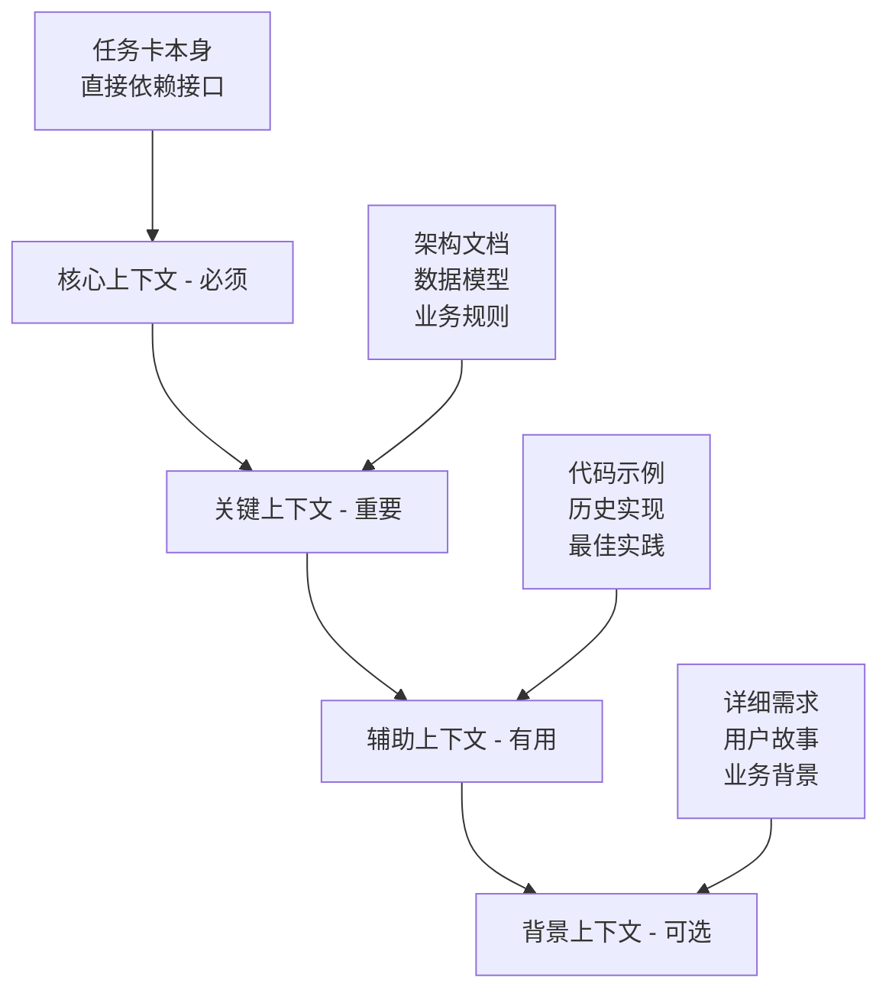

# 上下文工程：AI协作的核心技术

## 概述

**上下文工程**（Context Engineering）是PACE 1.0方法论的核心技术，它解决了AI在软件开发中面临的三大根本性局限：状态管理的不对称性、生成式推理与逻辑推理的范式冲突，以及局部注意力与分布式知识的矛盾。

## 什么是上下文工程？

上下文工程是一门设计和构建动态系统的学科，能够在正确的时间，以正确的格式，为AI提供恰当的信息和工具，使其能够完成复杂的软件开发任务。它不仅仅是信息的组织，更是人类意图和AI能力之间的桥梁。

## 为什么需要上下文工程？

### AI的本质局限性

大型语言模型（LLM）并非像人类一样理解代码逻辑，它的核心是一个基于概率的高度复杂的序列预测引擎。这导致了三大根本性冲突：

#### 1. 状态管理的不对称性
- **问题**：AI的无状态内核与软件项目的持久化状态之间存在根本矛盾
- **表现**：AI缺乏对项目全局和历史状态的记忆
- **影响**：无法理解复杂的依赖关系和隐性约定

#### 2. 生成式推理与逻辑推理的范式冲突
- **问题**：AI基于概率的模式生成与工程确定性逻辑之间的冲突
- **表现**：AI在模仿通用模式，而非执行真正的逻辑解析
- **影响**：通用解决方案常与项目特定约束不匹配

#### 3. 局部注意力与分布式知识的矛盾
- **问题**：AI的注意力机制局部性与软件系统知识分布性的冲突
- **表现**：难以理解跨文件或模块的"超距"依赖
- **影响**：处理复杂逻辑时忽略关键上下文信息

## 上下文工程的核心要素

### 1. 信息的结构化组织
**目标**：将复杂的业务需求转化为AI可理解的结构化描述

**方法**：
- 使用标准化的任务卡格式
- 明确的引用文档结构
- 清晰的输入输出定义

**示例**：
```markdown
## 任务背景
项目使用React + TypeScript + Node.js技术栈

## 相关文件
- src/components/LoginForm.tsx
- src/api/auth.ts
- docs/api-spec.md

## 依赖关系
- 依赖于用户认证API
- 被首页组件调用
```

### 2. 认知负荷的管理
**目标**：在有限的上下文窗口内传递最关键的信息

**策略**：
- **分层提供**：从概述到详细逐层展开
- **按需引用**：只包含当前任务相关的信息
- **优先级排序**：重要信息前置

**示例**：
```markdown
# 优先级1：核心逻辑
用户登录验证流程

# 优先级2：技术约束
必须使用JWT token，过期时间24小时

# 优先级3：边界情况
处理网络错误和服务器异常
```

### 3. 意图的精确传达
**目标**：确保AI理解人类的真实意图而非表面需求

**技巧**：
- **明确目标**：说明"为什么"而不仅是"做什么"
- **提供示例**：给出期望的输入输出样例
- **设定边界**：明确什么不应该做

**示例**：
```markdown
## 设计意图
创建一个可复用的登录组件，而不是一次性的页面
目标是建立统一的认证体验

## 期望行为
- 成功登录：显示加载状态，然后重定向
- 失败登录：保留用户输入，显示错误信息

## 边界约束
- 不要修改全局样式
- 不要直接操作localStorage
- 必须通过统一的auth service
```

## 实践应用

### 任务卡设计
```markdown
# 任务卡：用户登录组件

## 上下文信息
**项目类型**：React SPA应用
**技术栈**：TypeScript + Material-UI
**认证方式**：JWT + Cookie

## 引用文档
- [认证API文档](./auth-api.md)
- [UI组件规范](./ui-guidelines.md)
- [错误处理标准](./error-handling.md)

## 任务目标
为现有应用添加用户登录功能，集成到导航栏中

## 验收标准
1. 表单验证：邮箱格式、密码长度
2. 错误处理：网络错误、认证失败
3. 成功处理：存储token、更新UI状态
4. 代码质量：TypeScript类型安全、测试覆盖
```

### 上下文分层管理

**第一层：项目上下文**
- 技术栈和架构信息
- 项目规范和约定
- 全局配置和依赖

**第二层：功能上下文**
- 相关功能模块
- 接口和数据模型
- 业务逻辑规则

**第三层：任务上下文**
- 具体实现要求
- 输入输出定义
- 验收标准

## 常见问题与解决方案

### Q: 如何平衡上下文的详细程度？
**A**: 遵循"最小必要信息"原则：
- 包含完成任务必需的信息
- 排除与任务无关的细节
- 提供引用链接而非复制所有内容

### Q: AI理解错误怎么办？
**A**: 采用渐进式澄清策略：
- 检查任务卡的表述是否清晰
- 增加具体示例和反例
- 调整信息的组织结构

### Q: 如何处理复杂的依赖关系？
**A**: 使用依赖图和分步说明：
- 绘制依赖关系图
- 明确执行顺序
- 提供依赖检查清单

## 分层上下文模型

PACE 1.0采用四层上下文管理架构，确保信息的有序组织和优化利用：

### 四层上下文架构



#### 1. 核心上下文（必须）
- **任务卡内容**：完整的任务描述和规格
- **直接依赖**：必须引用的接口和数据结构
- **验收标准**：明确的完成标准和检查点
- **技术约束**：必须遵守的技术限制

#### 2. 关键上下文（重要）
- **架构文档**：相关的系统架构和设计原则
- **数据模型**：核心数据结构和关系
- **业务规则**：相关的业务逻辑和约束
- **API规范**：接口定义和调用规范

#### 3. 辅助上下文（有用）
- **代码示例**：相似功能的参考实现
- **历史实现**：项目中的既有模式
- **最佳实践**：团队和行业的最佳实践
- **工具配置**：相关工具的配置信息

#### 4. 背景上下文（可选）
- **详细需求**：完整的需求文档
- **用户故事**：用户场景和期望
- **业务背景**：项目的商业环境
- **竞品分析**：相关的市场分析

## 智能上下文压缩策略

### 关键信息提取原则

1. **保留关键决策信息**：影响实现方案的关键信息
2. **去除冗余描述**：重复和不必要的详细描述
3. **结构化组织**：将信息按逻辑关系组织
4. **分片加载**：根据需要动态加载相关上下文

### 上下文压缩技术

```typescript
interface ContextExtraction {
  // 核心信息优先级评分
  priorityScore: number;
  
  // 信息类型分类
  type: 'functional' | 'architectural' | 'business' | 'technical';
  
  // 与当前任务的相关性
  relevanceScore: number;
  
  // 压缩后的精简版本
  compressedContent: string;
}
```

## 任务卡中的上下文设计最佳实践

### 相关文件清单格式

```markdown
## 相关文件清单

### 需要查看的文件
- [AuthTypes](src/shared-kernel/auth/types.ts)：用户认证相关的类型定义和接口
- [LoginForm](src/features/user-auth/components/LoginForm.tsx)：登录表单组件实现

### 需要修改的文件
- [AuthService](src/features/user-auth/services/authService.ts)：认证服务核心逻辑，需要添加新的认证方法
- [useAuth](src/features/user-auth/hooks/useAuth.ts)：认证状态管理Hook，需要支持新的状态

### 需要创建的文件
- [LogoutButton](src/features/user-auth/components/LogoutButton.tsx)：登出按钮组件
- [AuthServiceTest](tests/unit/user-auth/authService.test.tsx)：认证服务的单元测试
```

### 技术规格的结构化描述

```markdown
## 技术规格

### 功能描述
- **核心功能**：用户邮箱和密码登录
- **输入验证**：邮箱格式和密码强度检查
- **状态管理**：登录状态的持久化存储
- **错误处理**：网络错误和认证失败的处理

### 接口定义
```typescript
// 登录请求接口
interface LoginRequest {
  email: string;
  password: string;
}

// 登录响应接口
interface LoginResponse {
  token: string;
  user: UserProfile;
  expiresAt: number;
}
```

### 数据模型
- **用户状态**：已登录/未登录/登录中/登录失败
- **用户信息**：用户ID、邮箱、角色、权限
- **会话信息**：访问令牌、刷新令牌、过期时间
```

## AI执行时的上下文管理策略

### 分步理解策略

```markdown
## AI执行指导

### 第一步：全局理解
1. 完整阅读任务卡的所有内容
2. 查看所有相关文件，建立项目全貌理解
3. 理解业务目标和技术约束

### 第二步：架构分析
1. 分析现有架构和模块关系
2. 确定新功能在架构中的位置
3. 识别需要修改的接口和依赖

### 第三步：实现规划
1. 制定详细的实现步骤
2. 确定文件创建和修改的顺序
3. 规划测试策略和验证方法
```

### 增量验证机制

```markdown
## 验证检查点

### 每个步骤完成后验证
- [ ] 代码能够正常编译
- [ ] 类型检查通过
- [ ] 单元测试通过
- [ ] 与任务卡规格一致

### 出现问题时的反馈格式
```typescript
interface ValidationFeedback {
  step: string;
  issues: Array<{
    type: 'compile_error' | 'type_error' | 'test_failure' | 'spec_deviation';
    description: string;
    suggestion: string;
  }>;
}
```
```

## 上下文版本管理

### 上下文演进追踪

```typescript
interface ContextVersion {
  version: string;
  timestamp: number;
  changes: ContextChange[];
  baseline: string; // 基准版本
}

interface ContextChange {
  type: 'add' | 'update' | 'remove';
  path: string;
  description: string;
  impact: 'high' | 'medium' | 'low';
}
```

### 上下文一致性检查

1. **引用完整性**：确保所有引用的文档都存在且有效
2. **版本兼容性**：检查引用文档的版本兼容性
3. **逻辑一致性**：验证不同文档间的逻辑一致性
4. **更新同步性**：确保相关文档的同步更新

## 常见陷阱与避免方法

### 陷阱1：上下文过载
- **表现**：任务卡包含过多不相关信息
- **影响**：AI注意力分散，影响生成质量
- **解决**：使用分层上下文模型，优先级排序

### 陷阱2：上下文不足
- **表现**：缺少关键的架构或业务信息
- **影响**：AI生成的代码不符合项目约束
- **解决**：建立上下文检查清单，确保完整性

### 陷阱3：上下文过时
- **表现**：引用的文档或代码已经过时
- **影响**：生成的代码与当前项目状态不一致
- **解决**：建立上下文版本管理和更新机制

### 陷阱4：上下文冲突
- **表现**：不同文档间存在矛盾信息
- **影响**：AI无法做出正确的判断
- **解决**：建立上下文一致性检查机制

## 工具支持

### 上下文构建器

PACE 1.0提供专门的上下文构建器工具：

- **自动文件扫描**：扫描项目文件，识别相关依赖
- **智能推荐**：基于任务内容推荐相关上下文
- **一致性检查**：自动检查上下文的完整性和一致性
- **版本管理**：跟踪上下文的变化和演进

### 集成开发环境支持

- **实时上下文提示**：在编辑任务卡时提供实时的上下文建议
- **依赖关系可视化**：可视化显示任务卡与项目文件的依赖关系
- **冲突检测**：自动检测和报告上下文冲突
- **快速导航**：在任务卡和相关文件间快速导航

## 进阶技巧

### 1. 动态上下文调整
根据AI的反馈和执行结果，动态调整上下文提供策略：
- 监控AI的理解偏差，及时调整信息组织
- 基于任务执行效果优化上下文模板
- 建立反馈循环，持续改进上下文质量

### 2. 上下文模板化
为不同类型的任务创建标准化模板：
- **Level 1任务**：标准化实现模板
- **Level 2任务**：集成协调模板
- **Level 3任务**：架构设计模板
- **Level 4任务**：创新探索模板

### 3. 上下文验证
建立系统化的上下文验证机制：
- 自动化检查上下文的完整性
- 验证引用文档的有效性
- 检测上下文间的一致性
- 评估上下文的AI友好性

## 小结

上下文工程是PACE 1.0方法论成功实施的关键技术。通过系统化的上下文设计和管理，我们可以：

1. **提升AI理解能力**：为AI提供准确、完整的工作上下文
2. **提高代码质量**：确保生成的代码符合项目约束和标准
3. **加速开发效率**：减少因上下文不当导致的返工
4. **降低协作成本**：建立标准化的人机协作接口

掌握上下文工程技术，是每个PACE 1.0实践者必须具备的核心能力。

---

**下一步**: 了解[垂直切片策略](./垂直切片.md)，学习如何将复杂项目分解为可管理的迭代单元。