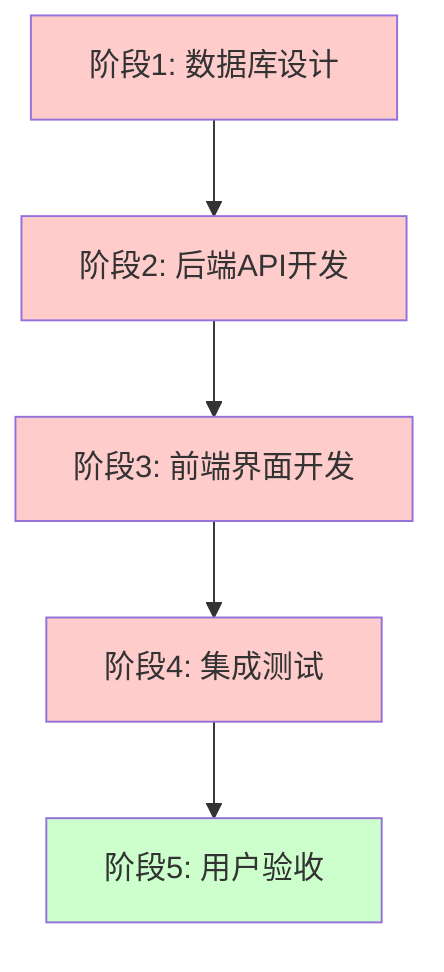
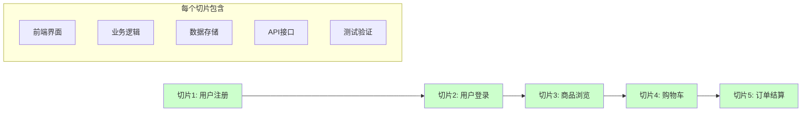
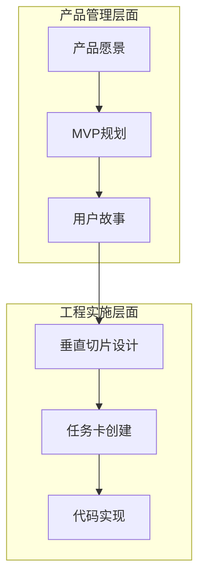
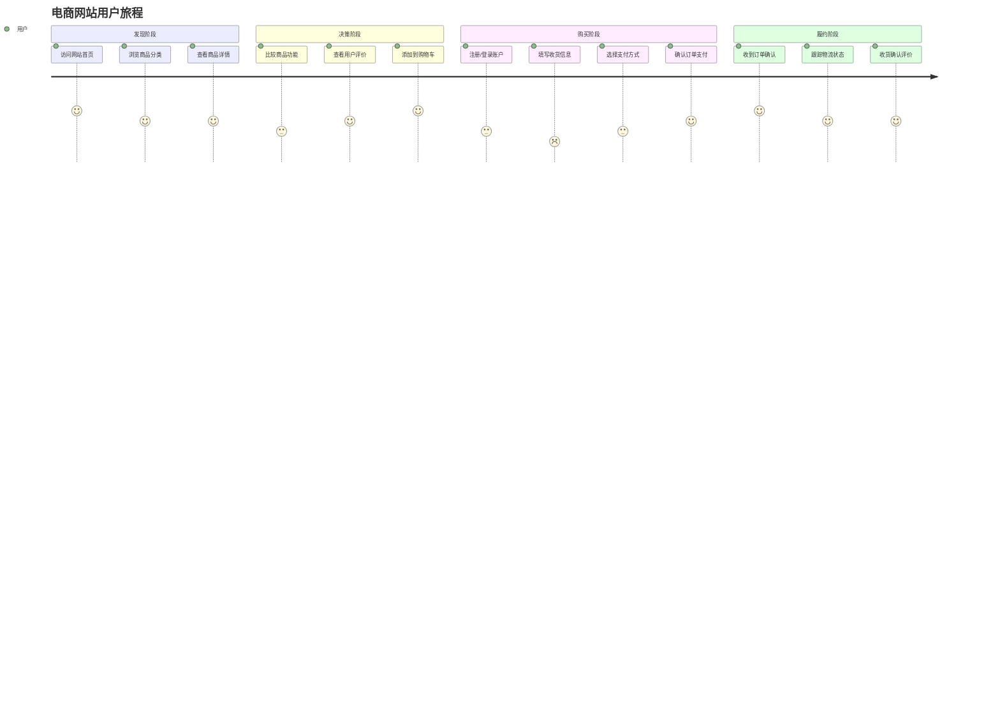
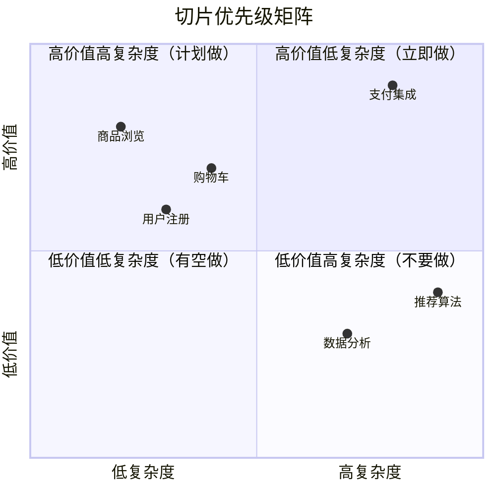
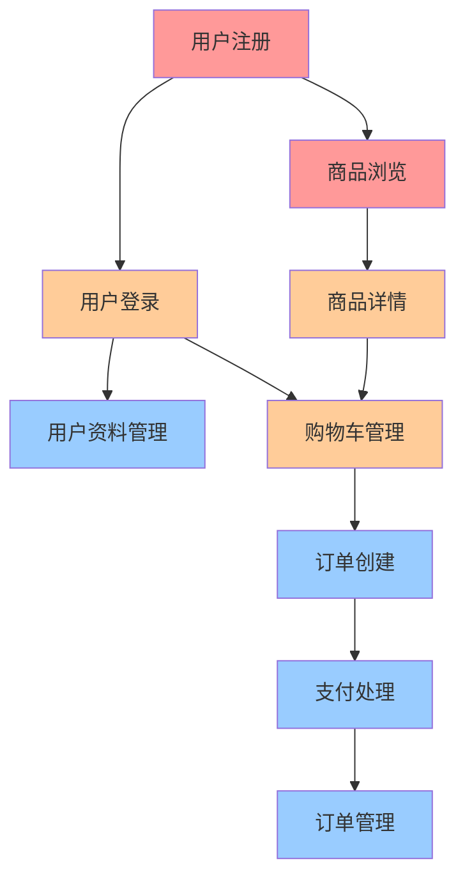

# 垂直切片策略：价值驱动的迭代开发

## 概述

垂直切片（Vertical Slicing）是PACE 1.0方法论的核心工作模式，它强调从第一天起就交付价值，通过构建一系列功能完整、端到端覆盖的小型增量来逐步实现产品目标。

## 什么是垂直切片？

垂直切片是一种软件开发策略，它将功能按照用户价值链进行切分，每个切片都包含从用户界面到数据存储的完整技术栈实现，能够独立交付并为用户创造可感知的价值。

### 核心特征

- **功能完整性**：每个切片都是一个可独立交付的功能单元
- **端到端覆盖**：从用户界面到数据存储的完整技术栈
- **价值导向**：每个切片都能为用户创造可感知的价值
- **风险分散**：通过小粒度迭代降低项目风险

## 垂直切片 vs 传统开发方式

### 传统水平分层开发



**问题**：
- 到项目后期才能看到整体效果
- 集成风险集中在最后阶段
- 用户反馈滞后，修改成本高
- 团队成员工作存在依赖关系

### PACE 1.0垂直切片开发



**优势**：
- 从第一个切片开始就有可用功能
- 持续集成，风险分散
- 早期用户反馈，快速调整
- 团队可以并行工作在不同切片

## 垂直切片 vs MVP

很多人容易将垂直切片与MVP（最小可行产品）概念混淆，但两者存在本质差异：

### MVP - 产品管理视角

| 维度 | MVP特征 |
|------|---------|
| **关注点** | 市场验证和用户反馈 |
| **目标** | 用最小成本验证商业假设 |
| **质量** | 允许"脏快"的实现方式 |
| **生命周期** | 验证完毕后可能被重写或废弃 |
| **问题导向** | "我们应该做什么产品？" |

### 垂直切片 - 工程实施视角

| 维度 | 垂直切片特征 |
|------|-------------|
| **关注点** | 代码架构和开发效率 |
| **目标** | 降低技术风险和提升交付质量 |
| **质量** | 每个切片都必须符合生产标准 |
| **生命周期** | 每个切片都成为最终产品的一部分 |
| **问题导向** | "我们应该如何做这个产品？" |

### 关系图示



## 垂直切片的设计原则

### 1. 用户价值优先

每个切片必须能够为最终用户创造可感知的价值：

```markdown
✅ 好的切片示例：
- "用户可以注册账户并收到确认邮件"
- "用户可以浏览商品列表并查看详情"
- "用户可以添加商品到购物车"

❌ 不好的切片示例：
- "完成用户表的数据库设计"
- "实现所有认证相关的API"
- "完成前端路由配置"
```

### 2. 功能边界清晰

每个切片应该有明确的功能边界，避免功能耦合：

```typescript
// 切片1：用户注册功能
interface UserRegistrationSlice {
  // 包含的功能
  features: [
    'registration_form',
    'email_validation', 
    'password_strength_check',
    'registration_api',
    'email_confirmation'
  ];
  
  // 不包含的功能
  excludes: [
    'user_login',        // 属于切片2
    'password_reset',    // 属于切片3
    'user_profile'       // 属于切片4
  ];
}
```

### 3. 技术栈一致性

每个切片都应该遵循相同的技术栈和架构模式：

```markdown
## 技术栈约定
- 前端：React + TypeScript + Material-UI
- 后端：Node.js + Express + TypeScript
- 数据库：PostgreSQL + Prisma ORM
- 认证：JWT + bcrypt
- 测试：Jest + React Testing Library

## 架构模式约定
- 前端：组件化架构 + Hooks状态管理
- 后端：分层架构（Controller-Service-Repository）
- 数据库：关系型设计 + 迁移管理
- API：RESTful设计 + OpenAPI文档
```

### 4. 可独立部署

每个切片完成后都应该能够独立部署和运行：

```yaml
# 切片部署检查清单
deployment_checklist:
  database:
    - 数据迁移脚本就绪
    - 种子数据准备完成
    - 数据库连接配置正确
    
  backend:
    - API接口正常响应
    - 业务逻辑测试通过
    - 错误处理完善
    
  frontend:
    - 页面正常渲染
    - 用户交互功能正常
    - 响应式设计适配
    
  integration:
    - 前后端集成正常
    - 端到端测试通过
    - 性能指标达标
```

## 切片规划实践指南

### 1. 用户旅程映射

从用户角度规划切片序列：



### 2. 切片优先级矩阵

使用价值-复杂度矩阵来确定切片优先级：



### 3. 切片依赖分析

识别和管理切片间的依赖关系：



## 切片实施流程

### 阶段1：切片定义

```markdown
## 切片规格模板

### 切片标识
- **切片ID**: SLICE-1.1
- **切片名称**: 用户注册功能
- **负责人**: 张三
- **预计工期**: 3-5天

### 业务价值
- **用户价值**: 新用户可以创建账户，开始使用网站服务
- **业务价值**: 建立用户基础，支撑后续个性化服务
- **技术价值**: 建立用户认证基础架构

### 功能范围
**包含功能**：
- 用户注册表单
- 邮箱格式验证
- 密码强度检查
- 用户注册API
- 邮箱确认机制

**不包含功能**：
- 用户登录（SLICE-1.2）
- 密码重置（SLICE-1.3）
- 社交登录（SLICE-2.1）

### 验收标准
1. 用户可以使用邮箱和密码注册
2. 系统验证邮箱格式和密码强度
3. 注册成功后发送确认邮件
4. 点击确认链接激活账户
5. 重复邮箱注册显示友好提示
```

### 阶段2：切片设计

```markdown
## 技术设计

### 前端组件设计
```typescript
// 组件层次结构
<RegistrationPage>
  <RegistrationForm>
    <EmailInput />
    <PasswordInput />
    <PasswordStrengthIndicator />
    <SubmitButton />
  </RegistrationForm>
  <ConfirmationMessage />
</RegistrationPage>
```

### 后端API设计
```typescript
// API接口定义
POST /api/auth/register
Request: {
  email: string;
  password: string;
  confirmPassword: string;
}
Response: {
  success: boolean;
  message: string;
  userId?: string;
}

GET /api/auth/confirm-email/:token
Response: {
  success: boolean;
  message: string;
}
```

### 数据模型设计
```sql
-- 用户表结构
CREATE TABLE users (
  id SERIAL PRIMARY KEY,
  email VARCHAR(255) UNIQUE NOT NULL,
  password_hash VARCHAR(255) NOT NULL,
  email_confirmed BOOLEAN DEFAULT FALSE,
  confirmation_token VARCHAR(255),
  created_at TIMESTAMP DEFAULT CURRENT_TIMESTAMP,
  updated_at TIMESTAMP DEFAULT CURRENT_TIMESTAMP
);
```
```

### 阶段3：切片实现

使用PACE 1.0的任务卡系统来指导AI实现：

```markdown
## 实现任务卡

### 任务背景
实现用户注册功能的完整切片，包括前端表单、后端API、数据存储和邮件确认。

### 技术约束
- 使用已定义的技术栈
- 遵循项目代码规范
- 确保类型安全
- 实现完整测试覆盖

### 实现步骤
1. 创建数据库迁移脚本
2. 实现后端注册API
3. 创建前端注册表单
4. 集成邮件确认功能
5. 编写单元测试和集成测试
6. 更新API文档

### 验证清单
- [ ] 数据库迁移成功执行
- [ ] 后端API通过Postman测试
- [ ] 前端表单正确渲染和交互
- [ ] 邮件确认流程正常工作
- [ ] 所有测试用例通过
- [ ] 代码审查通过
```

### 阶段4：切片验证

```markdown
## 切片验证检查清单

### 功能验证
- [ ] 所有验收标准得到满足
- [ ] 用户流程完整可用
- [ ] 边界条件正确处理
- [ ] 错误情况友好提示

### 技术验证
- [ ] 代码质量符合标准
- [ ] 性能指标达到要求
- [ ] 安全措施正确实施
- [ ] 文档完整更新

### 集成验证
- [ ] 与现有系统正确集成
- [ ] 不影响其他功能模块
- [ ] 数据一致性得到保证
- [ ] API接口向后兼容

### 部署验证
- [ ] 可以独立部署到测试环境
- [ ] 生产环境配置就绪
- [ ] 监控和日志正常工作
- [ ] 回滚方案准备完成
```

## 常见挑战与解决方案

### 挑战1：切片粒度难以把握

**问题描述**：切片太大导致风险集中，切片太小导致开销过大

**解决方案**：
- 使用"两个披萨"原则：一个切片的工作量不应该超过一个小团队两周的工作量
- 遵循"独立价值"原则：每个切片必须能独立为用户创造价值
- 建立切片复杂度评估标准：简单（1-3天）、中等（3-7天）、复杂（1-2周）

### 挑战2：切片间依赖复杂

**问题描述**：切片之间存在复杂的依赖关系，难以并行开发

**解决方案**：
- 优先实现基础设施切片（认证、权限、核心数据模型）
- 使用模拟（Mock）数据和接口减少依赖
- 设计松耦合的接口，允许切片独立演进
- 建立切片依赖管理和版本控制机制

### 挑战3：架构一致性保证

**问题描述**：多个切片并行开发容易导致架构不一致

**解决方案**：
- 建立"架构守护者"角色，负责架构一致性
- 制定详细的技术规范和编码标准
- 使用共享组件库和工具链
- 定期进行架构审查和重构

### 挑战4：用户体验连贯性

**问题描述**：按切片交付可能导致用户体验不连贯

**解决方案**：
- 在切片规划阶段就考虑整体用户体验
- 建立UI/UX设计系统和组件库
- 使用原型工具提前验证用户流程
- 定期进行用户体验审查和优化

## 切片管理工具和实践

### 切片看板管理

```markdown
## 切片看板示例

| 待规划 | 设计中 | 开发中 | 测试中 | 已完成 |
|--------|--------|--------|--------|--------|
| 订单管理 | 购物车 | 用户登录 | 用户注册 | 商品浏览 |
| 支付集成 | 商品搜索 | 商品详情 |  | 首页展示 |
| 用户评价 |  |  |  |  |

## 切片状态定义
- **待规划**：已识别但未开始设计
- **设计中**：正在进行技术设计和任务分解
- **开发中**：正在进行代码实现
- **测试中**：正在进行功能测试和集成验证
- **已完成**：已通过验收并部署到生产环境
```

### 切片质量度量

```typescript
interface SliceMetrics {
  // 交付指标
  delivery: {
    plannedDays: number;      // 计划天数
    actualDays: number;       // 实际天数
    deliveryOnTime: boolean;  // 是否按时交付
  };
  
  // 质量指标
  quality: {
    defectCount: number;      // 缺陷数量
    testCoverage: number;     // 测试覆盖率
    codeQualityScore: number; // 代码质量分数
  };
  
  // 价值指标
  value: {
    userAcceptance: number;   // 用户接受度
    businessValue: number;    // 业务价值评分
    technicalValue: number;   // 技术价值评分
  };
}
```

## 实战案例：在线教育平台

### 项目背景

构建一个在线教育平台，包含课程管理、用户学习、支付等功能模块。

### 切片规划

#### 切片1：课程浏览系统
- **用户价值**：用户可以发现和了解课程内容
- **功能范围**：课程列表、分类筛选、课程详情页
- **技术栈**：React组件 + Node.js API + PostgreSQL
- **验收标准**：
  - 用户可以浏览所有可用课程
  - 支持按分类、难度、价格筛选
  - 课程详情页展示完整信息
- **预期周期**：5-7天

#### 切片2：用户注册登录
- **用户价值**：用户可以创建个人账户并安全登录
- **功能范围**：注册表单、登录验证、密码重置
- **技术栈**：JWT认证 + 邮件服务 + 用户管理
- **验收标准**：
  - 支持邮箱和密码注册登录
  - 邮箱验证和密码重置功能
  - 登录状态持久化
- **预期周期**：4-6天

#### 切片3：课程购买系统
- **用户价值**：用户可以购买感兴趣的课程
- **功能范围**：购物车、支付集成、订单管理
- **技术栈**：支付网关集成 + 订单系统 + 库存管理
- **验收标准**：
  - 支持多种支付方式
  - 购买成功后自动开通课程权限
  - 完整的订单历史记录
- **预期周期**：7-10天

#### 切片4：视频学习系统
- **用户价值**：用户可以观看已购买的课程视频
- **功能范围**：视频播放器、学习进度、笔记功能
- **技术栈**：视频流媒体 + 进度跟踪 + 用户行为分析
- **验收标准**：
  - 流畅的视频播放体验
  - 自动保存学习进度
  - 支持视频笔记和书签
- **预期周期**：8-12天

### 实施策略

#### 第一阶段（第1-2周）
并行开发切片1和切片2，因为它们相对独立且都是基础功能。

#### 第二阶段（第3-4周）
基于前两个切片的基础，开发切片3，建立完整的商业闭环。

#### 第三阶段（第5-6周）
完成切片4，形成完整的学习平台体验。

### 任务卡示例

```markdown
# 任务卡：课程详情页实现

## 任务标识
- **任务ID**: SLICE-1.1-DETAIL-PAGE
- **所属切片**: 切片1 - 课程浏览系统
- **复杂度级别**: Level 2
- **预估时间**: 1-2天

## 业务上下文
### 用户价值
用户可以查看课程的详细信息，包括课程介绍、讲师信息、课程大纲等，帮助用户做出购买决策。

### 验收标准
1. 显示课程标题、价格、讲师信息
2. 展示课程大纲和学习目标
3. 显示用户评价和评分
4. 提供"立即购买"和"加入购物车"按钮
5. 响应式设计，支持移动端

## 技术规格
### 前端组件设计
```tsx
<CourseDetailPage>
  <CourseHeader 
    title={course.title}
    price={course.price}
    instructor={course.instructor}
  />
  <CourseContent 
    description={course.description}
    curriculum={course.curriculum}
    objectives={course.objectives}
  />
  <CourseReviews reviews={course.reviews} />
  <PurchaseActions 
    onBuyNow={handlePurchase}
    onAddToCart={handleAddToCart}
  />
</CourseDetailPage>
```

### API接口定义
```typescript
GET /api/courses/:courseId
Response: {
  id: string;
  title: string;
  description: string;
  price: number;
  instructor: {
    name: string;
    avatar: string;
    bio: string;
  };
  curriculum: Array<{
    chapter: string;
    lessons: string[];
    duration: number;
  }>;
  reviews: Array<{
    userId: string;
    rating: number;
    comment: string;
    date: string;
  }>;
}
```

## 相关文件清单
### 需要查看的文件
- [CourseTypes](src/types/course.ts)：课程相关的类型定义
- [APIClient](src/services/api.ts)：API调用的统一封装
- [ThemeConfig](src/styles/theme.ts)：UI主题配置

### 需要创建的文件
- [CourseDetailPage](src/pages/CourseDetailPage.tsx)：课程详情页面组件
- [CourseHeader](src/components/course/CourseHeader.tsx)：课程头部信息组件
- [CourseContent](src/components/course/CourseContent.tsx)：课程内容展示组件
- [CourseReviews](src/components/course/CourseReviews.tsx)：课程评价组件
- [PurchaseActions](src/components/course/PurchaseActions.tsx)：购买操作组件

### 需要修改的文件
- [Router](src/App.tsx)：添加课程详情页路由
- [CourseService](src/services/courseService.ts)：添加获取课程详情的方法

## 开发自检清单
- [ ] 组件正确渲染课程信息
- [ ] API调用正常工作
- [ ] 响应式设计在不同设备上正常显示
- [ ] 购买按钮点击事件正确处理
- [ ] 加载状态和错误处理完善
- [ ] 单元测试覆盖主要功能
- [ ] 代码符合项目规范
```

## 小结

垂直切片策略是PACE 1.0方法论的核心实践，它通过价值驱动的迭代开发模式，帮助团队：

1. **快速交付价值**：从第一个切片开始就为用户创造价值
2. **降低项目风险**：通过小粒度迭代分散技术和业务风险
3. **提高团队效率**：支持团队并行工作和持续集成
4. **改善用户体验**：通过早期用户反馈持续优化产品

掌握垂直切片策略，是成功实施PACE 1.0方法论的关键能力。

---

**下一步**: 了解[任务复杂度分级](../工作流程/任务复杂度分级.md)，学习如何根据任务特点选择合适的人机协作模式。