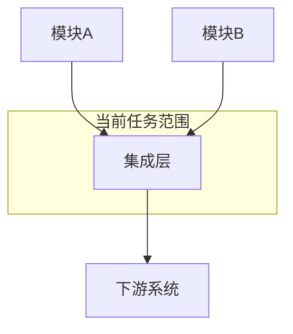
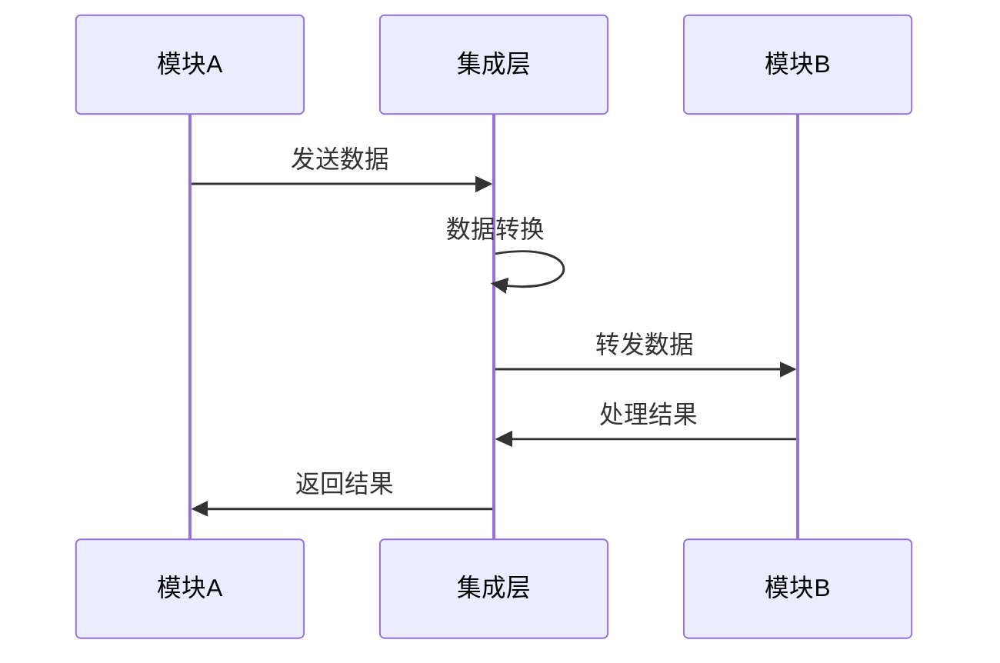

# Level 2 任务卡模板 - 集成协调任务

> **适用场景**：多模块交互，需要考虑系统一致性  
> **AI参与度**：60-80%  
> **人类角色**：架构设计、接口定义、集成策略  
> **协作模式**：人类设计框架，AI实现细节

---

## 任务标识

- **任务ID**：[项目前缀]-L2-[模块]-[序号]
- **任务标题**：[简洁描述任务目标]
- **任务类型**：Level 2 - 集成协调任务
- **优先级**：P0/P1/P2/P3
- **预估工作量**：[小时数]
- **负责人**：[工程师姓名]
- **架构审查人**：[架构师姓名]
- **创建日期**：[YYYY-MM-DD]
- **截止日期**：[YYYY-MM-DD]

## 业务上下文

### 业务目标
[描述要解决的核心业务问题，重点说明为什么需要多模块协作]

### 用户价值
[从最终用户角度描述整个集成功能带来的价值]

### 业务规则
[列出涉及多个模块的业务逻辑和约束条件]
- 跨模块规则1：...
- 数据一致性规则：...
- 业务流程规则：...

### 验收标准
[明确的、可测试的完成标准，特别关注集成点]
- [ ] 功能集成标准：各模块协作正常
- [ ] 数据一致性标准：数据在模块间保持一致
- [ ] 性能标准：集成后性能满足要求
- [ ] 容错标准：异常情况下的处理机制

## 技术规格

### 架构设计

#### 系统架构图


#### 模块交互设计
[详细描述各模块之间的交互方式和数据流]

### 接口定义

#### 核心接口
```typescript
// 主要集成接口
interface IntegrationInterface {
  // 接口定义
}

// 数据交换格式
interface DataExchange {
  // 数据结构
}
```

#### API规范
```typescript
// API接口设计
GET/POST /api/integration/endpoint
Request: {
  // 请求参数
}
Response: {
  // 响应数据
}
```

### 数据流设计
[描述数据在各模块间的流转过程]



### 技术约束
- **性能要求**：[集成后的性能指标]
- **可靠性要求**：[容错和恢复机制]
- **一致性要求**：[数据一致性保证]
- **安全要求**：[跨模块的安全措施]

## 集成策略

### 集成模式
[选择的集成模式及其原因]
- **同步集成**：实时数据交换场景
- **异步集成**：非实时批处理场景
- **事件驱动**：基于事件的松耦合集成

### 错误处理策略
[跨模块的错误处理和恢复机制]
- 重试机制：...
- 补偿机制：...
- 降级策略：...

### 数据一致性保证
[确保跨模块数据一致性的方法]
- 事务管理：...
- 最终一致性：...
- 冲突解决：...

## 相关文件清单

### 需要查看的文件
- [模块A接口](路径)：模块A的接口定义和实现
- [模块B接口](路径)：模块B的接口定义和实现
- [数据模型](路径)：共享数据模型定义
- [架构文档](路径)：系统整体架构设计

### 需要修改的文件
- [集成配置](路径)：添加新的集成配置
- [路由配置](路径)：更新API路由配置
- [中间件](路径)：修改或添加集成中间件

### 需要创建的文件
- [集成服务](路径)：核心集成逻辑实现
- [数据转换器](路径)：模块间数据转换逻辑
- [集成测试](路径)：端到端集成测试

## 实现指导

### 实现分阶段

#### 阶段1：接口设计和模拟
1. 设计清晰的模块接口
2. 创建Mock实现用于测试
3. 验证接口设计的合理性

#### 阶段2：核心集成逻辑
1. 实现数据转换逻辑
2. 实现错误处理机制
3. 实现基本的集成流程

#### 阶段3：完善和优化
1. 添加性能优化
2. 完善错误处理
3. 添加监控和日志

### 代码示例
```typescript
// 集成服务示例
class IntegrationService {
  async integrate(data: InputData): Promise<OutputData> {
    try {
      // 数据验证
      this.validateInput(data);
      
      // 数据转换
      const transformedData = this.transformData(data);
      
      // 调用下游模块
      const result = await this.callDownstream(transformedData);
      
      // 结果处理
      return this.processResult(result);
    } catch (error) {
      // 错误处理
      return this.handleError(error);
    }
  }
}
```

### 最佳实践
- 保持接口的稳定性和向后兼容
- 实现完整的错误处理和重试机制
- 添加详细的日志记录
- 使用配置文件管理集成参数

## 质量保障

### 测试策略
- **单元测试**：各个组件的独立测试
- **集成测试**：模块间交互的端到端测试
- **性能测试**：集成后的性能验证
- **容错测试**：异常情况下的行为验证

### 集成测试用例
```typescript
describe('集成测试', () => {
  it('应该正确处理正常的集成流程', async () => {
    // 测试正常流程
  });
  
  it('应该正确处理网络异常', async () => {
    // 测试异常处理
  });
  
  it('应该保证数据一致性', async () => {
    // 测试数据一致性
  });
});
```

### 验证清单
- [ ] 接口设计合理且稳定
- [ ] 数据转换正确无误
- [ ] 错误处理完整有效
- [ ] 性能满足要求
- [ ] 数据一致性得到保证
- [ ] 集成测试全部通过

### 监控指标
| 指标名称 | 目标值 | 监控方法 |
|----------|--------|----------|
| 响应时间 | < 500ms | APM监控 |
| 成功率 | > 99.9% | 错误日志统计 |
| 吞吐量 | > 1000 QPS | 性能监控 |

## AI执行指导

### 人类预先设计内容
在AI开始实现前，人类需要完成：
1. 整体架构设计和模块划分
2. 关键接口的定义和规范
3. 数据流和集成策略的确定
4. 错误处理和容错机制的设计

### AI实现重点
1. **接口实现**：根据设计实现具体的接口逻辑
2. **数据转换**：实现模块间的数据转换逻辑
3. **错误处理**：实现完整的错误处理机制
4. **测试编写**：编写comprehensive的集成测试

### 实现步骤
1. **理解架构**：深入理解整体架构和设计意图
2. **实现接口**：按照规范实现各个接口
3. **集成测试**：编写和执行集成测试
4. **性能优化**：根据测试结果进行性能调优
5. **文档更新**：更新集成相关的技术文档

### 质量检查点
每个阶段完成后验证：
- [ ] 接口实现符合设计规范
- [ ] 集成测试通过
- [ ] 性能指标达标
- [ ] 错误处理机制有效

## 开发自检清单

### 架构一致性
- [ ] 实现符合整体架构设计
- [ ] 模块边界清晰合理
- [ ] 接口设计稳定一致
- [ ] 依赖关系简单明确

### 集成质量
- [ ] 数据流正确无误
- [ ] 错误处理完整有效
- [ ] 性能满足要求
- [ ] 容错机制正常工作

### 测试完整性
- [ ] 单元测试覆盖所有组件
- [ ] 集成测试覆盖主要流程
- [ ] 异常场景得到充分测试
- [ ] 性能测试验证通过

### 运维就绪
- [ ] 监控指标完整
- [ ] 日志记录详细
- [ ] 配置管理规范
- [ ] 部署文档完整

---

## 模板使用说明

### 适用场景示例
- API服务集成
- 数据库操作协调
- 前后端状态同步
- 第三方服务集成
- 微服务间通信

### 关键成功因素
- 人类负责架构设计和接口定义
- AI专注于实现细节和测试编写
- 重视集成测试和错误处理
- 持续关注性能和一致性

### 常见挑战
- 模块间依赖复杂
- 数据一致性难以保证
- 错误传播和处理
- 性能瓶颈识别

---

*此模板基于PACE 1.0方法论设计，适用于需要多模块协调的集成任务*