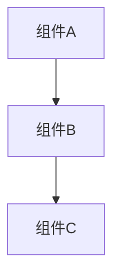
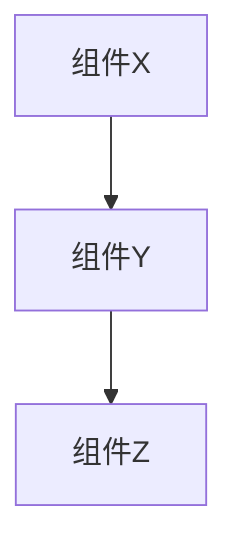
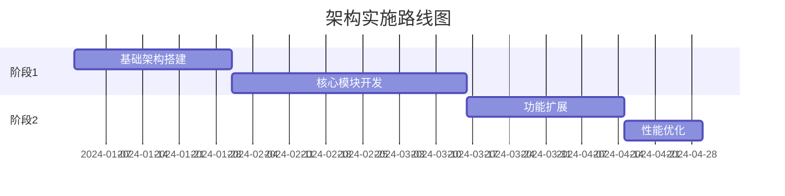

# Level 3 任务卡模板 - 架构设计任务

> **适用场景**：需要权衡多个因素，涉及技术选型  
> **AI参与度**：30-50%  
> **人类角色**：需求分析、方案评估、决策制定  
> **协作模式**：人机深度协作，共同探索方案

---

## 任务标识

- **任务ID**：[项目前缀]-L3-[模块]-[序号]
- **任务标题**：[简洁描述架构设计目标]
- **任务类型**：Level 3 - 架构设计任务
- **优先级**：P0/P1/P2/P3
- **预估工作量**：[天数]
- **负责人**：[架构师/高级工程师姓名]
- **评审团队**：[评审人员列表]
- **创建日期**：[YYYY-MM-DD]
- **决策截止日期**：[YYYY-MM-DD]

## 问题定义

### 核心问题
[清晰描述需要通过架构设计解决的核心问题]

### 问题背景
[详细描述问题产生的背景和现状]

### 影响范围
[描述问题对系统、团队、业务的影响范围]
- **技术影响**：...
- **业务影响**：...
- **团队影响**：...

### 约束条件
[列出设计过程中必须考虑的约束]
- **技术约束**：现有技术栈、团队技能等
- **业务约束**：时间、预算、合规要求等
- **资源约束**：人力、硬件、第三方服务等

## 需求分析

### 功能需求
[详细描述系统需要实现的功能]

#### 核心功能
- 功能1：详细描述和要求
- 功能2：详细描述和要求

#### 非功能需求
- **性能要求**：[具体的性能指标和目标]
- **可扩展性**：[未来扩展的需求和方向]
- **可用性**：[系统可用性要求]
- **安全性**：[安全相关的需求]
- **兼容性**：[与现有系统的兼容要求]

### 质量属性优先级
[按重要性排序的质量属性]
1. **首要考虑**：[最重要的质量属性]
2. **重要考虑**：[次要重要的质量属性]
3. **一般考虑**：[一般重要的质量属性]

## 架构探索

### 候选方案

#### 方案A：[方案名称]
**核心思路**：[简述方案的核心思路]

**架构图**：

**优势**：
- 优势1：具体描述
- 优势2：具体描述

**劣势**：
- 劣势1：具体描述
- 劣势2：具体描述

**适用场景**：[描述最适合这个方案的场景]

#### 方案B：[方案名称]
**核心思路**：[简述方案的核心思路]

**架构图**：

**优势**：
- 优势1：具体描述
- 优势2：具体描述

**劣势**：
- 劣势1：具体描述
- 劣势2：具体描述

**适用场景**：[描述最适合这个方案的场景]

#### 方案C：[方案名称]
[按照同样格式描述第三个方案]

### 技术选型分析

#### 技术栈对比
| 技术选项 | 优势 | 劣势 | 团队熟悉度 | 生态成熟度 | 推荐度 |
|----------|------|------|------------|------------|--------|
| 选项1 | ... | ... | 高/中/低 | 高/中/低 | ⭐⭐⭐⭐⭐ |
| 选项2 | ... | ... | 高/中/低 | 高/中/低 | ⭐⭐⭐⭐ |

#### 关键技术决策
1. **数据存储选择**：[数据库选择及原因]
2. **架构模式选择**：[微服务/单体/混合架构选择]
3. **通信方式选择**：[同步/异步通信方式]
4. **部署策略选择**：[容器化/云原生/传统部署]

## 方案评估

### 评估维度
[定义评估各方案的维度和权重]

| 评估维度 | 权重 | 方案A得分 | 方案B得分 | 方案C得分 |
|----------|------|-----------|-----------|-----------|
| 性能 | 25% | 8 | 7 | 9 |
| 可扩展性 | 20% | 9 | 6 | 8 |
| 开发效率 | 20% | 7 | 9 | 6 |
| 维护成本 | 15% | 6 | 8 | 7 |
| 技术风险 | 10% | 8 | 9 | 6 |
| 学习成本 | 10% | 9 | 7 | 5 |
| **总分** | **100%** | **7.8** | **7.6** | **7.4** |

### 风险分析

#### 方案A风险
| 风险项 | 影响程度 | 发生概率 | 风险等级 | 缓解措施 |
|--------|----------|----------|----------|----------|
| 风险1 | 高 | 中 | 高 | 具体缓解措施 |
| 风险2 | 中 | 低 | 低 | 具体缓解措施 |

#### 方案B风险
[按照同样格式分析方案B的风险]

### 原型验证

#### POC计划
[概念验证的计划和目标]
- **验证目标**：关键技术可行性
- **验证范围**：核心功能模块
- **验证周期**：[时间安排]
- **成功标准**：[明确的验证标准]

#### 验证结果
[POC的执行结果和结论]

## AI协作指导

### 人类主导的决策点
[明确哪些决策必须由人类主导]
1. **架构模式选择**：基于业务特点和团队能力
2. **技术栈选择**：考虑长期维护和团队技能
3. **质量属性权衡**：基于业务优先级决策
4. **风险接受度**：基于项目和团队风险承受能力

### AI辅助分析内容
[AI可以协助进行的分析工作]
1. **技术调研**：收集和整理技术选项的资料
2. **方案对比**：帮助分析不同方案的优劣
3. **最佳实践**：提供行业最佳实践参考
4. **风险识别**：协助识别潜在的技术风险

### 协作流程
1. **问题定义**：人类定义核心问题和约束
2. **方案生成**：人机协作生成候选方案
3. **分析评估**：AI协助分析，人类进行判断
4. **决策制定**：人类基于分析结果做出决策
5. **方案细化**：AI协助细化实施方案

## 决策记录

### 最终选择
**选定方案**：[最终选择的方案名称]

**选择理由**：[详细说明选择这个方案的原因]

### 决策依据
[支持这个决策的关键因素]
1. **技术因素**：...
2. **业务因素**：...
3. **团队因素**：...
4. **风险因素**：...

### 备选方案
[记录未选择方案的原因，便于未来参考]

### 决策权衡
[记录在决策过程中的主要权衡考虑]

## 实施计划

### 架构路线图

### 关键里程碑
- **里程碑1**：[日期] - [达成目标]
- **里程碑2**：[日期] - [达成目标]
- **里程碑3**：[日期] - [达成目标]

### 资源需求
- **人力资源**：[所需人员和技能]
- **技术资源**：[所需的技术环境和工具]
- **外部依赖**：[需要的外部支持或服务]

## 监控和评估

### 成功指标
[定义架构实施成功的具体指标]
- **技术指标**：性能、可用性等技术KPI
- **业务指标**：交付效率、缺陷率等业务KPI
- **团队指标**：开发效率、学习曲线等团队KPI

### 评估计划
[定期评估架构效果的计划]
- **评估周期**：[多久评估一次]
- **评估内容**：[评估哪些方面]
- **调整机制**：[如何根据评估结果调整]

## 开发指导

### 架构原则
[基于选定方案制定的开发原则]
1. **模块化原则**：...
2. **接口设计原则**：...
3. **数据管理原则**：...
4. **错误处理原则**：...

### 技术规范
[具体的技术实施规范]
- **编码规范**：...
- **接口规范**：...
- **测试规范**：...
- **部署规范**：...

### 质量门禁
[确保架构质量的检查点]
- [ ] 模块设计符合架构原则
- [ ] 接口设计满足规范要求
- [ ] 性能指标达到预期目标
- [ ] 安全措施得到正确实施

---

## 模板使用说明

### 适用场景示例
- 系统架构重构
- 新系统架构设计
- 技术栈升级决策
- 性能优化方案设计
- 微服务拆分设计

### 关键成功因素
- 充分的需求分析和问题定义
- 多方案对比和客观评估
- 重视风险分析和缓解措施
- 基于数据和事实的决策

### 常见陷阱
- 过度设计或设计不足
- 忽视非功能需求
- 缺乏风险评估
- 决策缺乏量化依据

---

*此模板基于PACE 1.0方法论设计，适用于需要深度思考和权衡的架构设计任务*