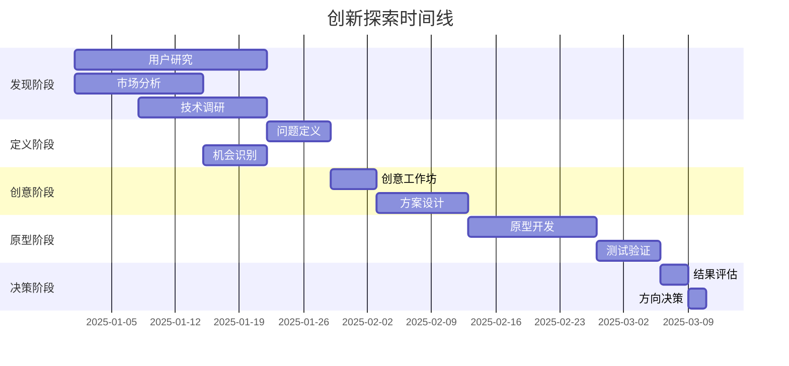

# Level 4 任务卡模板 - 创新探索任务

> **适用场景**：高度不确定性，需要创造性思维  
> **AI参与度**：10-30%  
> **人类角色**：创意产生、价值判断、战略决策  
> **协作模式**：人类主导创新，AI提供支持

---

## 任务标识

- **任务ID**：[项目前缀]-L4-[领域]-[序号]
- **任务标题**：[简洁描述探索目标]
- **任务类型**：Level 4 - 创新探索任务
- **优先级**：P0/P1/P2/P3
- **探索周期**：[周/月]
- **项目负责人**：[创新负责人姓名]
- **专家顾问**：[领域专家列表]
- **创建日期**：[YYYY-MM-DD]
- **阶段评估日期**：[YYYY-MM-DD]

## 探索背景

### 创新机会
[描述识别到的创新机会和市场空间]

### 现状分析
[分析当前的技术现状和业务现状]
- **技术现状**：...
- **市场现状**：...
- **竞争现状**：...
- **用户现状**：...

### 探索动机
[说明为什么需要进行这项创新探索]
- **战略价值**：...
- **技术价值**：...
- **商业价值**：...
- **用户价值**：...

### 探索假设
[列出需要验证的核心假设]
1. **技术假设**：[技术可行性假设]
2. **市场假设**：[市场需求假设]
3. **商业假设**：[商业模式假设]
4. **用户假设**：[用户接受度假设]

## 目标与成功指标

### 探索目标
[明确的探索目标和期望成果]

#### 主要目标
- 目标1：[具体、可衡量的目标]
- 目标2：[具体、可衡量的目标]

#### 次要目标
- 目标3：[补充性目标]
- 目标4：[补充性目标]

### 成功指标
[定义探索成功的具体指标]

#### 定量指标
- 指标1：[具体数值目标]
- 指标2：[具体数值目标]

#### 定性指标
- 指标3：[定性评估标准]
- 指标4：[定性评估标准]

### 最小成功标准
[定义最低限度的成功标准]
- [ ] 最低标准1：[必须达成的最低要求]
- [ ] 最低标准2：[必须达成的最低要求]

## 探索范围

### 技术探索范围
[明确技术探索的边界和重点]

#### 核心技术领域
- 领域1：[技术领域和探索重点]
- 领域2：[技术领域和探索重点]

#### 技术调研方向
- 方向1：[调研的具体方向]
- 方向2：[调研的具体方向]

### 市场探索范围
[明确市场探索的范围]

#### 目标市场
- 主要市场：[主要目标市场描述]
- 次要市场：[次要目标市场描述]

#### 用户群体
- 核心用户：[核心用户群体特征]
- 潜在用户：[潜在用户群体特征]

### 业务探索范围
[明确业务模式探索的范围]

#### 商业模式
- 模式1：[商业模式选项]
- 模式2：[商业模式选项]

#### 价值链分析
[分析价值创造和传递的链条]

## 探索方法论

### 设计思维流程
[采用设计思维方法进行创新探索]

#### 阶段1：共情理解 (Empathize)
**目标**：深入理解用户需求和痛点

**方法**：
- 用户访谈：[访谈计划和目标]
- 用户观察：[观察方法和重点]
- 市场调研：[调研范围和方法]

**产出**：
- 用户画像
- 需求洞察报告
- 痛点分析

#### 阶段2：问题定义 (Define)
**目标**：明确需要解决的核心问题

**方法**：
- 问题收敛：[问题归纳和优先级排序]
- POV陈述：[观点陈述的形成]
- HMW问题：[How Might We问题的设计]

**产出**：
- 核心问题陈述
- 设计挑战定义
- 机会点识别

#### 阶段3：创意产生 (Ideate)
**目标**：产生创新的解决方案想法

**方法**：
- 头脑风暴：[头脑风暴session计划]
- 创意工作坊：[工作坊设计和执行]
- 跨界借鉴：[从其他领域获取灵感]

**产出**：
- 创意清单
- 解决方案概念
- 创新点识别

#### 阶段4：原型制作 (Prototype)
**目标**：快速构建可测试的原型

**方法**：
- 低保真原型：[纸质原型、线框图]
- 中保真原型：[交互原型、mockup]
- 高保真原型：[功能性原型、演示系统]

**产出**：
- 原型系列
- 演示材料
- 技术验证

#### 阶段5：测试验证 (Test)
**目标**：验证解决方案的有效性

**方法**：
- 用户测试：[用户测试计划]
- A/B测试：[对比测试方案]
- 专家评估：[专家评审机制]

**产出**：
- 测试报告
- 改进建议
- 验证结论

### 精益创新方法
[结合精益创新的Build-Measure-Learn循环]

#### Build：构建
- **最小可行产品(MVP)**：[MVP设计和开发]
- **快速迭代**：[迭代周期和节奏]
- **资源最小化**：[资源使用优化]

#### Measure：测量
- **关键指标**：[核心测量指标]
- **数据收集**：[数据收集方法]
- **效果评估**：[效果评估标准]

#### Learn：学习
- **洞察提取**：[从数据中提取洞察]
- **假设验证**：[验证初始假设]
- **方向调整**：[基于学习调整方向]

## 风险与挑战

### 技术风险
| 风险项 | 影响程度 | 发生概率 | 风险等级 | 应对策略 |
|--------|----------|----------|----------|----------|
| 技术可行性 | 高 | 中 | 高 | POC验证 |
| 技术成熟度 | 中 | 高 | 中 | 技术调研 |
| 集成复杂度 | 中 | 中 | 中 | 架构设计 |

### 市场风险
| 风险项 | 影响程度 | 发生概率 | 风险等级 | 应对策略 |
|--------|----------|----------|----------|----------|
| 市场接受度 | 高 | 中 | 高 | 用户验证 |
| 竞争压力 | 中 | 高 | 中 | 差异化定位 |
| 市场时机 | 高 | 低 | 中 | 趋势分析 |

### 资源风险
[识别资源相关的风险和应对措施]

### 组织风险
[识别组织层面的风险和应对措施]

## AI协作策略

### 人类主导的创新活动
[明确哪些创新活动必须由人类主导]

#### 创意生成
- **概念设计**：基于深度洞察的创意概念
- **价值判断**：对创意价值和可行性的判断
- **战略决策**：关于方向和资源的战略决策

#### 用户研究
- **用户访谈**：深度的用户访谈和洞察
- **需求解读**：对用户真实需求的解读
- **体验设计**：用户体验的创新设计

### AI辅助支持内容
[AI可以提供的支持和协助]

#### 信息支持
- **技术调研**：技术趋势和最佳实践调研
- **市场分析**：市场数据分析和趋势识别
- **竞品分析**：竞争对手分析和对比

#### 分析支持
- **数据分析**：用户行为数据的分析
- **模式识别**：从大量信息中识别模式
- **可行性分析**：技术和商业可行性分析

#### 执行支持
- **原型开发**：技术原型的快速开发
- **测试执行**：自动化测试的执行
- **文档整理**：探索过程的文档整理

### 协作界面设计
[设计人机协作的有效界面]

#### 信息交换
- **需求传递**：如何向AI清晰传递创新需求
- **结果反馈**：AI如何有效反馈分析结果
- **迭代优化**：基于反馈的持续优化

#### 决策支持
- **方案对比**：AI辅助的方案对比分析
- **风险评估**：AI支持的风险识别和评估
- **效果预测**：基于历史数据的效果预测

## 探索计划

### 阶段规划

### 关键里程碑
- **M1**: [日期] - 用户需求洞察完成
- **M2**: [日期] - 创新概念确定
- **M3**: [日期] - 原型验证完成
- **M4**: [日期] - 可行性评估完成
- **M5**: [日期] - 战略决策制定

### 资源计划
#### 人力资源
- **创新团队**：[核心团队成员和角色]
- **专家顾问**：[领域专家支持]
- **用户代表**：[目标用户参与]

#### 技术资源
- **开发环境**：[原型开发所需环境]
- **测试平台**：[用户测试所需平台]
- **分析工具**：[数据分析所需工具]

#### 预算资源
- **研发费用**：[原型开发费用]
- **调研费用**：[市场调研费用]
- **测试费用**：[用户测试费用]

## 评估与决策

### 评估框架
[建立系统的评估框架]

#### 技术维度
- **可行性**：技术实现的可行性评估
- **创新性**：技术方案的创新程度
- **可扩展性**：解决方案的扩展潜力

#### 商业维度
- **市场潜力**：市场机会的大小
- **商业模式**：商业模式的可行性
- **投资回报**：预期的投资回报率

#### 用户维度
- **用户价值**：为用户创造的价值
- **用户体验**：用户使用体验
- **用户接受度**：用户的接受程度

### 决策标准
[明确的go/no-go决策标准]

#### Go标准
- [ ] 技术可行性得到验证
- [ ] 市场需求得到确认
- [ ] 商业模式清晰可行
- [ ] 用户价值显著
- [ ] 资源投入合理

#### No-Go标准
- [ ] 技术风险过高
- [ ] 市场需求不足
- [ ] 商业模式不清晰
- [ ] 竞争劣势明显
- [ ] 资源投入过大

### 决策流程
[决策的具体流程和责任人]

## 知识管理

### 经验沉淀
[将探索过程中的经验进行沉淀]

#### 成功经验
- **有效方法**：证明有效的探索方法
- **关键洞察**：重要的用户和市场洞察
- **创新模式**：可复用的创新模式

#### 失败教训
- **无效尝试**：证明无效的尝试和原因
- **踩过的坑**：遇到的问题和解决方案
- **风险预警**：需要注意的风险点

### 知识传承
[如何将探索的知识传承给团队]

#### 文档化
- **探索报告**：完整的探索过程报告
- **最佳实践**：总结的最佳实践指南
- **模板工具**：可复用的模板和工具

#### 分享交流
- **内部分享**：团队内部的经验分享
- **跨团队交流**：与其他团队的交流
- **外部交流**：行业内的经验交流

---

## 模板使用说明

### 适用场景示例
- 新技术验证和探索
- 创新产品概念设计
- 新市场机会探索
- 用户体验创新
- 商业模式创新

### 关键成功因素
- 保持开放和实验的心态
- 快速迭代和学习
- 用户中心的设计思维
- 跨学科的团队协作
- 数据驱动的决策

### 常见挑战
- 不确定性的管理
- 创新与执行的平衡
- 资源投入的控制
- 团队期望的管理

---

*此模板基于PACE 1.0方法论设计，适用于高度不确定性的创新探索任务*