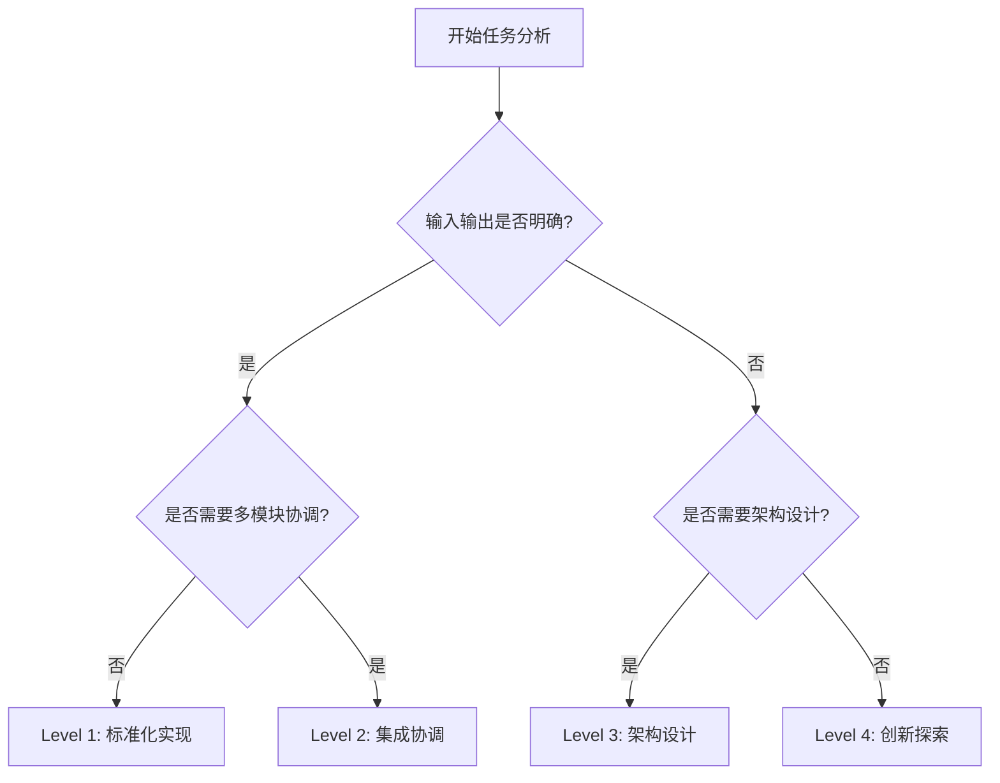

# PACE 1.0 任务卡模板使用指南

## 概述

PACE 1.0方法论提供四个层级的任务卡模板，每个模板针对不同复杂度和AI适用性的任务设计。本指南帮助您选择合适的模板并正确使用。

## 四级任务分类体系

### 快速选择指南

| 任务特征 | Level 1 | Level 2 | Level 3 | Level 4 |
|----------|---------|---------|---------|---------|
| **复杂度** | 简单 | 中等 | 复杂 | 高度复杂 |
| **不确定性** | 低 | 中等 | 高 | 极高 |
| **标准化程度** | 高度标准化 | 部分标准化 | 需要设计 | 需要创新 |
| **AI参与度** | 85-95% | 60-80% | 30-50% | 10-30% |
| **预估时间** | 几小时-1天 | 1-3天 | 3-7天 | 1周以上 |

### Level 1 - 标准化实现任务

**何时使用**：
- 明确的输入输出规格
- 有标准实现模式
- 技术方案相对固定
- 主要是编码实现工作

**典型场景**：
```markdown
✅ 适合的任务：
- 创建用户注册API
- 实现商品列表页面
- 编写数据转换函数
- 实现标准CRUD操作
- 编写单元测试

❌ 不适合的任务：
- 设计系统架构
- 选择技术栈
- 创新用户体验
- 制定业务策略
```

**使用要点**：
- 提供详细的技术规格
- 明确输入输出定义
- 包含完整的验收标准
- 提供相关文件列表

### Level 2 - 集成协调任务

**何时使用**：
- 需要多个模块协作
- 涉及系统集成
- 需要考虑一致性
- 有一定的架构设计

**典型场景**：
```markdown
✅ 适合的任务：
- 用户认证与权限集成
- 支付系统集成
- 前后端状态同步
- 微服务间通信
- 数据库操作协调

❌ 不适合的任务：
- 简单的组件实现
- 复杂的架构决策
- 全新技术探索
- 业务模式创新
```

**使用要点**：
- 人类设计集成架构
- 明确模块间接口
- 定义数据流和时序
- AI实现具体集成逻辑

### Level 3 - 架构设计任务

**何时使用**：
- 需要技术选型
- 涉及架构决策
- 需要权衡多个因素
- 对系统有重大影响

**典型场景**：
```markdown
✅ 适合的任务：
- 系统架构设计
- 数据库设计方案
- 性能优化策略
- 安全架构设计
- 技术栈选择

❌ 不适合的任务：
- 具体代码实现
- 标准化操作
- 纯创新性探索
- 业务策略制定
```

**使用要点**：
- 人类主导方案设计
- AI协助分析和对比
- 重视风险评估
- 基于数据做决策

### Level 4 - 创新探索任务

**何时使用**：
- 高度不确定性
- 需要创造性思维
- 探索性质的工作
- 涉及战略决策

**典型场景**：
```markdown
✅ 适合的任务：
- 新产品概念设计
- 用户体验创新
- 新技术可行性探索
- 商业模式创新
- 算法创新研究

❌ 不适合的任务：
- 标准功能实现
- 确定的技术集成
- 明确的架构实施
- 已知的解决方案
```

**使用要点**：
- 人类主导创新过程
- AI提供信息支持
- 重视用户研究
- 快速迭代验证

## 任务卡创建流程

### 1. 任务分析阶段

#### 步骤1：确定任务类型
```markdown
分析问题：
- 这个任务的主要目标是什么？
- 技术方案是否已经明确？
- 需要多少创新性思考？
- 涉及哪些系统或模块？

判断标准：
- 输入输出是否明确？→ Level 1
- 需要多模块协调？→ Level 2  
- 需要架构设计决策？→ Level 3
- 需要创新和探索？→ Level 4
```

#### 步骤2：评估复杂度
- **简单**：几小时内可完成，方案明确
- **中等**：1-3天，需要一些设计工作
- **复杂**：3-7天，需要重要决策
- **极复杂**：超过1周，高度不确定

### 2. 模板选择和填写

#### 选择模板
根据任务分析结果选择对应的模板文件：
- `level-1-标准化实现.md`
- `level-2-集成协调.md`
- `level-3-架构设计.md`
- `level-4-创新探索.md`

#### 填写要点
```markdown
通用填写原则：
1. 任务标识：使用统一的命名规范
2. 业务上下文：解释为什么要做这件事
3. 技术规格：详细描述具体要求
4. 验收标准：明确完成的标准
5. 相关文件：列出所有相关的文件路径

Level特定要点：
- Level 1：重点关注输入输出规格
- Level 2：重点关注模块间交互设计
- Level 3：重点关注方案对比和决策
- Level 4：重点关注探索方法和成功指标
```

### 3. 评审和批准

#### 评审清单
- [ ] 任务分级正确
- [ ] 业务目标清晰
- [ ] 技术规格完整
- [ ] 验收标准明确
- [ ] 相关文件列表完整
- [ ] 风险评估充分

#### 评审流程
1. **自我检查**：创建者按照清单自检
2. **同行评审**：团队成员交叉评审
3. **架构评审**：Level 3/4任务需要架构师评审
4. **最终批准**：项目负责人最终批准

## 最佳实践

### 任务卡质量标准

#### 信息完整性
- **上下文充分**：AI能理解任务背景
- **规格明确**：技术要求清晰无歧义
- **边界清晰**：明确什么要做，什么不做
- **验收具体**：可测试的完成标准

#### AI友好性
- **结构化描述**：使用标准化格式
- **引用明确**：相关文件路径准确
- **示例丰富**：提供代码示例和参考
- **检查点清晰**：明确的验证步骤

### 常见问题与解决方案

#### 问题1：任务分级不准确
**表现**：任务复杂度超出预期，执行困难

**解决方案**：
- 重新评估任务的不确定性
- 将复杂任务拆分为多个简单任务
- 提升任务级别或调整期望

#### 问题2：上下文信息不足
**表现**：AI生成的代码不符合项目约束

**解决方案**：
- 补充相关文档引用
- 添加项目特定的约束说明
- 提供更多代码示例

#### 问题3：验收标准模糊
**表现**：完成标准存在争议

**解决方案**：
- 使用具体、可测试的标准
- 添加反例说明
- 定义明确的质量门禁

#### 问题4：文件引用错误
**表现**：AI无法找到相关文件

**解决方案**：
- 验证所有文件路径的准确性
- 使用相对路径而非绝对路径
- 及时更新过期的文件引用

### 团队协作规范

#### 任务卡命名规范
```markdown
格式：[项目前缀]-L[级别]-[模块]-[序号]

示例：
- ECOM-L1-AUTH-001：电商项目Level1认证模块第1个任务
- BLOG-L2-CMS-003：博客项目Level2内容管理第3个任务
- SAAS-L3-ARCH-001：SaaS项目Level3架构设计第1个任务
```

#### 版本控制规范
- 任务卡作为项目文档纳入版本控制
- 使用Pull Request进行任务卡评审
- 任务完成后标记任务卡状态
- 保留历史版本用于经验总结

#### 协作流程规范
1. **创建**：负责人创建任务卡草稿
2. **评审**：团队评审任务卡内容
3. **批准**：项目负责人批准执行
4. **执行**：AI或团队执行任务
5. **验收**：按照验收标准检查结果
6. **归档**：将任务卡和结果归档

## 工具支持

### 推荐工具
- **Markdown编辑器**：VS Code、Typora等
- **图表工具**：Mermaid、Draw.io等
- **项目管理**：Jira、Trello、GitHub Projects等
- **文档协作**：Notion、Confluence等

### 自动化支持
- **模板生成器**：自动生成标准化任务卡
- **质量检查器**：自动检查任务卡完整性
- **进度跟踪**：自动跟踪任务执行状态
- **效果分析**：分析任务卡执行效果

## 持续改进

### 效果评估
定期评估任务卡的使用效果：
- **完成质量**：任务完成的质量水平
- **时间预估**：预估时间与实际时间的偏差
- **AI效果**：AI协作的有效性
- **团队满意度**：团队对流程的满意度

### 模板演进
基于使用反馈持续改进模板：
- 收集团队使用反馈
- 分析常见问题和改进点
- 更新模板内容和格式
- 发布新版本并培训团队

---

## 快速参考

### 选择决策树


### 质量检查清单
- [ ] 任务分级合适
- [ ] 业务目标明确
- [ ] 技术规格详细
- [ ] 验收标准清晰
- [ ] 文件引用正确
- [ ] 风险识别充分
- [ ] 预估时间合理

---

*通过正确使用PACE 1.0任务卡模板，您可以显著提升AI协作的效果和项目交付的质量*