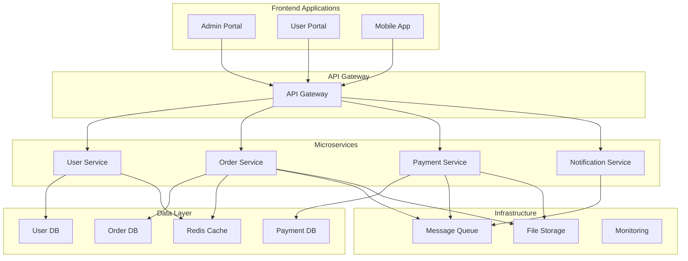
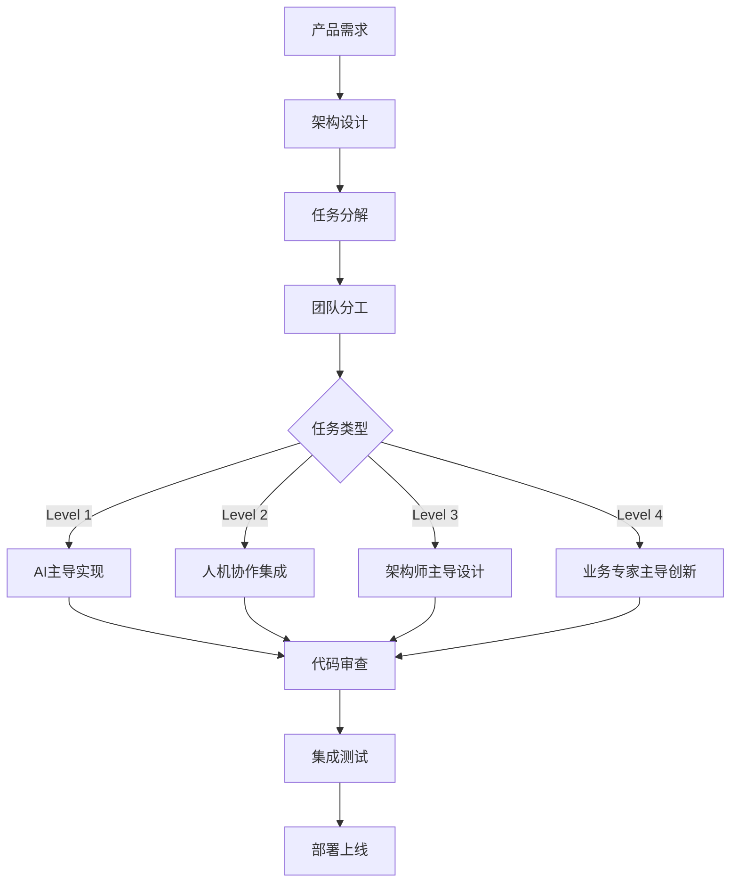

# 企业应用项目结构模板

## 概述

这是一个基于PACE 1.0方法论设计的企业级应用项目结构模板，支持大型团队协作和AI协作开发。适用于复杂的企业业务系统、ERP、CRM等大型应用。

## 项目结构

```
enterprise-app-template/
├── docs/                           # 项目文档
│   ├── architecture/              # 架构文档
│   │   ├── system-overview.md     # 系统概览
│   │   ├── microservices.md       # 微服务架构
│   │   ├── data-architecture.md   # 数据架构
│   │   └── security-architecture.md # 安全架构
│   ├── api/                       # API文档
│   │   ├── user-service.md        # 用户服务API
│   │   ├── order-service.md       # 订单服务API
│   │   └── payment-service.md     # 支付服务API
│   ├── deployment/                # 部署文档
│   │   ├── k8s-deployment.md      # Kubernetes部署
│   │   ├── ci-cd.md               # CI/CD流程
│   │   └── monitoring.md          # 监控运维
│   └── business/                  # 业务文档
│       ├── requirements.md        # 需求规格
│       ├── user-stories.md        # 用户故事
│       └── workflows.md           # 业务流程
├── specs/                          # 任务卡规格文档
│   ├── user-management/           # 用户管理模块
│   │   ├── slice-1.1-user-auth.spec.md
│   │   └── slice-1.2-user-profile.spec.md
│   ├── order-management/          # 订单管理模块
│   │   ├── slice-2.1-order-creation.spec.md
│   │   └── slice-2.2-order-processing.spec.md
│   └── shared/                    # 共享功能
│       └── slice-0.1-common-components.spec.md
├── services/                       # 微服务
│   ├── user-service/              # 用户服务
│   │   ├── src/
│   │   ├── tests/
│   │   ├── Dockerfile
│   │   └── package.json
│   ├── order-service/             # 订单服务
│   │   ├── src/
│   │   ├── tests/
│   │   ├── Dockerfile
│   │   └── package.json
│   ├── payment-service/           # 支付服务
│   ├── notification-service/      # 通知服务
│   └── api-gateway/               # API网关
├── web-apps/                       # 前端应用
│   ├── admin-portal/              # 管理后台
│   │   ├── src/
│   │   ├── public/
│   │   └── package.json
│   ├── user-portal/               # 用户门户
│   ├── mobile-app/                # 移动应用
│   └── shared-components/         # 共享组件库
├── shared/                         # 共享代码库
│   ├── types/                     # 共享类型定义
│   ├── utils/                     # 共享工具函数
│   ├── config/                    # 共享配置
│   └── schemas/                   # 数据模式定义
├── infrastructure/                 # 基础设施
│   ├── docker/                    # Docker配置
│   │   ├── docker-compose.yml
│   │   └── docker-compose.dev.yml
│   ├── k8s/                       # Kubernetes配置
│   │   ├── deployments/
│   │   ├── services/
│   │   └── ingress/
│   ├── terraform/                 # Terraform配置
│   └── scripts/                   # 部署脚本
├── tests/                          # 端到端测试
│   ├── e2e/                       # 端到端测试
│   ├── integration/               # 集成测试
│   └── performance/               # 性能测试
├── monitoring/                     # 监控配置
│   ├── prometheus/
│   ├── grafana/
│   └── alerting/
├── .github/                        # GitHub配置
│   ├── workflows/                 # CI/CD工作流
│   └── templates/                 # Issue和PR模板
├── scripts/                        # 构建和部署脚本
├── package.json                    # 根项目配置
├── lerna.json                      # Lerna配置
├── nx.json                         # Nx配置
└── README.md                       # 项目说明
```

## 技术架构

### 整体架构


### 技术栈

#### 后端服务
- **运行时**: Node.js 18+ + TypeScript
- **框架**: Express.js / Fastify
- **数据库**: PostgreSQL + Prisma ORM
- **缓存**: Redis
- **消息队列**: RabbitMQ / Apache Kafka
- **搜索引擎**: Elasticsearch
- **文件存储**: AWS S3 / MinIO

#### 前端应用
- **框架**: React 18 + TypeScript
- **状态管理**: Redux Toolkit / Zustand
- **UI库**: Ant Design / Material-UI
- **构建工具**: Vite / Webpack
- **移动端**: React Native

#### DevOps和基础设施
- **容器化**: Docker + Kubernetes
- **CI/CD**: GitHub Actions / GitLab CI
- **监控**: Prometheus + Grafana
- **日志**: ELK Stack
- **API网关**: Kong / Traefik
- **服务网格**: Istio (可选)

#### 开发工具
- **Monorepo**: Nx / Lerna
- **代码质量**: ESLint + Prettier + SonarQube
- **测试**: Jest + Cypress
- **文档**: GitBook / Confluence

## 快速开始

### 1. 环境准备
```bash
# 确保已安装必要工具
node --version    # >= 18.0.0
npm --version     # >= 9.0.0
docker --version
kubectl version --client

# 全局安装工具
npm install -g nx lerna
```

### 2. 项目初始化
```bash
# 克隆模板
git clone <template-repo> my-enterprise-app
cd my-enterprise-app

# 安装依赖
npm install

# 初始化开发环境
npm run setup:dev
```

### 3. 启动开发环境
```bash
# 启动基础设施服务（数据库、Redis、消息队列等）
docker-compose -f infrastructure/docker/docker-compose.dev.yml up -d

# 启动所有微服务
nx run-many --target=dev --all

# 启动前端应用
nx run admin-portal:dev
nx run user-portal:dev
```

### 4. 构建和部署
```bash
# 构建所有服务
nx run-many --target=build --all

# 运行测试
nx run-many --target=test --all

# 部署到开发环境
npm run deploy:dev

# 部署到生产环境
npm run deploy:prod
```

## Monorepo管理

### Nx工作区配置
```json
{
  "version": 2,
  "projects": {
    "user-service": "services/user-service",
    "order-service": "services/order-service",
    "payment-service": "services/payment-service",
    "admin-portal": "web-apps/admin-portal",
    "user-portal": "web-apps/user-portal",
    "shared-types": "shared/types",
    "shared-utils": "shared/utils"
  },
  "defaultProject": "admin-portal"
}
```

### 项目间依赖管理
```typescript
// shared/types中的共享类型
export interface User {
  id: string;
  email: string;
  firstName: string;
  lastName: string;
  role: UserRole;
}

// user-service中使用共享类型
import { User } from '@shared/types';

export class UserService {
  async createUser(userData: CreateUserDto): Promise<User> {
    // 实现逻辑
  }
}
```

### 脚本和命令
```json
{
  "scripts": {
    "dev": "nx run-many --target=dev --all",
    "build": "nx run-many --target=build --all",
    "test": "nx run-many --target=test --all",
    "lint": "nx run-many --target=lint --all",
    "setup:dev": "scripts/setup-dev.sh",
    "deploy:dev": "scripts/deploy-dev.sh",
    "deploy:prod": "scripts/deploy-prod.sh"
  }
}
```

## 微服务设计

### 服务拆分原则
1. **业务边界**: 按照业务领域拆分
2. **数据边界**: 每个服务拥有独立的数据库
3. **团队边界**: 符合团队组织结构
4. **技术边界**: 考虑技术栈和性能需求

### 服务间通信
```typescript
// 同步通信 - HTTP/REST
export class OrderService {
  constructor(
    private userServiceClient: UserServiceClient,
    private paymentServiceClient: PaymentServiceClient
  ) {}

  async createOrder(orderData: CreateOrderDto): Promise<Order> {
    // 验证用户
    const user = await this.userServiceClient.getUser(orderData.userId);
    
    // 创建订单
    const order = await this.orderRepository.create(orderData);
    
    // 异步处理支付
    await this.messageQueue.publish('order.created', {
      orderId: order.id,
      amount: order.total
    });
    
    return order;
  }
}

// 异步通信 - 消息队列
export class PaymentService {
  @MessageHandler('order.created')
  async handleOrderCreated(message: OrderCreatedEvent): Promise<void> {
    // 处理支付逻辑
    const payment = await this.processPayment(message);
    
    // 发送支付结果
    await this.messageQueue.publish('payment.completed', {
      orderId: message.orderId,
      paymentId: payment.id,
      status: payment.status
    });
  }
}
```

### API网关配置
```yaml
# Kong网关配置示例
services:
  - name: user-service
    url: http://user-service:3001
    routes:
      - name: user-routes
        paths:
          - /api/users
  
  - name: order-service
    url: http://order-service:3002
    routes:
      - name: order-routes
        paths:
          - /api/orders

plugins:
  - name: rate-limiting
    config:
      minute: 100
  - name: cors
  - name: jwt
```

## 前端架构

### 多应用架构
```typescript
// 共享组件库
export { Button, Input, Modal } from '@shared/components';

// 管理后台应用
import { Button } from '@shared/components';

export const AdminDashboard: React.FC = () => {
  return (
    <div className="admin-dashboard">
      <Button variant="primary">管理按钮</Button>
    </div>
  );
};

// 用户门户应用
import { Button } from '@shared/components';

export const UserDashboard: React.FC = () => {
  return (
    <div className="user-dashboard">
      <Button variant="secondary">用户按钮</Button>
    </div>
  );
};
```

### 状态管理策略
```typescript
// 全局状态管理
interface AppState {
  auth: AuthState;
  user: UserState;
  orders: OrderState;
}

// 模块化Store
export const useAuthStore = create<AuthState>((set, get) => ({
  user: null,
  token: null,
  login: async (credentials) => {
    const response = await authAPI.login(credentials);
    set({ user: response.user, token: response.token });
  },
  logout: () => set({ user: null, token: null })
}));
```

## PACE 1.0集成

### 企业级任务卡管理
1. **模块化组织**: 按业务模块组织任务卡
2. **跨服务协调**: Level 2任务处理服务间集成
3. **架构决策**: Level 3任务处理重要架构决策
4. **业务创新**: Level 4任务探索新业务模式

### 大团队协作流程


### 质量保障体系
1. **多层次测试**: 单元测试、集成测试、端到端测试
2. **代码质量**: 自动化代码质量检查
3. **性能监控**: 实时性能和错误监控
4. **安全审计**: 定期安全审计和漏洞扫描

## 部署和运维

### Kubernetes部署
```yaml
# user-service部署配置
apiVersion: apps/v1
kind: Deployment
metadata:
  name: user-service
spec:
  replicas: 3
  selector:
    matchLabels:
      app: user-service
  template:
    metadata:
      labels:
        app: user-service
    spec:
      containers:
      - name: user-service
        image: my-registry/user-service:latest
        ports:
        - containerPort: 3001
        env:
        - name: DATABASE_URL
          valueFrom:
            secretKeyRef:
              name: db-secret
              key: url
        resources:
          requests:
            memory: "256Mi"
            cpu: "250m"
          limits:
            memory: "512Mi"
            cpu: "500m"
```

### CI/CD流水线
```yaml
# GitHub Actions工作流
name: CI/CD Pipeline

on:
  push:
    branches: [main, develop]
  pull_request:
    branches: [main]

jobs:
  test:
    runs-on: ubuntu-latest
    steps:
      - uses: actions/checkout@v3
      - uses: actions/setup-node@v3
        with:
          node-version: '18'
      - run: npm ci
      - run: nx run-many --target=test --all
      - run: nx run-many --target=lint --all

  build:
    needs: test
    runs-on: ubuntu-latest
    steps:
      - uses: actions/checkout@v3
      - run: nx run-many --target=build --all
      - run: docker build -t my-app .

  deploy:
    needs: build
    runs-on: ubuntu-latest
    if: github.ref == 'refs/heads/main'
    steps:
      - run: kubectl apply -f k8s/
```

### 监控和可观测性
```typescript
// 应用监控
import { createPrometheusMetrics } from '@prometheus/client';

const metrics = createPrometheusMetrics({
  requestDuration: new Histogram({
    name: 'http_request_duration_seconds',
    help: 'HTTP request duration in seconds',
    labelNames: ['method', 'route', 'status']
  }),
  
  requestCount: new Counter({
    name: 'http_requests_total',
    help: 'Total number of HTTP requests',
    labelNames: ['method', 'route', 'status']
  })
});

// 中间件
export const metricsMiddleware = (req: Request, res: Response, next: NextFunction) => {
  const start = Date.now();
  
  res.on('finish', () => {
    const duration = (Date.now() - start) / 1000;
    metrics.requestDuration.observe(
      { method: req.method, route: req.route?.path, status: res.statusCode },
      duration
    );
    metrics.requestCount.inc({
      method: req.method, 
      route: req.route?.path, 
      status: res.statusCode
    });
  });
  
  next();
};
```

## 最佳实践

### 代码组织
1. **领域驱动设计**: 按业务领域组织代码
2. **依赖注入**: 使用IoC容器管理依赖
3. **配置外部化**: 环境配置外部化管理
4. **错误处理**: 统一的错误处理策略

### 性能优化
1. **缓存策略**: 多层缓存设计
2. **数据库优化**: 索引优化和查询优化
3. **负载均衡**: 服务负载均衡
4. **CDN加速**: 静态资源CDN加速

### 安全实践
1. **认证授权**: OAuth 2.0 + JWT
2. **API安全**: API限流和防护
3. **数据加密**: 敏感数据加密存储
4. **安全审计**: 定期安全审计

### 团队协作
1. **代码规范**: 统一的代码风格和规范
2. **文档管理**: 完善的技术文档
3. **知识分享**: 定期的技术分享
4. **代码审查**: 严格的代码审查流程

---

这个企业应用模板为大型、复杂的企业级应用开发提供了完整的项目结构和最佳实践指南，支持大团队协作和PACE 1.0方法论的有效实施。