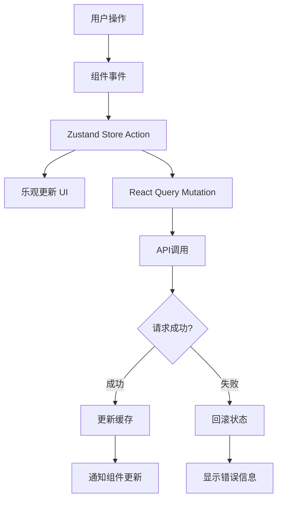

# L2-STATE-001: 任务状态管理集成

## 任务标识
- **任务ID**: L2-STATE-001
- **任务类型**: Level 2 - 集成协调
- **优先级**: P0
- **预估工作量**: 6小时
- **负责人**: 全栈开发
- **创建日期**: 2024-01-11
- **截止日期**: 2024-01-11

## 业务上下文

### 业务目标
建立完整的任务状态管理系统，实现前端状态管理与后端API的无缝集成，确保数据的一致性和实时性。

### 用户价值
用户的任务操作（创建、更新、删除）能够实时反映在界面上，数据持久化存储，多页面间状态同步，提供流畅的用户体验。

### 业务规则
- 所有任务操作必须同时更新前端状态和后端数据
- 网络错误时提供友好的错误提示和重试机制
- 支持乐观更新，提升用户体验
- 状态变更需要有加载指示和成功反馈
- 支持离线操作的基础架构

### 验收标准
- [ ] 任务CRUD操作前后端状态完全同步
- [ ] 网络错误时有合适的错误处理和用户提示
- [ ] 乐观更新机制工作正常，失败时能正确回滚
- [ ] 加载状态和成功提示用户体验良好
- [ ] 状态管理性能优秀，无不必要的重渲染
- [ ] 多组件间状态共享正常工作
- [ ] 数据缓存策略有效，减少不必要的API调用

## 技术规格

### 功能描述
实现基于Zustand的状态管理系统，集成React Query进行服务端状态管理，建立前后端数据流的完整链路。

### 技术要求

| 类别 | 描述 | 必需 |
|------|------|------|
| 状态管理 | Zustand + React Query | ✅ |
| API客户端 | Axios + 拦截器 | ✅ |
| 错误处理 | 统一错误处理机制 | ✅ |
| 缓存策略 | React Query缓存配置 | ✅ |
| 类型安全 | TypeScript类型定义 | ✅ |

### 接口定义

#### 状态管理Store
```typescript
interface TaskStore {
  // 状态
  tasks: Task[];
  selectedTask: Task | null;
  filters: TaskFilters;
  pagination: PaginationState;
  
  // UI状态
  loading: boolean;
  error: string | null;
  
  // 操作方法
  setTasks: (tasks: Task[]) => void;
  addTask: (task: Task) => void;
  updateTask: (id: number, updates: Partial<Task>) => void;
  removeTask: (id: number) => void;
  setSelectedTask: (task: Task | null) => void;
  setFilters: (filters: Partial<TaskFilters>) => void;
  setLoading: (loading: boolean) => void;
  setError: (error: string | null) => void;
  
  // 异步操作
  fetchTasks: () => Promise<void>;
  createTask: (data: CreateTaskRequest) => Promise<Task>;
  updateTaskAsync: (id: number, updates: UpdateTaskRequest) => Promise<Task>;
  deleteTask: (id: number) => Promise<void>;
}
```

#### API服务接口
```typescript
interface TaskService {
  getTasks(filters?: TaskFilters): Promise<{ data: Task[]; total: number }>;
  getTask(id: number): Promise<Task>;
  createTask(data: CreateTaskRequest): Promise<Task>;
  updateTask(id: number, data: UpdateTaskRequest): Promise<Task>;
  deleteTask(id: number): Promise<void>;
}
```

#### React Query集成
```typescript
interface TaskQueries {
  useTasks: (filters?: TaskFilters) => UseQueryResult<Task[]>;
  useTask: (id: number) => UseQueryResult<Task>;
  useCreateTask: () => UseMutationResult<Task, Error, CreateTaskRequest>;
  useUpdateTask: () => UseMutationResult<Task, Error, { id: number; data: UpdateTaskRequest }>;
  useDeleteTask: () => UseMutationResult<void, Error, number>;
}
```

### 数据流设计


## 实现指导

### 核心实现

#### 1. Zustand Store实现
```typescript
import { create } from 'zustand';
import { devtools, subscribeWithSelector } from 'zustand/middleware';
import { immer } from 'zustand/middleware/immer';

interface TaskStore {
  // State
  tasks: Task[];
  selectedTask: Task | null;
  filters: TaskFilters;
  loading: boolean;
  error: string | null;
  
  // Actions
  setTasks: (tasks: Task[]) => void;
  addTask: (task: Task) => void;
  updateTask: (id: number, updates: Partial<Task>) => void;
  removeTask: (id: number) => void;
  setSelectedTask: (task: Task | null) => void;
  setFilters: (filters: Partial<TaskFilters>) => void;
  setLoading: (loading: boolean) => void;
  setError: (error: string | null) => void;
}

export const useTaskStore = create<TaskStore>()(
  devtools(
    subscribeWithSelector(
      immer((set, get) => ({
        // Initial state
        tasks: [],
        selectedTask: null,
        filters: {
          status: undefined,
          priority: undefined,
          search: '',
        },
        loading: false,
        error: null,
        
        // Actions
        setTasks: (tasks) => {
          set((state) => {
            state.tasks = tasks;
            state.error = null;
          });
        },
        
        addTask: (task) => {
          set((state) => {
            state.tasks.unshift(task);
          });
        },
        
        updateTask: (id, updates) => {
          set((state) => {
            const index = state.tasks.findIndex(task => task.id === id);
            if (index !== -1) {
              Object.assign(state.tasks[index], updates);
            }
          });
        },
        
        removeTask: (id) => {
          set((state) => {
            state.tasks = state.tasks.filter(task => task.id !== id);
            if (state.selectedTask?.id === id) {
              state.selectedTask = null;
            }
          });
        },
        
        setSelectedTask: (task) => {
          set((state) => {
            state.selectedTask = task;
          });
        },
        
        setFilters: (filters) => {
          set((state) => {
            Object.assign(state.filters, filters);
          });
        },
        
        setLoading: (loading) => {
          set((state) => {
            state.loading = loading;
          });
        },
        
        setError: (error) => {
          set((state) => {
            state.error = error;
          });
        },
      }))
    ),
    { name: 'task-store' }
  )
);
```

#### 2. API服务层
```typescript
import axios from 'axios';

const api = axios.create({
  baseURL: '/api/v1',
  timeout: 10000,
});

// 请求拦截器
api.interceptors.request.use(
  (config) => {
    // 添加认证token等
    return config;
  },
  (error) => Promise.reject(error)
);

// 响应拦截器
api.interceptors.response.use(
  (response) => response.data,
  (error) => {
    const message = error.response?.data?.message || '网络错误，请稍后重试';
    return Promise.reject(new Error(message));
  }
);

export const taskService = {
  async getTasks(filters?: TaskFilters) {
    const params = new URLSearchParams();
    if (filters?.status) params.append('status', filters.status);
    if (filters?.priority) params.append('priority', filters.priority);
    if (filters?.search) params.append('search', filters.search);
    
    return api.get(`/tasks?${params}`);
  },
  
  async getTask(id: number) {
    return api.get(`/tasks/${id}`);
  },
  
  async createTask(data: CreateTaskRequest) {
    return api.post('/tasks', data);
  },
  
  async updateTask(id: number, data: UpdateTaskRequest) {
    return api.put(`/tasks/${id}`, data);
  },
  
  async deleteTask(id: number) {
    return api.delete(`/tasks/${id}`);
  },
};
```

#### 3. React Query集成
```typescript
import { useQuery, useMutation, useQueryClient } from '@tanstack/react-query';
import { taskService } from './taskService';
import { useTaskStore } from './taskStore';

export const taskQueryKeys = {
  all: ['tasks'] as const,
  lists: () => [...taskQueryKeys.all, 'list'] as const,
  list: (filters: TaskFilters) => [...taskQueryKeys.lists(), filters] as const,
  details: () => [...taskQueryKeys.all, 'detail'] as const,
  detail: (id: number) => [...taskQueryKeys.details(), id] as const,
};

export function useTasks(filters?: TaskFilters) {
  return useQuery({
    queryKey: taskQueryKeys.list(filters || {}),
    queryFn: () => taskService.getTasks(filters),
    staleTime: 5 * 60 * 1000, // 5分钟
    cacheTime: 10 * 60 * 1000, // 10分钟
  });
}

export function useCreateTask() {
  const queryClient = useQueryClient();
  const { addTask, setError } = useTaskStore();
  
  return useMutation({
    mutationFn: taskService.createTask,
    onMutate: async (newTask) => {
      // 乐观更新
      const optimisticTask = {
        id: Date.now(), // 临时ID
        ...newTask,
        status: 'todo' as const,
        createdAt: new Date(),
        updatedAt: new Date(),
      };
      
      addTask(optimisticTask);
      return { optimisticTask };
    },
    onSuccess: (data, variables, context) => {
      // 替换临时任务
      const { updateTask, removeTask } = useTaskStore.getState();
      removeTask(context?.optimisticTask.id!);
      addTask(data);
      
      // 使缓存失效
      queryClient.invalidateQueries({ queryKey: taskQueryKeys.lists() });
    },
    onError: (error, variables, context) => {
      // 回滚乐观更新
      if (context?.optimisticTask) {
        const { removeTask } = useTaskStore.getState();
        removeTask(context.optimisticTask.id);
      }
      
      setError(error.message);
    },
  });
}

export function useUpdateTask() {
  const queryClient = useQueryClient();
  const { updateTask, setError } = useTaskStore();
  
  return useMutation({
    mutationFn: ({ id, data }: { id: number; data: UpdateTaskRequest }) =>
      taskService.updateTask(id, data),
    onMutate: async ({ id, data }) => {
      // 保存当前状态用于回滚
      const { tasks } = useTaskStore.getState();
      const currentTask = tasks.find(task => task.id === id);
      
      // 乐观更新
      updateTask(id, data);
      
      return { currentTask };
    },
    onSuccess: (data, { id }) => {
      // 更新为服务器返回的数据
      updateTask(id, data);
      
      // 使缓存失效
      queryClient.invalidateQueries({ queryKey: taskQueryKeys.detail(id) });
      queryClient.invalidateQueries({ queryKey: taskQueryKeys.lists() });
    },
    onError: (error, { id }, context) => {
      // 回滚到之前的状态
      if (context?.currentTask) {
        updateTask(id, context.currentTask);
      }
      
      setError(error.message);
    },
  });
}
```

#### 4. 自定义Hook集成
```typescript
export function useTaskOperations() {
  const createMutation = useCreateTask();
  const updateMutation = useUpdateTask();
  const deleteMutation = useDeleteTask();
  
  const createTask = useCallback(async (data: CreateTaskRequest) => {
    try {
      await createMutation.mutateAsync(data);
      toast.success('任务创建成功');
    } catch (error) {
      toast.error('创建失败，请重试');
    }
  }, [createMutation]);
  
  const updateTask = useCallback(async (id: number, data: UpdateTaskRequest) => {
    try {
      await updateMutation.mutateAsync({ id, data });
      toast.success('任务更新成功');
    } catch (error) {
      toast.error('更新失败，请重试');
    }
  }, [updateMutation]);
  
  const deleteTask = useCallback(async (id: number) => {
    try {
      await deleteMutation.mutateAsync(id);
      toast.success('任务删除成功');
    } catch (error) {
      toast.error('删除失败，请重试');
    }
  }, [deleteMutation]);
  
  return {
    createTask,
    updateTask,
    deleteTask,
    isLoading: createMutation.isPending || updateMutation.isPending || deleteMutation.isPending,
  };
}
```

### 最佳实践
- 使用乐观更新提升用户体验
- 实现完善的错误处理和回滚机制
- 合理设置缓存策略减少API调用
- 使用TypeScript确保类型安全
- 分离业务逻辑和UI状态
- 实现统一的加载状态管理

## 相关文件

| 文件路径 | 描述 | 操作 |
|----------|------|------|
| `src/stores/taskStore.ts` | Zustand任务状态管理 | 📝 create |
| `src/services/taskService.ts` | API服务层 | 📝 create |
| `src/hooks/useTasks.ts` | React Query集成Hook | 📝 create |
| `src/hooks/useTaskOperations.ts` | 任务操作Hook | 📝 create |
| `src/types/api.ts` | API类型定义 | 📝 create |
| `src/utils/apiClient.ts` | Axios配置 | 📝 create |
| `src/providers/QueryProvider.tsx` | React Query Provider | 📝 create |

## 质量保障

### 测试策略
- 单元测试覆盖Store actions和API service
- 集成测试验证前后端数据流
- Mock API测试网络错误场景
- 性能测试确保状态更新效率

### 验证清单
- [ ] 所有CRUD操作状态同步正确
- [ ] 乐观更新和错误回滚正常工作
- [ ] 网络错误处理用户体验良好
- [ ] 缓存策略有效减少API调用
- [ ] 加载状态和成功提示及时准确
- [ ] 多组件状态共享无冲突
- [ ] 内存泄漏检查通过
- [ ] 性能分析无不必要重渲染
- [ ] TypeScript类型检查通过
- [ ] 单元测试覆盖率>85%

### 风险评估
| 风险描述 | 影响程度 | 发生概率 | 缓解措施 |
|----------|----------|----------|----------|
| 状态管理复杂度过高 | 🔴 high | 🟡 medium | 简化状态结构，充分测试 |
| 网络错误影响用户体验 | 🟡 medium | 🔴 high | 完善的错误处理和重试机制 |
| 乐观更新失败处理不当 | 🟡 medium | 🟡 medium | 详细的回滚逻辑和测试 |
| 缓存策略不当影响数据一致性 | 🔴 high | 🟢 low | 合理的缓存时间和失效策略 |

### 回滚计划
如果状态管理集成出现问题：
1. 回滚到简单的useState本地状态管理
2. 临时禁用乐观更新，使用同步操作
3. 使用最基本的API调用，不使用缓存

---

## AI协作说明

这是一个典型的Level 2任务，需要人机协作：

### 人类负责
- 整体架构设计和技术选型
- 数据流设计和状态管理策略
- 错误处理和边界情况分析
- 性能优化和缓存策略
- 集成测试和质量保证

### AI负责
- 具体的代码实现
- 类型定义和接口实现
- 单元测试编写
- 代码注释和文档

### 协作要点
1. 人类先设计整体架构和数据流
2. AI根据设计实现具体代码
3. 人类review代码并提出优化建议
4. 共同调试和解决集成问题
5. 人类负责最终的质量验收

### 注意事项
- 重点关注状态一致性和数据流正确性
- 确保错误处理覆盖所有异常情况
- 验证乐观更新的回滚机制
- 测试网络异常情况下的用户体验