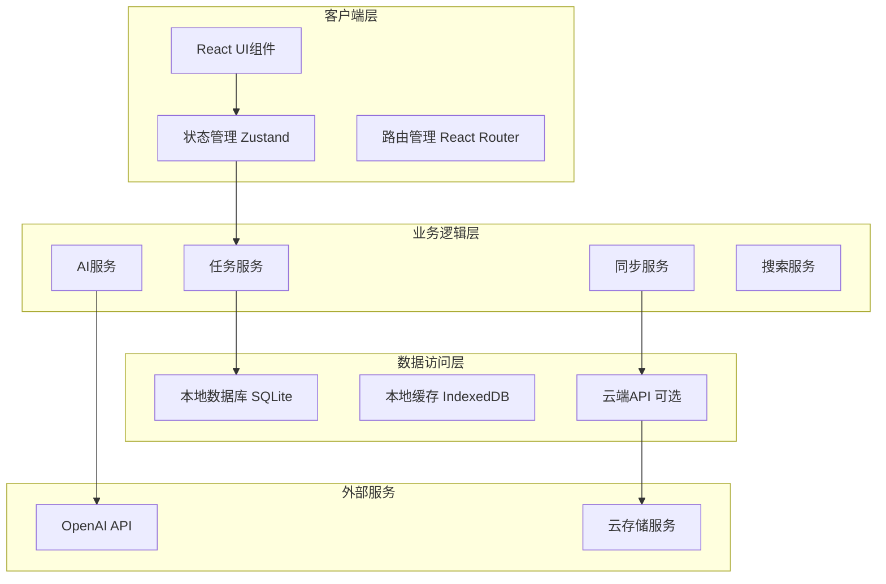

# TodoMaster 技术架构设计

## 架构概述

### 设计原则
1. **简单优先**: 优先选择简单、成熟的技术方案
2. **本地优先**: 核心功能支持完全离线使用
3. **渐进增强**: AI功能作为增强特性，不影响核心体验
4. **模块化**: 各功能模块松耦合，便于独立开发和测试

### 总体架构



## 技术栈选择

### 前端技术栈

#### 核心框架
- **React 18.2+**: 现代化的组件库，生态成熟
- **TypeScript 4.9+**: 静态类型检查，提升代码质量
- **Vite**: 快速的构建工具，优秀的开发体验

#### 状态管理
- **Zustand**: 轻量级状态管理库，API简洁
- **React Query**: 服务端状态管理，缓存和同步

#### UI组件库
- **Tailwind CSS**: 实用类优先的CSS框架
- **Headless UI**: 无样式的可访问组件
- **React Hot Toast**: 消息提示组件
- **React DnD**: 拖拽功能实现

#### 路由和导航
- **React Router 6**: 声明式路由管理
- **React Helmet**: 页面元数据管理

### 后端技术栈

#### 运行环境
- **Node.js 18+**: 服务端JavaScript运行环境
- **Express 4.18+**: 轻量级Web应用框架

#### 数据库
- **SQLite**: 本地嵌入式数据库，无需安装
- **PostgreSQL**: 云端数据库（可选）
- **Prisma**: 类型安全的ORM工具

#### API和中间件
- **CORS**: 跨域资源共享处理
- **Helmet**: 安全头设置
- **Morgan**: HTTP请求日志
- **Express Rate Limit**: API限流

### 开发工具

#### 代码质量
- **ESLint**: JavaScript/TypeScript代码检查
- **Prettier**: 代码格式化
- **Husky**: Git钩子管理
- **lint-staged**: 暂存区文件检查

#### 测试框架
- **Vitest**: 快速的单元测试框架
- **React Testing Library**: React组件测试
- **MSW**: API模拟和测试

#### 构建和部署
- **Electron**: 桌面应用打包（可选）
- **Docker**: 容器化部署
- **GitHub Actions**: CI/CD自动化

## 数据库设计

### 数据表结构

#### 任务表 (tasks)
```sql
CREATE TABLE tasks (
    id INTEGER PRIMARY KEY AUTOINCREMENT,
    title TEXT NOT NULL,
    description TEXT,
    status TEXT DEFAULT 'todo' CHECK (status IN ('todo', 'in_progress', 'completed', 'cancelled')),
    priority TEXT DEFAULT 'medium' CHECK (priority IN ('low', 'medium', 'high')),
    due_date DATETIME,
    created_at DATETIME DEFAULT CURRENT_TIMESTAMP,
    updated_at DATETIME DEFAULT CURRENT_TIMESTAMP,
    completed_at DATETIME,
    category_id INTEGER,
    position INTEGER DEFAULT 0,
    estimated_minutes INTEGER,
    actual_minutes INTEGER,
    FOREIGN KEY (category_id) REFERENCES categories(id)
);
```

#### 分类表 (categories)
```sql
CREATE TABLE categories (
    id INTEGER PRIMARY KEY AUTOINCREMENT,
    name TEXT NOT NULL UNIQUE,
    description TEXT,
    color TEXT DEFAULT '#6B7280',
    icon TEXT DEFAULT 'folder',
    parent_id INTEGER,
    created_at DATETIME DEFAULT CURRENT_TIMESTAMP,
    FOREIGN KEY (parent_id) REFERENCES categories(id)
);
```

#### 标签表 (tags)
```sql
CREATE TABLE tags (
    id INTEGER PRIMARY KEY AUTOINCREMENT,
    name TEXT NOT NULL UNIQUE,
    color TEXT DEFAULT '#6B7280',
    created_at DATETIME DEFAULT CURRENT_TIMESTAMP
);
```

#### 任务标签关联表 (task_tags)
```sql
CREATE TABLE task_tags (
    task_id INTEGER,
    tag_id INTEGER,
    PRIMARY KEY (task_id, tag_id),
    FOREIGN KEY (task_id) REFERENCES tasks(id) ON DELETE CASCADE,
    FOREIGN KEY (tag_id) REFERENCES tags(id) ON DELETE CASCADE
);
```

#### 用户设置表 (settings)
```sql
CREATE TABLE settings (
    key TEXT PRIMARY KEY,
    value TEXT,
    type TEXT DEFAULT 'string' CHECK (type IN ('string', 'number', 'boolean', 'json')),
    updated_at DATETIME DEFAULT CURRENT_TIMESTAMP
);
```

### 索引优化
```sql
-- 任务查询优化
CREATE INDEX idx_tasks_status ON tasks(status);
CREATE INDEX idx_tasks_priority ON tasks(priority);
CREATE INDEX idx_tasks_due_date ON tasks(due_date);
CREATE INDEX idx_tasks_category ON tasks(category_id);
CREATE INDEX idx_tasks_updated ON tasks(updated_at);

-- 全文搜索索引
CREATE VIRTUAL TABLE tasks_fts USING fts5(title, description, content='tasks', content_rowid='id');
```

## API设计

### RESTful API规范

#### 基础路径
```
/api/v1/
├── tasks/          # 任务管理
├── categories/     # 分类管理
├── tags/          # 标签管理
├── search/        # 搜索功能
├── ai/            # AI功能
├── sync/          # 数据同步
└── settings/      # 用户设置
```

#### 任务API示例

**获取任务列表**
```http
GET /api/v1/tasks?status=todo&category=work&limit=20&offset=0
```

**创建任务**
```http
POST /api/v1/tasks
Content-Type: application/json

{
  "title": "完成项目文档",
  "description": "编写技术设计文档",
  "priority": "high",
  "due_date": "2025-01-15T09:00:00Z",
  "category_id": 1,
  "tags": ["工作", "文档"]
}
```

**更新任务**
```http
PUT /api/v1/tasks/123
Content-Type: application/json

{
  "status": "completed",
  "actual_minutes": 120
}
```

#### AI API示例

**智能任务创建**
```http
POST /api/v1/ai/parse-task
Content-Type: application/json

{
  "input": "明天下午3点开会讨论项目进度",
  "context": {
    "timezone": "Asia/Shanghai",
    "current_time": "2025-01-10T14:30:00Z"
  }
}
```

**任务建议**
```http
POST /api/v1/ai/suggestions
Content-Type: application/json

{
  "type": "priority",
  "task_ids": [1, 2, 3],
  "context": {
    "workload": "high",
    "deadline_pressure": "medium"
  }
}
```

## 前端架构

### 组件层次结构

```
src/
├── components/           # 可复用组件
│   ├── ui/              # 基础UI组件
│   │   ├── Button.tsx
│   │   ├── Input.tsx
│   │   ├── Modal.tsx
│   │   └── ...
│   ├── task/            # 任务相关组件
│   │   ├── TaskItem.tsx
│   │   ├── TaskList.tsx
│   │   ├── TaskForm.tsx
│   │   └── ...
│   └── layout/          # 布局组件
│       ├── Header.tsx
│       ├── Sidebar.tsx
│       └── Layout.tsx
├── pages/               # 页面组件
│   ├── Dashboard.tsx
│   ├── TaskDetail.tsx
│   ├── Settings.tsx
│   └── ...
├── hooks/               # 自定义Hook
│   ├── useTask.ts
│   ├── useLocalStorage.ts
│   └── ...
├── stores/              # 状态管理
│   ├── taskStore.ts
│   ├── uiStore.ts
│   └── ...
├── services/            # 业务逻辑
│   ├── taskService.ts
│   ├── aiService.ts
│   └── ...
├── utils/               # 工具函数
├── types/               # 类型定义
└── constants/           # 常量定义
```

### 状态管理设计

#### 任务状态管理
```typescript
interface TaskStore {
  // 状态
  tasks: Task[];
  categories: Category[];
  tags: Tag[];
  filters: TaskFilters;
  selectedTask: Task | null;
  loading: boolean;
  error: string | null;
  
  // 操作
  loadTasks: () => Promise<void>;
  createTask: (task: CreateTaskRequest) => Promise<Task>;
  updateTask: (id: number, updates: UpdateTaskRequest) => Promise<Task>;
  deleteTask: (id: number) => Promise<void>;
  setFilters: (filters: Partial<TaskFilters>) => void;
  selectTask: (task: Task | null) => void;
}
```

#### UI状态管理
```typescript
interface UIStore {
  // 状态
  sidebarOpen: boolean;
  theme: 'light' | 'dark' | 'system';
  viewMode: 'list' | 'board' | 'calendar';
  
  // 操作
  toggleSidebar: () => void;
  setTheme: (theme: Theme) => void;
  setViewMode: (mode: ViewMode) => void;
}
```

### 路由设计

```typescript
const routes = [
  {
    path: '/',
    element: <Layout />,
    children: [
      { index: true, element: <Dashboard /> },
      { path: 'tasks', element: <TaskList /> },
      { path: 'tasks/:id', element: <TaskDetail /> },
      { path: 'categories', element: <CategoryManagement /> },
      { path: 'settings', element: <Settings /> },
      { path: 'analytics', element: <Analytics /> }
    ]
  }
];
```

## 核心服务设计

### 任务服务 (TaskService)

```typescript
class TaskService {
  private db: Database;
  private cache: Cache;
  
  async getTasks(filters: TaskFilters): Promise<Task[]> {
    // 实现任务查询逻辑
  }
  
  async createTask(data: CreateTaskRequest): Promise<Task> {
    // 实现任务创建逻辑
  }
  
  async updateTask(id: number, updates: UpdateTaskRequest): Promise<Task> {
    // 实现任务更新逻辑
  }
  
  async deleteTask(id: number): Promise<void> {
    // 实现任务删除逻辑
  }
  
  async searchTasks(query: string): Promise<Task[]> {
    // 实现全文搜索逻辑
  }
}
```

### AI服务 (AIService)

```typescript
class AIService {
  private openai: OpenAI;
  private cache: Map<string, any>;
  
  async parseNaturalLanguageTask(input: string): Promise<ParsedTask> {
    // 自然语言任务解析
  }
  
  async suggestTaskPriority(tasks: Task[]): Promise<PrioritySuggestion[]> {
    // 任务优先级建议
  }
  
  async analyzeWorkload(tasks: Task[]): Promise<WorkloadAnalysis> {
    // 工作负荷分析
  }
  
  async generateTaskBreakdown(task: Task): Promise<Task[]> {
    // 任务分解建议
  }
}
```

### 搜索服务 (SearchService)

```typescript
class SearchService {
  private ftsEngine: FTSEngine;
  private indexer: Indexer;
  
  async search(query: string, filters?: SearchFilters): Promise<SearchResult[]> {
    // 全文搜索实现
  }
  
  async buildIndex(): Promise<void> {
    // 构建搜索索引
  }
  
  async updateIndex(tasks: Task[]): Promise<void> {
    // 增量更新索引
  }
}
```

## 性能优化策略

### 前端优化
1. **代码分割**: 使用React.lazy和Suspense进行路由级别的代码分割
2. **虚拟滚动**: 大列表使用虚拟滚动技术
3. **防抖优化**: 搜索和过滤操作使用防抖
4. **缓存策略**: 使用React Query进行数据缓存

### 数据库优化
1. **索引优化**: 为常用查询字段创建合适的索引
2. **分页查询**: 大数据量使用分页加载
3. **连接池**: 数据库连接池管理
4. **查询优化**: 避免N+1查询问题

### 网络优化
1. **API缓存**: 使用HTTP缓存头
2. **请求合并**: 批量API操作
3. **压缩传输**: 启用gzip压缩
4. **CDN加速**: 静态资源CDN分发

## 安全性设计

### 数据安全
1. **本地加密**: 敏感数据本地加密存储
2. **传输加密**: HTTPS强制传输加密
3. **输入验证**: 严格的输入验证和清理
4. **SQL注入防护**: 使用参数化查询

### API安全
1. **访问控制**: 基于Token的身份验证
2. **请求限流**: API请求频率限制
3. **CORS配置**: 严格的跨域资源共享配置
4. **安全头**: 设置必要的HTTP安全头

### 隐私保护
1. **数据最小化**: 只收集必要的用户数据
2. **匿名化**: AI分析时数据匿名化处理
3. **用户控制**: 用户可控制数据的使用和删除
4. **透明度**: 明确的隐私政策和数据使用说明

## 部署架构

### 本地部署
```
Desktop App (Electron)
├── Frontend (React SPA)
├── Backend (Node.js + Express)
├── Database (SQLite)
└── AI Service (Optional)
```

### 云端部署 (可选)
```
Load Balancer
├── Frontend (Static Files on CDN)
├── Backend (Node.js on Container)
├── Database (PostgreSQL)
├── Cache (Redis)
└── AI Service (Serverless Functions)
```

### 监控和日志
1. **应用监控**: 性能指标和错误追踪
2. **日志管理**: 结构化日志记录和分析
3. **健康检查**: 服务健康状态监控
4. **告警系统**: 关键问题自动告警

## 技术债务管理

### 代码质量
1. **静态分析**: ESLint、TypeScript严格模式
2. **测试覆盖**: 80%+的测试覆盖率
3. **代码审查**: 强制的代码审查流程
4. **重构计划**: 定期的代码重构和优化

### 依赖管理
1. **版本锁定**: 精确的依赖版本管理
2. **安全扫描**: 定期的依赖安全漏洞扫描
3. **更新策略**: 渐进式的依赖更新
4. **冗余清理**: 定期清理未使用的依赖

---

本技术架构设计将指导TodoMaster项目的具体实现，确保系统的可扩展性、可维护性和高性能。